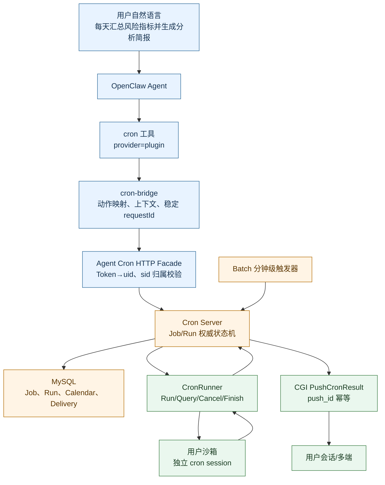
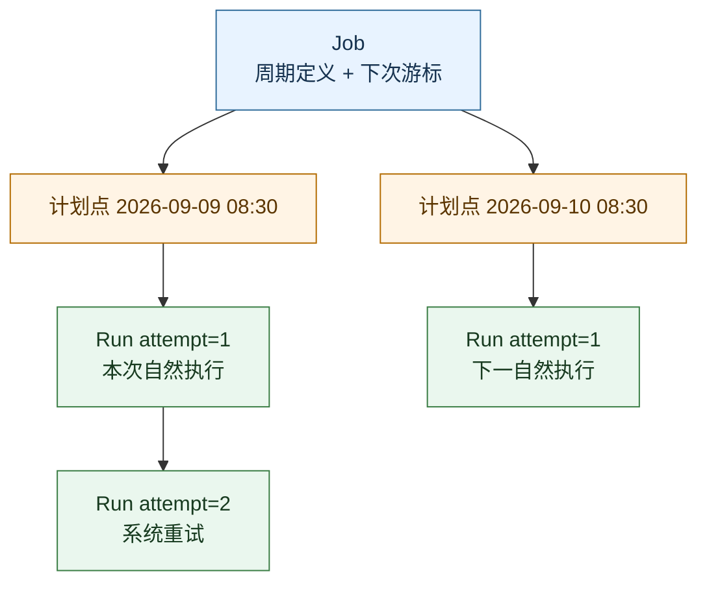
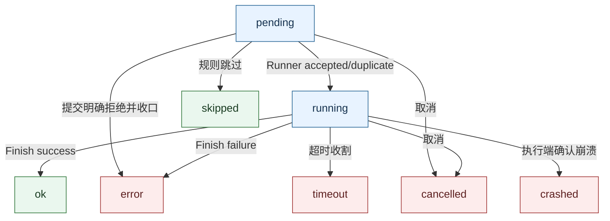

# 中心化 Cron 服务｜Agent 长任务调度与执行平台

Go · TypeScript · MySQL · Redis · OpenClaw Plugin

## 1. 项目背景

### 1.1 业务中的定时分析需求

腾讯自选股希望通过stockbuddy为用户提供定时执行、主动反馈的服务，例如用户设置“每天固定时间整理自选股信息”后，系统自动执行并将结果发送到指定会话，无需用户每天重复提问或保持客户端在线。

原有部署方式需要用户租用腾讯云服务器运行 OpenClaw，部署维护和持续运行成本较大。由于定时任务依赖用户沙箱内的本地 Cron 进程触发，即使两次任务之间没有计算需求，也需要维持环境运行；一旦沙箱停止，本地调度便无法到点执行。因此， **用户对定时服务持续可用的需求，与降低沙箱空闲资源占用的目标之间形成了矛盾** 。

为解决这一问题，项目建设中心化 Cron 服务，将任务计划的存储、到期触发和执行状态管理从用户沙箱迁移至平台，由中心服务统一调度，通过 Runner 协调隔离沙箱执行 Agent 任务，并完成结果保存与投递。通过将任务计划与沙箱运行生命周期解耦，为沙箱按需启动、复用和空闲回收提供调度基础。

同时，针对多实例重复调度、长任务执行状态不确定、回调丢失和结果投递失败等问题，系统引入 Job/Run 建模、幂等控制、状态对账与失败补偿，建立从任务创建到结果可查询的完整链路。项目目标是在减少用户部署负担和空闲资源占用的同时，保障定时任务的可靠性与结果时效；实际降本效果需结合运行时资源回收和计费数据验证。

### 1.2 为什么需要从本地 Cron 转向中心服务

Agent 采用沙箱运行，沙箱会按需启动，也可能因资源回收、版本更新或迁移而退出。任务计划可能持续数周甚至更久，不能把它的执行机会绑定在某个短生命周期进程上。

OpenClaw 的原生本地 Cron 在单实例运行时可以完成定时触发，但进入沙箱化和多实例环境后，需要进一步解决四个问题：

1. **计划如何持续存在。** 沙箱退出后，任务定义和执行历史仍然需要可查询，调度不应依赖用户保持在线。
2. **同一计划点如何避免重复领取。** 多个服务实例可能同时扫描到任务，不能因此启动多次分析。
3. **长任务异常如何恢复。** RPC 超时可能只是响应丢失，Agent 实际上已经开始执行，直接重跑可能产生重复结果。
4. **结果如何独立投递。** 分析完成与通知送达是两个阶段，通知失败不应再次触发整套模型和工具调用。

因此，中心化 Cron 将任务定义、调度、提交、执行和投递拆开管理，以持久化执行记录、稳定身份和状态机建立恢复依据。

### 1.3 项目目标与业务价值

业务侧可以统一创建、修改、取消和查询周期任务，查看每次执行是否成功以及结果是否送达；研发侧可以区分任务停在调度、受理、执行还是投递阶段，并通过对应的补偿机制处理。

项目的核心价值是让长期计划与沙箱进程解耦，减少重复调度和盲目重试，同时保留足够的执行与观测信息，支持任务追踪、异常恢复和故障定位。

---

## 2. 主要工作

### 2.1 Job/Run、状态机与 CAS

> 设计 Job/Run 分层、状态机执行账与事务 + CAS Claim，支持多实例唯一领取、重试、取消、超时收口与结果投递。

设计要点：

> Job 表达长期计划，Run 表达一次 attempt；自然计划、Runner 受理、Agent 执行、用户投递分别由不同状态和稳定身份约束，避免一个状态字段承载多个不可靠边界。

### 2.2 OpenClaw cron-bridge

> 设计 OpenClaw cron-bridge 接管任务 CRUD，禁用原生 Cron 与本地调度，通过稳定 ID、服务端幂等和失败关闭避免双调度及重复创建。

设计要点：

> `toolProvider=plugin` 切断原生工具注册，`cron.enabled=false` 关闭本地 Timer，插件只做代理；中心不可用时关闭，不回退本地造成两套调度真值。

### 2.3 执行账、补偿与可观测

> 基于 Run 执行账与补偿 Worker 收敛长任务异常，并基于现有 Agent Hook/CFS 日志设计 Append-only Checkpoint，用于过程可视化与失败定位。

设计要点：

> 执行账负责业务恢复，Checkpoint 负责解释过程；日志不能直接驱动业务终态，否则重复、乱序和晚到事件会造成非法状态迁移。

Checkpoint 属于执行可观测方案设计。

---

## 3. 为什么需要中心化 Cron

### 3.1 原生本地 Cron 的问题

OpenClaw 原生 Cron 更适合单实例本地自动化。进入 金融风控 Agent 多用户沙箱体系后，出现新的约束：

- 用户沙箱并非常驻，任务不能只保存在某个本地进程。
- 沙箱/Pod 重启后，本地 Timer 和内存状态可能丢失。
- 多副本或迁移时容易出现两个实例同时调度。
- 需要统一支持取消、超时、重试、投递、审计和运营看板。
- Agent 执行是长任务，RPC 超时不等于任务失败。
- 任务执行成功也不代表用户已经收到结果。

因此中心化不是单纯“把 cron 表放进 MySQL”，而是把**定义、调度、执行、收口、投递**拆成有清晰所有权的阶段。

### 3.2 组件职责



| 组件            | 所有权                                                 | 不负责什么                             |
| --------------- | ------------------------------------------------------ | -------------------------------------- |
| `cron-bridge` | 接管 OpenClaw cron tool，转发中心 CRUD/Run/Runs        | 不扫描任务、不落 Job/Run、不执行 Agent |
| Facade          | 鉴权、uid 派生、sid 校验、协议映射                     | 不信任模型传 uid                       |
| Cron Server     | Job/Run 权威表、调度游标、CAS、状态机、重试、投递账    | 不理解 Agent 内部推理过程              |
| Batch           | 定时唤醒`DispatchDueCronJobs`                        | 不成为数据属主                         |
| CronRunner      | 按`reply_id` 幂等受理、拉起执行、Query/Cancel/Finish | 不决定 Job 的下一自然计划点            |
| CGI             | 按`push_id` 幂等落历史和推送                         | 不决定执行成功与否                     |

### 3.3 先给结论：它不是 Exactly-once

Exactly-once 指从业务观察上一次操作只产生一次效果。分布式系统跨越 MySQL、RPC、沙箱 Agent、消息投递后，很难靠一个事务保证物理上只执行一次。

本设计更准确的目标是：

- 调度账：同一计划点只创建一条合法 attempt 链。
- 执行入口：相同 `reply_id` 重提时 Runner 幂等受理。
- 终态：第一个合法终态收口，晚到回调不能覆盖。
- 投递：同一 `run_id` 对应稳定 `push_id`，用户消息不重复。

即**at-least-once 的请求尝试 + 多层幂等，尽量实现业务上的 effectively-once**。对于 Agent 已经对外产生的副作用，仍要由具体工具自身幂等保护。

---

## 4. Job、Run 与三本账

### 4.1 为什么拆 Job 和 Run

Job 是长期定义，Run 是一次执行尝试。如果只用一张表，会混淆：

- “每天 8:30 执行”的配置。
- 今天 8:30 这次是否已领取。
- 本次是否提交 Runner。
- Agent 最终结果。
- 用户是否收到推送。

关系：



### 4.2 Job 核心字段

```go
type CronJob struct {
    JobID          string
    UID            string
    RuntimeType    string
    Enabled        bool
    DeletedAt      *time.Time
    CronExpr       string
    TimeZone       string
    Prompt         string
    TimeoutSeconds int
    DeliveryTo     string
    MaxAttempts    int
    DedupKey       *string

    // 名义上的下一自然 cron 点。
    NextRunAt      *time.Time
    // 加入确定性 jitter 后，真正允许被扫描领取的时间。
    NextDispatchAt *time.Time
}
```

### 4.3 两个调度游标为什么都要有

假设大量用户都设置“每天 8:30 生成风控分析简报”。如果 8:30 同时启动，会形成流量尖峰。

- `next_run_at` 保存名义计划点，例如 08:30，稳定表达用户意图。
- `next_dispatch_at = next_run_at + deterministic_jitter`，例如该 Job 本次为 08:37，实际到 08:37 才允许 Claim。

确定性 jitter 不能每次扫描都重新随机，否则同一个计划点在不同实例算出不同值。参考：

```go
func dispatchAt(jobID string, scheduledFor time.Time, maxJitter time.Duration) time.Time {
    seed := jobID + "|" + strconv.FormatInt(scheduledFor.UTC().UnixMilli(), 10)
    sum := sha256.Sum256([]byte(seed))
    n := binary.BigEndian.Uint64(sum[:8])
    offset := time.Duration(n % uint64(maxJitter.Milliseconds())) * time.Millisecond
    return scheduledFor.Add(offset)
}
```

“随机因子”通常称为 **jitter（抖动）**。这里使用 deterministic jitter（确定性抖动）。

### 4.4 Run 核心字段

```go
type CronRun struct {
    RunID          string // 同时作为 Runner reply_id
    JobID          string
    RootRunID      string
    ParentRunID    *string
    Attempt        int
    TriggerType    string // natural / manual / retry
    TriggerKey     string
    IdempotencyKey string

    ScheduledFor   time.Time // 原始自然计划点
    DispatchAt     time.Time // 原始实际派发点
    RetryAt        *time.Time

    Status         string // pending/running/ok/error/timeout/cancelled/...
    SubmitStatus   string // not_submitted/accepted/duplicate/rejected/unknown
    DeliveryStatus string // pending/delivered/failed/suppressed

    PromptSnapshot string
    TimeoutSnapshot int
    DeliverySnapshot string
    PushID          string
}
```

### 4.5 三本账

| 账                         | 回答的问题             | 典型状态                                                          |
| -------------------------- | ---------------------- | ----------------------------------------------------------------- |
| `status` 执行账          | Agent 任务最终完成了吗 | pending、running、ok、error、timeout、cancelled、crashed、skipped |
| `submit_status` 提交账   | 请求是否被 Runner 接收 | not_submitted、accepted、duplicate、rejected、unknown             |
| `delivery_status` 投递账 | 结果是否送达用户       | pending、delivered、failed、suppressed                            |

为什么不能只用一个状态字段：

```text
场景 A：Runner 已执行成功，但 Finish 响应丢失
  执行事实可能成功，中心 submit=accepted，中心 status 仍 running

场景 B：执行成功，CGI 推送失败
  status=ok，但 delivery_status=failed

场景 C：调用 Runner 超时
  submit_status=unknown；不能说执行失败，也不能盲目创建新 Run
```

拆账让每个补偿 Worker 只修复自己负责的不可靠边界。

---

## 5. Run 状态机与首终态

### 5.1 状态机



### 5.2 什么是非法状态迁移

状态机只允许定义过的边。例如：

- `pending → running` 合法。
- `running → ok` 合法。
- `ok → running` 非法：任务已经成功，不能被旧 Worker 改回执行中。
- `timeout → ok` 默认非法：超时已经作为业务终态收口，晚到成功只能记录旁路事实。
- `cancelled → error` 非法：晚到失败不能覆盖用户取消。

SQL 不应先查再无条件更新，而应带前置状态：

```sql
UPDATE cron_run
SET status = 'ok', answer = ?, finished_at = NOW()
WHERE run_id = ?
  AND status = 'running';
```

`affected_rows == 1` 才表示本次状态推进成功。

### 5.3 什么是首终态

终态包括 `ok/error/timeout/cancelled/crashed/skipped`。并发下可能同时到达：

- 用户取消。
- 超时 Worker 收割。
- Runner 成功回调。

首终态规则是：**第一个通过合法前置状态 CAS 的终态成为权威结果，后续终态回调不再覆盖。**

```go
func FinishRun(ctx context.Context, runID string, result FinishResult) error {
    terminal := normalizeTerminal(result)
    affected, err := repo.UpdateStatusIfActive(ctx, runID, terminal)
    if err != nil {
        return err
    }
    if affected == 0 {
        // 重复或晚到回调；查询现有终态并幂等返回。
        return nil
    }
    return enqueueDelivery(ctx, runID)
}
```

首终态不表示丢弃晚到证据。晚到事件仍可写审计/Checkpoint，只是不改权威业务状态。

---

## 6. 多实例 Claim：CAS、数据库锁与唯一约束

### 6.1 为什么会竞争

多个 Server 实例可能在同一轮都扫描到 `next_dispatch_at <= now` 的 Job。如果每台都执行：

```text
SELECT due jobs
for each job:
  INSERT run
  UPDATE next time
```

就可能产生多条 Run。

### 6.2 事务 + CAS Claim

核心是固定读取到的旧游标，并用它作为条件推进：

```sql
BEGIN;

SELECT job_id, next_run_at, next_dispatch_at, cron_expr, tz, prompt
FROM cron_job
WHERE job_id = ?
FOR UPDATE;

UPDATE cron_job
SET next_run_at = :next_natural_run_at,
    next_dispatch_at = :next_natural_dispatch_at
WHERE job_id = :job_id
  AND enabled = 1
  AND deleted_at IS NULL
  AND next_run_at = :scheduled_for
  AND next_dispatch_at = :dispatch_at;

-- 只有 affected_rows = 1 才继续。
INSERT INTO cron_run(..., scheduled_for, dispatch_at, idempotency_key, status)
VALUES (..., :scheduled_for, :dispatch_at, :idem, 'pending');

COMMIT;
```

两台实例都读到旧游标时，只有第一台更新成功；第二台 `affected_rows=0`，放弃创建 Run。

### 6.3 CAS 和数据库锁是什么关系

这里 CAS 是业务层“比较旧值再更新”的条件写，不是 CPU 的无锁 CAS。MySQL 执行 UPDATE 时仍会加行锁。

- 行锁负责数据库内部并发互斥。
- CAS 条件负责确认“我看到的版本仍然是当前版本”。
- 唯一索引负责最后兜底“不允许两条相同业务身份的记录存在”。

Redis 锁不是不能用，但不能替代数据库唯一约束和状态条件。若先拿 Redis 锁再写 MySQL，还要处理锁过期、进程暂停、数据库事务未提交、Redis 和 MySQL 状态不一致。因为 Job 游标与 Run 本来就在 MySQL，选择 MySQL 作为仲裁点更容易把两者放进同一事务。

### 6.4 为什么游标推进和 Run 插入必须同一事务

如果先推进游标后进程崩溃，计划点被跳过但没有 Run，形成静默漏跑。

如果先插 Run 后推进游标失败，下一轮会再次扫描同一计划点。唯一键可阻止重复 Run，但游标一直卡住，扫描会反复撞键。

同一事务保证：

```text
要么：游标推进 + Run 记录同时存在
要么：两者都回滚
```

### 6.5 唯一约束示例

```sql
UNIQUE KEY uk_run_idem (idempotency_key)
```

自然调度的幂等身份可由以下稳定字段生成：

```text
natural|job_id|scheduled_for_utc_ms
```

重试：

```text
retry|root_run_id|attempt
```

手动执行：

```text
manual|job_id|request_id
```

不要用调用时的 `now` 代替固定 `scheduled_for`，否则不同实例或重试会生成不同 Key。

---

## 7. 创建幂等与“Agent 先 list”

### 7.1 两层去重解决不同问题

你的真实逻辑可以这样解释：

1. 用户说“每天早上发一份风险简报”。Agent 先 `list` 已有任务，根据用户意图判断是否已有重复任务。这一层处理语义重复。
2. Agent 决定创建后，网络抖动可能让同一个 add 请求重试。`cron-bridge` 复用稳定 `requestId`，服务端幂等返回同一个 Job。这一层处理请求重放。

服务端不需要声称可以理解所有自然语言同义句。它只做可信、可定义的身份约束。

### 7.2 为什么不只靠 SELECT 再 INSERT

对于同一个 `request_id`，两个并发请求都可能执行：

```text
请求 A：SELECT → 不存在
请求 B：SELECT → 不存在
请求 A：INSERT
请求 B：INSERT
```

因此最后正确性要交给数据库唯一键：

```sql
INSERT INTO cron_job(..., request_id, dedup_key)
VALUES (...)
ON DUPLICATE KEY UPDATE job_id = LAST_INSERT_ID(job_id);
```

查询可以用于友好返回，但不能取代唯一约束。

### 7.3 归一化 Dedup Key 的边界

设计材料中 Job 的 dedup 可包含：

```text
uid + kind + cron + tz + normalize(prompt)
```

归一化可以去掉多余空白、统一 Cron 表达，但不能保证：

```text
“每天早上发风险简报” == “工作日早上给我汇总风险异常”
```

这些语义判断仍由 Agent 的 `list + 判断` 完成。服务端 dedup 更重要的职责是防止字面相同或同一请求重试。

### 7.4 唯一键冲突后为什么不总是“直接返回”

不同入口冲突后的业务动作不同：

- 创建 Job 重放：返回已有 Job。
- 手动 Run 重放：返回已有 Run，让调用方查同一结果。
- 重试 Worker 撞键：说明该 attempt 已生成，本 Worker 放弃。
- 自然调度插入撞键：说明该计划点已有 Run，但仍要确认 Job 游标是否已按合法流程推进；否则下一轮扫描会一直卡在同一计划点。

唯一键只回答“不能再插一份”，不替业务层决定接下来如何返回或推进。

### 7.5 幂等记录为什么还会涉及 TTL

Job/Run 如果永久保存在数据库且唯一键永不删除，就不需要 TTL。TTL 常出现在额外的 Redis 去重缓存、执行入口去重表、消息路由或通知侧。

需要区分：

- Job/Run 业务记录：通常按审计/运营周期长期保留，唯一约束随记录存在。
- Redis 提交去重：为了控制空间会过期，必须覆盖最大网络重试和人工重放窗口。
- `MsgRoute` 12 小时：只解决回复路由，不是执行幂等。
- `push_id` 去重：应落持久化唯一约束，不能只依赖短 TTL 内存缓存。

如果物理清理了 Run，或把唯一键释放，旧请求在证据消失后确实可能再次执行。所以保留策略要覆盖“仍允许旧请求到达”的最长窗口。

---

## 8. OpenClaw Cron Provider 与 cron-bridge

### 8.1 为什么不是只写一个同名插件

材料指出 OpenClaw 原扩展能力不足以透明替换原生 `cron`：如果核心仍注册 builtin cron，插件再注册同名工具，可能冲突或存在绕回本地调度的路径。

因此引入：

```ts
type CronToolProvider = "builtin" | "plugin";
```

配置：

```json
{
  "cron": {
    "enabled": false,
    "toolProvider": "plugin"
  },
  "plugins": {
    "entries": {
      "cron-bridge": {
        "enabled": true,
        "config": {
          "endpoint": "https://cron-facade.example"
        }
      }
    }
  }
}
```

两道保险的含义不同：

- `toolProvider=plugin`：核心不注册原生 cron 工具，把工具所有权交给插件。
- `cron.enabled=false` / `OPENCLAW_SKIP_CRON=1`：关闭本地 Timer/调度进程。

再配合 Prompt 约束模型使用中心能力，形成工具面、执行面和模型行为三层约束。

### 8.2 fail-close 是什么

如果中心服务不可用：

- 返回明确错误。
- 不退回本地调度。
- 插件缺失时宁可没有 cron 工具，也不启用 builtin。

这是 fail-close。原因是本地 fallback 会导致同一任务一部分在中心、一部分在沙箱，恢复后出现双调度，后果比暂时创建失败更难控制。

### 8.3 `cron-bridge` 的边界

插件注册同名工具，但只做薄适配：

```ts
api.registerTool(
  () => ({
    name: "cron",
    description: "Manage centralized 金融风控 Agent cron jobs",
    parameters: CronToolSchema,
    execute: async (toolCallId, params, ctx) => {
      const token = process.env.WZQ_APIKEY; // 只来自可信环境
      const deliveryTo = ctx.deliveryContext?.to;
      const requestId = stableRequestId(toolCallId, params.action, params.jobId);

      return cronClient.call({
        token,
        deliveryTo,
        requestId,
        action: mapAction(params.action),
        payload: mapPayload(params),
      });
    },
  }),
  { name: "cron" },
);
```

稳定 ID 示例：

```ts
function stableRequestId(
  toolCallId: string,
  action: string,
  jobId?: string,
): string {
  return sha256(`${toolCallId}|${jobId ?? ""}|${action}`);
}
```

同一 tool call 网络重试复用相同 ID；用户主动创建两个内容相同但确实独立的任务，会有不同 toolCallId，再由 Agent list/业务规则决定是否允许。

### 8.4 P0 支持范围

设计稿明确：

- 支持：status、list、add、update、remove、run、runs。
- P0 明确拒绝：at、every、wake、systemEvent、webhook 等未实现语义。

拒绝比静默改写安全。模型请求一个一次性 `at`，服务端却偷偷转成周期 Cron，会产生业务错误。

### 8.5 存量任务切换

从本地 Cron 切中心时最危险的是重复和漏执行。安全灰度顺序：

1. 中心 Job/Run/Facade 先上线但不接管流量。
2. CGI `push_id` 幂等先上线。
3. 验证中心执行和投递链路。
4. 导入或登记存量任务，记录迁移边界时间。
5. Sandbox 镜像启用 `toolProvider=plugin` 并关闭本地 Timer。
6. 核对本地任务不再触发，中心任务从边界后的下一计划点开始。

不能在本地和中心同时 active 后指望 dedup 自动兜住，因为两边可能没有共享相同执行身份。

---

## 9. 自然调度、漏点、重叠与背压

### 9.1 正常窗口与 misfire

设计采用 `dispatch_grace=2min` 举例：

```text
next_dispatch_at ∈ [now-2min, now]：正常到点，可 Claim
next_dispatch_at < now-2min：misfire
```

判断基于 `next_dispatch_at`，不是 `next_run_at`。如果名义时间 08:30、jitter 后 08:37，那么 08:37～08:39 都是正常窗口；不能在 08:32 就认定漏点。

### 9.2 停机期间漏点策略

P0 选择“不补跑”：

- 服务停机 30 分钟，错过多个计划点。
- 恢复后聚合记录 first/last missed 和 count。
- CAS 把两个游标推进到未来第一个自然点。
- 不瞬间补跑大量过时报告，避免恢复风暴。

这个选择适合“报告/提醒”类任务，不一定适合账务结算。策略必须由业务语义决定。

### 9.3 上一次没结束，下一次又到了

设计中的 overlap 策略：

- 仍推进 Job 到下一个计划点，避免游标卡住。
- 为本次计划点创建 `skipped` 记录，说明因上次 active 被跳过。
- 不并发启动同一 Job 的另一次执行。

这保留了审计事实，同时防止同一用户任务堆叠。

### 9.4 背压与容量保护

调度成功不等于可以无限提交 Runner。需要：

- 每轮扫描上限。
- 全局并发上限。
- 用户/租户级配额，防止单用户占满。
- Runner 明确返回 overload/retryable。
- 确定性 jitter 打散固定时间热点。
- 队列等待和最老 Pending 年龄指标。

容量估算需要区分存量任务、执行频率和瞬时并发：

```text
存量 Job 数 ≈ 用户数 × 定时任务使用率 × 人均任务数
日执行量 = 按各 Job 的 Cron 频率汇总
```

库中的 Job 数不等于每天的执行次数，也不能直接当作 QPS；容量需要结合频率分布与热点计划点估算。

---

## 10. Runner：受理、对账与 Fencing

### 10.1 接口契约

CronRunner 被当作黑盒，核心动作：

```proto
service CronRunner {
  rpc RunCronPrompt(RunCronPromptRequest) returns (RunCronPromptResponse);
  rpc QueryCronAnswer(QueryCronAnswerRequest) returns (QueryCronAnswerResponse);
  rpc CancelCronPrompt(CancelCronPromptRequest) returns (CancelCronPromptResponse);
}

message RunCronPromptRequest {
  string reply_id = 1; // 等于 run_id，也是执行入口幂等键
  string uid = 2;
  string session_id = 3;
  string prompt = 4;
  int32 timeout_seconds = 5;
}

message FinishCronRunRequest {
  string reply_id = 1;
  string status = 2;
  string answer = 3;
  string error_code = 4;
  int64 duration_ms = 5;
}
```

实际协议字段以真实 IDL 为准，上面用于表达边界。

### 10.2 `reply_id=run_id` 的意义

中心和 Runner 共享同一稳定身份：

- 第一次提交已被 Runner 接受，但响应丢失。
- Server 用相同 `reply_id` Query。
- 若协议允许重提，也仍用相同 `reply_id`。
- Runner 返回 existing/duplicate，而不是启动第二个 Agent。

### 10.3 提交结果分类

| 结果             | 中心判断           | 动作                                              |
| ---------------- | ------------------ | ------------------------------------------------- |
| ACCEPTED         | 已受理             | `submit_status=accepted`，进入 running          |
| DUPLICATE        | 同 reply_id 已存在 | `submit_status=duplicate`，查询同一执行         |
| REJECTED         | 明确未受理         | 根据 retryable 决定收口或派生 retry               |
| RPC timeout/断网 | 是否受理未知       | `submit_status=unknown`，不得直接创建新 attempt |

### 10.4 Agent 成功但响应丢失

这是典型“两将军问题”：Server 没收到响应，无法仅凭本地状态判断 Runner 是否执行。

正确处理：

```text
RunCronPrompt(reply_id=R) 超时
  → run.submit_status=unknown
  → QueryCronAnswer(R)
      ├─ RUNNING：继续等待
      ├─ SUCCEEDED：按同一 R 收口
      ├─ FAILED：按错误语义处理
      └─ NOT_FOUND：不能立刻断定未执行；需确认 Runner 的幂等存储与查询一致性
```

如果 Runner 的 Run 与 Query 不共享强一致存储，一次 NOT_FOUND 可能只是数据延迟，盲目新建 attempt 会双跑。

### 10.5 实例刚领取就宕机，“实例”指谁

通常指参与中心调度/提交的某个 Server Worker 进程，而不是用户客户端。

分宕机位置：

- 事务未提交：MySQL 回滚，其他 Server 可重新 Claim。
- 事务已提交、还未提交 Runner：Run 留在 pending，stale 扫描再次推进。
- 请求可能到 Runner、响应丢失：submit unknown，按相同 reply_id 对账。
- Runner Worker 启动沙箱后宕机：执行侧租约/账本决定是否接管。

### 10.6 Fencing 是什么

Fencing Token 可以理解为“第几代执行权凭证”。每次任务被领取或接管时发一个更大的 token：

```text
Worker A 领取：fence_token=7
A 卡顿，租约过期
Worker B 接管：fence_token=8
A 恢复，尝试用 token=7 写终态 → 数据库拒绝
B 用 token=8 写终态 → 允许
```

SQL：

```sql
UPDATE runner_ledger
SET status = ?, result = ?
WHERE run_id = ?
  AND fence_token = ?
  AND status IN ('ACCEPTED', 'STARTING', 'RUNNING', 'DELIVERING');
```

租约时间回答“是否过期”，fence token 回答“谁是当前所有者”。

### 10.7 时间精度问题

一个容易出现的问题是用租约时间本身做 Fencing 等值条件。MySQL 保存到秒，Go `time.Time` 带微秒；写入再读出后肉眼相同，但等值条件不命中，affected rows 一直为 0。

定位与处理：

> 联调多实例接管时，状态更新始终 affected rows=0。排除状态前置条件和任务被抢后，对比 RPC 入参、数据库值与 SQL，发现 MySQL 秒精度把 Go 的微秒截断，导致用租约时间做等值校验永远失败。将“是否过期”和“是否拥有写权”拆开：租约时间只判断接管，领取时生成递增 fence_token，后续写入同时校验 token 和前置状态。这样旧 Worker 恢复也无法覆盖新执行者。

### 10.8 Fencing 保护不了什么

Fencing 只能保护所有会校验 token 的受控状态写入。它不能撤回已经发生的外部副作用：

- Agent 已发送消息。
- 工具已经提交处置工单或写外部系统。
- 文件已经上传。

因此外部工具仍要有自己的业务幂等键；进入不可撤销阶段后，设计倾可“宁可漏可疑，不盲目重投”。

---

## 11. 重试、取消、超时与投递

### 11.1 重试为什么创建新 Run

一次 attempt 对应一行，重试创建新的 Run 并关联：

```text
root_run_id = 首次 Run
parent_run_id = 上一次 Run
attempt = previous.attempt + 1
scheduled_for / dispatch_at = 复用原计划点
retry_at = 本次重试时间
```

这样可以保留每次失败证据，不用覆盖原行。重试不修改 Job 的自然游标，因为 Job 在首次自然 Claim 时已经推进到下一计划点。

### 11.2 哪些失败能重试

可以考虑自动重试：

- Runner 明确拒绝且标记 retryable。
- 沙箱启动临时资源不足。
- 网络瞬时错误且能确认未受理，或使用同 reply_id 重提。

谨慎或不自动重试：

- 提交状态 unknown，先 Query。
- Agent 已进入可能产生外部副作用的阶段。
- 用户输入/Prompt 本身错误。
- 鉴权失败、配额耗尽等需要外部状态改变的问题。

### 11.3 取消语义

取消事务内：

- Job disable/delete。
- Active Run 尝试迁移 cancelled。
- 写 `cancel_reason/cancelled_at`。
- `delivery_status=suppressed`。

外部 `CancelCronPrompt` 放在数据库事务外，尽力而为。原因是不能在事务里等待不可靠网络 RPC。

取消能否停止已经运行的 Agent 取决于 Runner 是否有 Abort 能力；业务上先阻止后续结果投递和状态覆盖，再尽力终止计算。

### 11.4 超时与晚到成功

Timeout Worker 用状态条件收口：

```sql
UPDATE cron_run
SET status='timeout', finished_at=NOW()
WHERE run_id=? AND status IN ('pending','running');
```

如果随后 Finish(success) 到达，affected rows=0，不覆盖 timeout。可写审计事件 `late_success_after_timeout`，便于评估 timeout 是否过短。

### 11.5 执行成功但答案为空

Runner 返回 SUCCEEDED 但 answer 为空不能默认成功投递。它可能是协议错误、产物只写文件但未给摘要、或回调组装 bug。设计应明确：

- 哪些任务允许空文本但有 artifact。
- `answer` 和 `artifacts` 的最小成功条件。
- 不满足契约时转为 protocol error，而不是给用户推一条空消息。

### 11.6 投递幂等

稳定：

```text
push_id = cron:{run_id}
```

CGI 应在“占用 push_id + 落历史消息”同一事务中建立持久化唯一约束，再尝试 WebSocket/App 推送：

```sql
BEGIN;
INSERT INTO push_dedup(push_id, uid, run_id) VALUES (?, ?, ?);
INSERT INTO message_history(...) VALUES (...);
COMMIT;
```

若网络推送失败，重试同一个 `push_id`，不能重新生成消息。`delivery_status` 的重试不会重新执行 Agent。

### 11.7 Session 已删除如何投递

Run 创建时保存 `delivery_to/session_id` 快照。投递时：

1. 校验 Session 仍归属用户且存在。
2. 有效则投原 Session。
3. 无效则降级到 uid 默认 Session。
4. 默认 Session 仍失败则 `delivery_status=failed`，进入异步重推。

不要因为投递 Session 失效而重新跑 Agent。

---

## 12. Cron 可用性、指标与成功率口径

### 12.1 多实例部署是否足够说明高可用

不能。Cron 的高可用来自：

- 多实例扫描没有单点。
- MySQL CAS/唯一键作为共享仲裁。
- Pending/Unknown/Timeout/Delivery 都有扫描与补偿。
- Runner 执行账不绑定单一 Worker。
- 下游过载时背压，不把故障放大。

机器数量只是容量和节点冗余的一部分。

### 12.2 调度成功率能不能说 100%

不建议说 100%。即使理论上中心调度不丢计划点，也存在：

- MySQL/Redis 故障。
- 任务被业务规则 skip/misfire。
- 扫描延迟超窗口。
- 配置非法或业务日历失败关闭。
- 人工取消和禁用。

更有意义的是拆指标：

```text
调度领取成功率 = 合法到期计划点中成功生成 Run 的比例
Runner 受理成功率 = submitted 中 accepted/duplicate 的比例
Agent 执行成功率 = 进入 running 后以 ok 收口的比例
投递成功率 = 需要投递的终态中 delivered 的比例
端到端成功率 = 合法计划点最终成功执行且完成投递的比例
```

### 12.3 分层衡量端到端成功率

> 设计上会把调度、受理、执行、投递分层统计：中心调度本身的目标是接近 100% 地把合法计划点生成唯一 Run，但端到端成功率还受沙箱启动、模型配额、工具调用和投递影响。Agent 执行成功率需要按失败域分解，不能用调度成功率代替。

### 12.4 Agent 执行失败来源

建议分层：

| 失败域     | 例子                           | 优化方向                                 |
| ---------- | ------------------------------ | ---------------------------------------- |
| 沙箱资源   | 启动失败、镜像拉取慢、资源不足 | 预热、池化、镜像瘦身、容量预测           |
| 鉴权与配额 | Token 过期、LLM quota          | key-watch 热更新、前置健康检查、配额隔离 |
| 模型       | 超时、空响应、不按格式         | 超时预算、协议校验、Prompt/模型回退      |
| 工具       | 金融接口失败、限流、参数错误   | 工具幂等、重试分类、熔断、参数验证       |
| Agent Loop | 超步数、循环、无终止           | step budget、循环检测、工具策略          |
| 回调       | Finish 丢失、乱序              | Query 对账、稳定 reply_id、首终态 CAS    |
| 投递       | Session 失效、WebSocket 断开   | 默认 Session 降级、持久化历史、异步重推  |

### 12.5 推荐监控面板

- due Job 数、Claim 成功/冲突数。
- 最老 `next_dispatch_at` 延迟。
- Run 状态分布与状态停留时间。
- `submit_status=unknown` 数与对账收敛时长。
- Runner accepted 到 sandbox_ready 时延。
- Agent 成功率，按 error_code、工具、模型分组。
- 首终态冲突/晚到回调数。
- delivery failed 数与重推次数。
- 每 uid/时间段的公平性和限流命中。
- Checkpoint 缺口率、started 无 finished 的 Span 数。

---

## 13. 沙箱执行可观测链路

本节为基于现有 Hook 与 CFS 日志的 Checkpoint 方案设计。

### 13.1 当前基础与真正痛点

当前沙箱已经有很多 Hook，例如 before tool call、工具结果、Agent 生命周期事件；CFS 也有完整日志。问题不是完全没日志，而是：

- 证据散落在不同位置。
- 出问题后需要人工登录沙箱或进入 CFS 搜索。
- 无法直接从一个 `run_id` 看到“排队多久、模型耗时多久、哪个工具卡住、结果是否回调”。
- 业务 Run 状态只能说成功/失败，解释不了执行内部过程。

因此工作重点是把已有点串成一条可查询的执行轨迹，再上报到腾讯已有可观测平台进行展示与聚合。

### 13.2 Span 是什么

Span 是一段有开始、结束和上下文的操作记录。例如一次工具调用：

```text
span_id: tool_17
parent_span_id: agent_turn_3
name: tool.risk_query
start_at: 10:00:01.120
end_at: 10:00:01.460
status: OK
duration_ms: 340
```

多个 Span 用 `trace_id` 串起来：

```text
Cron Run
└── Sandbox Start
    └── Agent Turn
        ├── LLM Request
        ├── Tool Call: stock_query
        └── LLM Request
```

Span 适合性能分解；Append-only Checkpoint 更适合保存不可变的类型化事实。二者可以互转：`tool_call_start` 和 `tool_call_end` 两条事件投影成一个工具 Span。

### 13.3 为什么 Append-only

如果每次事件直接覆盖一行“当前状态”，晚到事件可能把真实终态覆盖掉，也无法还原过程。Append-only 的含义是事件只追加，不修改旧事实：

```json
{
  "event_id": "evt_01J...",
  "trace_id": "run_123",
  "run_id": "run_123",
  "attempt": 1,
  "seq": 17,
  "event_type": "tool_call_started",
  "timestamp_ms": 1788900000123,
  "actor": "openclaw-gateway",
  "session_id": "cron:run_123",
  "span_id": "tool_17",
  "parent_span_id": "turn_3",
  "payload": {
    "tool_name": "risk_query",
    "arguments_digest": "sha256:..."
  },
  "schema_version": 1
}
```

推荐字段：

| 字段                       | 作用                                                     |
| -------------------------- | -------------------------------------------------------- |
| `event_id`               | 上报幂等键                                               |
| `trace_id/run_id`        | 把跨组件事件连成同一条链                                 |
| `attempt`                | 区分同一计划点的多次尝试                                 |
| `seq`                    | 同一生产者/执行内的逻辑顺序，不用时间做唯一顺序          |
| `event_type`             | `agent_start/tool_call_started/tool_call_finished/...` |
| `timestamp_ms`           | 时间展示与耗时计算                                       |
| `actor`                  | 事件由 Gateway、Runner、工具还是平台产生                 |
| `span_id/parent_span_id` | 树形调用关系                                             |
| `payload`                | 类型化扩展字段，敏感参数只存摘要                         |
| `schema_version`         | 兼容事件演进                                             |

### 13.4 推荐事件集合

```text
run_accepted
sandbox_start_requested
sandbox_ready
prompt_injected
agent_started
turn_started
llm_request_started
llm_request_finished
tool_call_started
tool_call_finished
artifact_created
agent_finished
finish_callback_started
finish_callback_finished
run_timed_out
```

事件成对出现时可以生成 Span；如果只有 started 没有 finished，页面就能明确展示“未确认结束”，而不是猜测成功。

### 13.5 重复、乱序、丢失怎么处理

接收侧参考模型：

```sql
CREATE TABLE execution_checkpoint (
  event_id        VARCHAR(64) PRIMARY KEY,
  trace_id        VARCHAR(64) NOT NULL,
  run_id          VARCHAR(64) NOT NULL,
  attempt         INT NOT NULL,
  producer_id     VARCHAR(64) NOT NULL,
  seq             BIGINT NOT NULL,
  event_type      VARCHAR(64) NOT NULL,
  event_time_ms   BIGINT NOT NULL,
  payload_json    JSON NOT NULL,
  schema_version  INT NOT NULL,
  received_at     TIMESTAMP NOT NULL DEFAULT CURRENT_TIMESTAMP,
  UNIQUE KEY uk_producer_seq (run_id, attempt, producer_id, seq),
  KEY idx_trace (trace_id, attempt, seq)
);
```

- **重复**：`event_id` 或 `(run_id, attempt, producer_id, seq)` 唯一约束去重。
- **乱序**：原样保存，展示时按执行内 seq 和父子关系投影；不能用 `received_at` 覆盖业务结果。
- **丢失**：检测 seq 空洞或 started 无 finished，标为缺失/未确认；必要时结合 Runner 执行账和超时事实推断。
- **重传**：Gateway 可有小型本地缓冲/批量上报，但是否真实采用需要结合生产基础设施。

### 13.6 为什么与业务状态机解耦

业务状态机决定是否重试、是否发通知、是否收口，必须由受控事务和 CAS 推进。观测事件可能延迟、乱序或缺失，只用于解释过程。

例如 Checkpoint 已出现 `agent_finished`，Cron Run 仍是 running，可能是 Finish 回调还没落账。业务上仍相信 Run 状态机；排查时用 Checkpoint 定位为回调延迟，并通过合法回调或对账流程收口，不能让可视化页面直接把 running 改为 ok。

反过来，Run 已 timeout 但晚到 `agent_finished` 也不能覆盖首终态。两条事实都保留：

```text
业务事实：任务已按超时规则收口
观测事实：Agent 后来完成并上报了结束事件
```

### 13.7 Agent 进程崩溃能保证最后一条事件吗

不能。正常异常路径可以尽量发送 `agent_finished(error)`，但进程被强杀、机器断电或网络中断时，进程不可能保证主动上报最后一条。

可用外部事实兜底：

- Runner 的租约和超时索引。
- 宿主平台的容器退出事件。
- Gateway 进程外日志/sidecar。
- started 无 finished 的事件缺口。

可观测的目标是“保留足够证据并明确未知”，不是承诺一个已消失的进程还能可靠说最后一句话。

---

## 14. 项目复盘与核心追问

### 14.1 核心设计总结

> 这个项目最核心的设计不是定时扫描，而是把一个 Agent 长任务拆成调度、提交、执行和投递四个不可靠阶段。Job 保存周期定义和双游标，Run 保存每次 attempt；Server 多实例通过 MySQL 事务 + CAS 推进游标并创建唯一 Run。提交 Runner 后单独记录 accepted/unknown，响应丢失时沿用 run_id 作为 reply_id 做 Query 对账，不盲目新建任务。执行终态采用首终态 CAS，投递再用稳定 push_id 幂等。这样即使 Worker 宕机、回调晚到或 WebSocket 断线，也能知道是哪一层失败，并由对应补偿链路收敛。

### 14.2 最高频追问清单

1. Job 与 Run 为什么拆分？
2. `next_run_at` 和 `next_dispatch_at` 有什么区别？
3. 两台 Server 同时扫到 Job，怎么保证唯一 Claim？
4. CAS 和 MySQL 行锁有什么关系？
5. Claim 后宕机发生在不同阶段怎么恢复？
6. `submit_status=unknown` 为什么不能直接重试新 Run？
7. Fencing Token 保护什么，保护不了什么？
8. 首终态是什么，timeout 后成功回调怎么办？
9. 重试为什么创建新 Run，但不推进 Job 游标？
10. `push_id` 幂等和 Agent 执行幂等为什么不是一回事？
11. 为什么中心不可用时 fail-close？
12. 你完成了什么，哪些只是设计？

---

## 15. 高频追问速答

### 15.1 CAS 是什么

在你的 Cron 里是条件 UPDATE：只有 Job 的旧游标/Run 的旧状态仍等于读取值时才更新；通过 affected rows 判断是否抢到执行权。它仍依赖 MySQL 行锁，不是 CPU 无锁算法。

### 15.2 Fencing 是什么

每次授予执行权生成更大的代际 Token，所有受控写入都必须携带当前 Token；旧 Worker 即使恢复，也会因 Token 过期被拒绝。

### 15.3 首终态是什么

并发到来的成功、失败、超时、取消中，第一个通过合法 CAS 的终态成为业务权威；后续只记审计，不覆盖。

### 15.4 Exactly-once 是什么

业务效果只出现一次。跨 DB/RPC/Agent/推送通常无法靠单一事务物理保证；使用稳定 ID、持久化唯一键、状态机和对账得到 effectively-once。

### 15.5 Jitter 是什么

在计划时间上增加小偏移以打散流量。Cron 使用由 `job_id + scheduled_for` 计算的确定性 jitter，所有实例对同一计划点得到相同派发时间。

### 15.6 为什么幂等会“消失”

如果幂等证据在长期 DB 唯一记录中且不清理，就不会因 TTL 消失；TTL 主要是 Redis 去重缓存或短期入口记录。物理清理 DB 记录或释放唯一键后，旧请求可能再次被当作新请求。

### 15.7 为什么先 SELECT 再 INSERT 不够

两个并发请求都能先读到不存在，然后同时插入。最终必须由数据库唯一约束仲裁。

### 15.8 “实例刚领取就宕机”的实例是谁

通常是某台 Server 上执行 Claim/提交的 Worker 进程。事务未提交由 DB 回滚；已提交则依赖 Pending stale 扫描、reply_id 对账和 Runner 执行账恢复。

### 15.9 Span 是什么

一次有开始、结束、父子关系和耗时的操作记录，例如一次 LLM 请求或工具调用；多个 Span 用 trace_id 构成调用树。

---

## 16. 项目价值

这个项目的价值，不只是“把定时任务从本地搬到中心”，而是把**长期计划的生命周期**和**执行资源的生命周期**解耦：计划由中心共享服务持久化，用户沙箱不必仅为等待定时任务而常驻；到点才创建执行记录、协调执行环境，执行完再回收或复用。由此同时带来用户服务、资源利用、可靠性和平台运营四方面价值。

### 1. 用户价值：定时服务持续有效，结果可查询

用户设置一次定时需求后，计划由中心持久化，不再依赖客户端在线，也不依赖原沙箱里的本地 Cron 进程一直存活。例如用户提出“每天 18:00 整理我的自选股信息，生成摘要发到这个会话”，即使客户端退出、沙箱被回收或重建，中心仍会到点创建 Run，协调执行环境运行 Agent，并将结果持久化后投递回用户会话。用户获得的是持续有效、结果可查的定时服务，而不是“必须保持某个执行环境一直开着”才能生效的任务。

### 2. 资源价值：减少沙箱为等待而常驻，为按需执行创造条件

原来如果由用户沙箱内的本地 Cron 计时，沙箱为了等待到点触发可能一直常驻或保留；低频任务真正执行时间可能很短，但等待时间很长，用户体量大时这部分空闲云资源成本会累计成平台侧成本。

中心化后：

- 计划由中心共享服务保存和扫描，等待成本由共享服务分摊；
- 到点才创建 Run、协调沙箱执行；
- 执行结束后，运行时确认没有其他在途工作，才允许停止或回收环境；
- 下次到点再启动或复用，热环境命中时还可以减少冷启动开销。

因此，中心化为减少用户沙箱“空等”占用的云资源、提升共享宿主机利用率、降低单位用户服务成本创造了条件。需要说明的是，实际节省幅度取决于任务频率、执行耗时、冷启动与预热开销、环境是否真正回收以及计费方式，需要用同口径资源时长和账单验证；固定包年包月场景还可能先体现为容量释放，而不是当期账单下降。

### 3. 可靠性价值：提交、执行、投递分账，故障按阶段恢复

中心化不是简单把定时器挪走，而是把长任务链路中几个不可靠边界拆开处理：

- **提交账**回答 Runner 是否受理；
- **执行账**回答 Agent 是否完成；
- **投递账**回答用户是否收到结果。

这样在调用 Runner 超时时，不会直接判定执行失败或盲目创建新 Run，而是用同一 `reply_id` 查询对账；执行成功但推送失败时，只重试投递已有结果，不重新运行 Agent；成功、取消、超时并发时，由第一个通过合法 CAS 的终态生效，晚到回调只保留审计证据，不覆盖业务状态。最终减少重复派发、重复模型调用和重复消息，使长任务在响应丢失、实例宕机、投递失败等情况下仍能收敛。

### 4. 平台价值：统一管理多用户任务的容量、配额与恢复

集中调度后，平台可以统一统计到期负载、限制并发、执行用户配额、处理漏点并追踪失败：

- 多实例通过事务、CAS 和唯一约束竞争同一计划点，避免重复建账；
- 漏点、重叠和背压策略统一配置，避免恢复风暴或热点时间压垮执行资源；
- 补偿 Worker 按提交、执行、投递状态分别处理，不把不同阶段的失败混在一起；
- OpenClaw 侧通过 cron-bridge 接管工具并关闭本地调度，保持单一计划归属，避免双调度。

这使多用户定时任务从“分散在各沙箱里、难以统一排查和治理”，变成“计划、容量、失败和恢复都有中心记录和统一策略”。

### 5. 技术价值：把不可靠边界显式建模

项目中最有技术含量的部分，不是“用了 CAS”，而是承认调度、执行、投递是三个独立的不可靠阶段，并用稳定身份和多层幂等把它们串起来：

- Job 管长期计划，Run 管单次执行；
- 自然调度、重试、手动执行使用不同幂等身份；
- Runner 按 `reply_id` 幂等受理，响应丢失先对账；
- 投递按 `push_id` 幂等，失败只补投递；
- 首终态仲裁避免晚到回调覆盖已确定结果；
- Checkpoint 作为旁路观测，不驱动业务状态机。

这套设计的价值在于：不追求物理上的 Exactly-once，而是通过 at-least-once 请求尝试加多层幂等，尽量实现业务上的 effectively-once；对外部副作用，仍由具体工具自身幂等保护。

### 6. 一句话总结

中心化 Cron 的核心价值，是把“长期记住计划”和“执行时占用计算资源”解耦：用户计划由中心共享服务保存，沙箱不再为了等待定时任务而必须常驻；到点才协调执行环境，执行完回收或复用。由此在用户侧实现持续有效、结果可查，在平台侧为减少空闲云资源占用、统一多用户任务治理和提升可靠性创造条件。项目目前已整体开发完成并进入灰度上线；实际降本幅度和端到端指标仍需结合灰度覆盖、资源账单和有效结果数验证。
