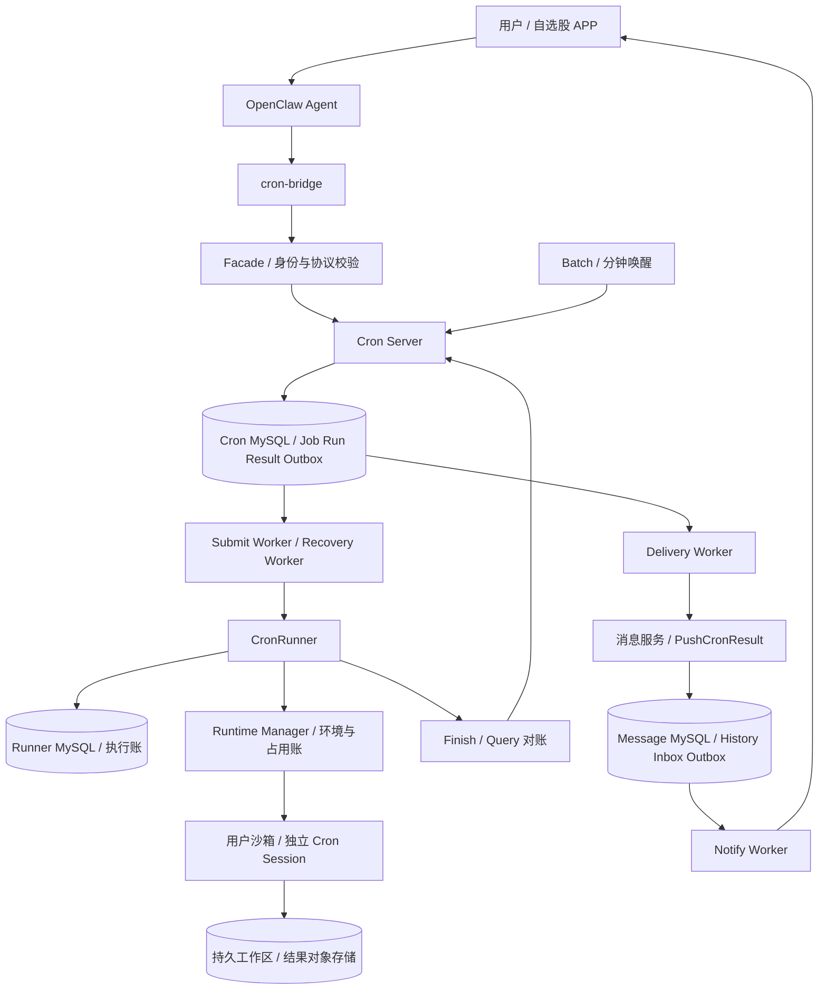
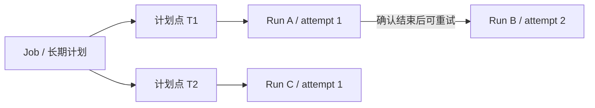
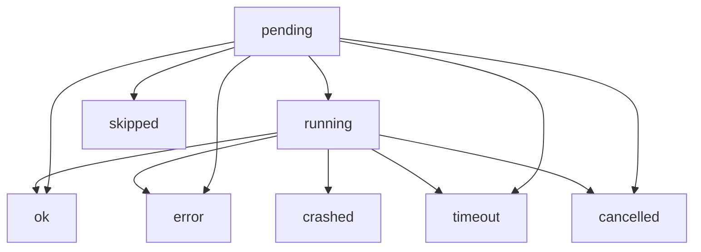
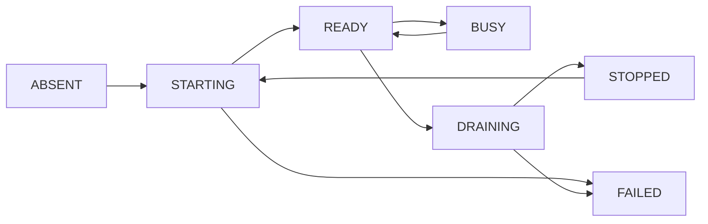

# StockBuddy 中心化 Cron：完整项目说明

> 项目现状：腾讯自选股约 100 万用户，其中约 10% 使用 StockBuddy，即约 10 万用户；Cron 当前在 StockBuddy 用户中灰度约 2%，覆盖约 2,000 人。StockBuddy 线上部署 20 台高配置服务器。
>
> 文档口径：上述业务与部署规模采用项目方确认的信息。技术细节按设计与配置口径整理；容量预算、SLO、压测用例属于规划和验收标准，成本收益按资源与账单统计口径评价。
>
> 范围：仅包含 StockBuddy 中心化 Cron。SQL、接口与伪代码用于说明实现契约。

**目录**

- [1. 项目背景与建设目标](#section-1)
- [2. 总体架构与组件职责](#section-2)
- [3. 产品语义与统一参数](#section-3)
- [4. 数据模型与事务边界](#section-4)
- [5. 多实例调度、漏点与背压](#section-5)
- [6. OpenClaw 接入与创建幂等](#section-6)
- [7. Runner 受理、查询与执行权](#section-7)
- [8. 业务状态机、重试、取消与超时](#section-8)
- [9. 沙箱生命周期、状态恢复与回收](#section-9)
- [10. 结果持久化、投递与去重](#section-10)
- [11. 身份隔离、配置与数据访问](#section-11)
- [12. 故障恢复与可用性](#section-12)
- [13. 观测体系、SLO 与告警](#section-13)
- [14. 线上规模、容量规划与成本评估](#section-14)
- [15. 验收方案与证据要求](#section-15)
- [16. 迁移、灰度、回滚与交付组织](#section-16)
- [17. 原待确认事项的完整决策表](#section-17)
- [18. 项目总述与关键设计解释](#section-18)

---

<a id="section-1"></a>

## 1. 项目背景与建设目标

### 1.1 业务背景

StockBuddy 是基于 OpenClaw 二次开发的金融 Agent 平台，面向腾讯自选股 APP 等业务入口，承接金融问答、内容生成及定时任务。腾讯自选股用户规模约 100 万，StockBuddy 用户约 10 万；Cron 当前灰度覆盖约 2,000 人。

典型需求是：“每个 A 股交易日 18:00，汇总我的自选股表现，生成报告并保存到会话。”用户创建长期计划后，不需要持续在线；系统在每个计划点独立执行，并使结果可查询。

原有独立部署方式由用户租用服务器运行 OpenClaw，本地 Timer 负责到点触发。任务之间的等待时间通常远大于实际计算时间，但本地调度要求运行进程持续存在，导致计划生命周期与用户执行环境绑定。

### 1.2 核心问题

| 问题              | 具体表现                          | 设计方向                             |
| ----------------- | --------------------------------- | ------------------------------------ |
| 空闲占用          | 为等待低频任务持续保有执行资源    | 中心保存计划，用户环境按需运行       |
| 生命周期耦合      | 沙箱停止后，本地 Timer 无法触发   | 调度从沙箱迁移到平台控制面           |
| 长 RPC 结果不确定 | 调用超时无法判断 Agent 是否已执行 | 稳定执行身份、持久化受理账、查询对账 |
| 分布式重复        | 多实例扫描、请求重试、回调重复    | 事务、状态条件、唯一约束与消费幂等   |
| 结果交付断点      | Agent 成功但历史消息缺失          | 结果与投递意图原子登记，跨服务补偿   |
| 资源回收竞态      | 一条 Cron 结束时其他对话仍在执行  | 环境占用账、排空状态与代际校验       |

### 1.3 建设目标与范围

项目提供任务管理、计划扫描、执行编排、结果存储、历史投递、恢复补偿和资源观测。

P0 支持分钟级、只读信息查询与报告生成任务。金融数据通过已有授权数据服务访问；Cron Agent 不直接下单，不修改资金账户，也不自行发送外部消息。用户通知统一经过结果投递服务，便于控制重复与取消语义。

成功标准包括：

1. 用户离线和沙箱停止不影响已保存计划。
2. 每个应处理的计划点都有执行或跳过记录。
3. 不因一次 RPC 超时盲目创建新的执行。
4. 成功结果在沙箱回收后仍可查询。
5. 投递失败只修复投递，不重跑已经成功的 Agent。
6. 资源收益按同口径测量，服务质量与成本一起验收。

### 1.4 方案选择

采用“共享中心调度 + 隔离用户执行环境”。现有 Batch 系统只负责唤醒扫描；Cron Server 使用 MySQL 管理业务计划与状态；Runner 适配 Agent 和运行时。

| 备选方案                          | 适用性                                     | 本方案取舍                              |
| --------------------------------- | ------------------------------------------ | --------------------------------------- |
| 每用户本地 Timer                  | 独立部署简单，但依赖常驻环境               | 不作为平台托管任务的权威调度            |
| 仅迁移任务文件到共享存储          | 可恢复配置，但不能在环境停止后主动触发     | 用于文件持久化，不能替代中心调度        |
| 每个 Job 创建一个基础设施定时对象 | 可利用基础设施调度，但业务状态仍需另外管理 | P0 用业务数据库统一处理租户、重试和结果 |
| 中心 Cron 复用现有 Batch          | 能复用唤醒能力，业务事务边界清晰           | 作为中心调度方案                        |

该方案将业务调度与底层执行环境分离，便于在现有 StockBuddy 平台上逐步放量，并独立控制 Cron 的执行配额和故障恢复。

### 1.5 线上规模与当前灰度阶段

| 层级                      |          当前规模 | 统计说明                |
| ------------------------- | ----------------: | ----------------------- |
| 腾讯自选股用户            |   约 1,000,000 人 | APP 用户规模            |
| StockBuddy 使用比例       |            约 10% | 分母为自选股用户        |
| StockBuddy 用户           |     约 100,000 人 | 1,000,000 × 10%        |
| Cron 当前灰度比例         |             约 2% | 分母为 StockBuddy 用户  |
| Cron 灰度覆盖用户         |       约 2,000 人 | 100,000 × 2%           |
| Cron 覆盖占自选股用户比例 |           约 0.2% | 2,000 / 1,000,000       |
| StockBuddy 线上部署       | 20 台高配置服务器 | StockBuddy 平台部署总量 |

当前阶段是面向约 2,000 名 StockBuddy 用户的 Cron 灰度。后续放量的目标人群是 StockBuddy 的约 10 万用户；按覆盖规模计算，从当前 2% 到 100% 是 50 倍用户范围。

灰度覆盖人数、创建过 Cron 的人数、启用 Job 数、每日执行人数和峰值并发分别统计。覆盖 2,000 人不代表 2,000 人每天都创建或执行任务，也不代表需要同时运行 2,000 个沙箱。

20 台是 StockBuddy 平台的线上机器总量。容量核算通过调度平台资源清单与服务配额识别 Cron 可用资源，不把全部机器直接认定为 Cron 独占资源。单机 CPU、内存、GPU 和具体服务分布以资源清单为准。

<a id="section-2"></a>

## 2. 总体架构与组件职责

### 2.1 架构图


```mermaid
flowchart TD
    USER[用户 / 自选股 APP] --> AGENT[OpenClaw Agent]
    AGENT --> BRIDGE[cron-bridge]
    BRIDGE --> FACADE[Facade / 身份与协议校验]
    FACADE --> SERVER[Cron Server]
    BATCH[Batch / 分钟唤醒] --> SERVER
    SERVER --> CDB[(Cron MySQL / Job Run Result Outbox)]
    CDB --> SW[Submit Worker / Recovery Worker]
    SW --> RUNNER[CronRunner]
    RUNNER --> RDB[(Runner MySQL / 执行账)]
    RUNNER --> RUNTIME[Runtime Manager / 环境与占用账]
    RUNTIME --> SANDBOX[用户沙箱 / 独立 Cron Session]
    SANDBOX --> FILES[(持久工作区 / 结果对象存储)]
    RUNNER --> FINISH[Finish / Query 对账]
    FINISH --> SERVER
    CDB --> DW[Delivery Worker]
    DW --> CGI[消息服务 / PushCronResult]
    CGI --> MDB[(Message MySQL / History Inbox Outbox)]
    MDB --> NW[Notify Worker]
    NW --> USER
```

### 2.2 职责与状态属主

| 组件            | 权威数据或职责                                 | 约束                                   |
| --------------- | ---------------------------------------------- | -------------------------------------- |
| cron-bridge     | 工具动作映射、上下文传递、稳定请求 ID          | 不扫描、不执行 Agent、不持久化权威 Job |
| Facade          | 从可信 Token 派生 uid，校验 Session 与资源归属 | 不接受模型自行指定身份                 |
| Cron Server     | Job、Run、计划点、业务终态、投递意图           | 不管理 Agent 内部推理步骤              |
| Batch           | 周期唤醒                                       | 重复或漏唤醒均由持久状态恢复           |
| Runner          | 持久化受理、执行租约、查询、取消、完成事件     | 不推进 Job 自然计划游标                |
| Runtime Manager | 环境代际、占用、挂载、就绪与回收               | 不以单条 Run 结束直接判断整个环境空闲  |
| 消息服务        | 历史消息、push_id 去重、通知状态               | 不决定 Agent 执行成功与否              |
| 对象与文件存储  | 工作文件、不可变结果产物                       | 不代替 Job/Run 权威数据库              |

### 2.3 技术架构与线上部署

StockBuddy 线上运行在 20 台高配置服务器上。技术方案采用 Go 服务、MySQL 8.x/InnoDB、容器运行时、共享持久工作区和对象存储；容器编排按 Kubernetes 接口说明，工作区与产物接口可映射到 CFS、COS。文件、对象存储与 MySQL 之间通过持久化引用和补偿保持一致，不依赖跨服务事务。

Redis 仅用于缓存、软限流和加速，不承担执行去重、任务游标或消息历史的唯一权威。P0 以数据库 Outbox 作为持久工作队列，无需先引入额外 MQ。

### 2.4 一致性保证

系统目标是“请求至少尝试一次 + 多层持久化幂等”。在约定的身份、保留窗口和数据库一致性前提下，尽量提供业务上的 effectively-once。

具体保证：

- 同一自然计划点只有一条合法 attempt 链。
- 同一个 reply_id 的重复提交关联同一份执行账。
- 第一个合法业务终态不可被晚到回调覆盖。
- 同一成功 Run 只创建一条平台历史消息。
- 消息渠道若缺少幂等能力，无法仅靠平台数据库保证系统通知物理上只出现一次。
- 执行进程、远端模型请求和外部工具调用无法用一个数据库事务实现物理 exactly-once。

<a id="section-3"></a>

## 3. 产品语义与统一参数

### 3.1 支持范围

| 动作          | 行为                                           |
| ------------- | ---------------------------------------------- |
| status / list | 查询平台能力与当前用户的任务                   |
| add           | 创建周期任务，事务提交后才返回成功             |
| update        | 带 version 更新配置，影响后续未领取计划点      |
| remove        | 软删除任务，停止未来调度，并请求取消未完成执行 |
| run           | 手动执行，以 request_id 幂等建账               |
| runs          | 分页查询执行记录及结果                         |

P0 拒绝 at、every、wake、systemEvent 和 webhook 等未纳入支持范围的语义，不将其静默改写为周期任务。

“停用任务”默认只停止未来计划；“取消本次执行”只针对一条 Run；“删除任务”同时停用计划并请求取消在途执行。API 分别表达，界面使用同样的文案。

### 3.2 时间规则

- Cron 使用五段、分钟精度表达式；P0 最小执行间隔为 5 分钟。
- P0 仅开放 `Asia/Shanghai`，请求其他时区返回明确错误。
- 数据库使用 UTC `DATETIME(6)`，RPC 使用 UTC epoch microseconds；时间展示转换到任务时区。
- 月内日期与星期字段不同时设置具体值，避免不同解析器的 OR/AND 语义差异。
- `scheduled_for` 是用户约定的自然计划点；`dispatch_at` 是加上确定性错峰后允许领取的时间。
- 一个已经领取的 Run 使用配置快照；修改 Job 不改变该 Run 的 Prompt、截止时间或接收位置。

### 3.3 任务等级

下表为任务模板的默认配置口径，参数通过版本化配置管理。

| 参数            | 定时简报                | 收盘汇总                   |
| --------------- | ----------------------- | -------------------------- |
| 触发语义        | 指定分钟附近开始准备    | 在用户同意的结果窗口内生成 |
| 最大 jitter     | 0 秒                    | 300 秒，创建时明确展示     |
| 扫描间隔        | 60 秒                   | 60 秒                      |
| dispatch_grace  | 120 秒                  | 120 秒                     |
| 最长容量排队    | 120 秒                  | 120 秒                     |
| 环境准备预算    | 60 秒                   | 60 秒                      |
| 单次 Agent 超时 | 300 秒                  | 300 秒                     |
| 结果可用截止    | scheduled_for + 10 分钟 | scheduled_for + 15 分钟    |
| max_attempts    | 2，含首次               | 2，含首次                  |
| 漏点策略        | skip，不补跑            | skip，不补跑               |
| 同一 Job 重叠   | skip                    | skip                       |

阶段预算不能各自无限叠加。准备、重试与 Agent 调用都受同一个 `result_deadline_at` 约束；为结果提交和历史落库预留 30 秒。余额不足时不再启动新 attempt。

分钟扫描不提供秒级准点 SLA。严格要求精确到秒的需求，在 P0 创建阶段拒绝。

### 3.4 交易日历

交易日任务使用 `calendar_id=CN_A_SHARE` 和不可变 `calendar_version`。Calendar Service 从经授权的市场日历渠道维护日期状态，数据包含覆盖范围、来源、版本、更新时间及生效时间。

每天 06:00 检查未来至少 30 天覆盖范围，节假日前增加人工复核。只有经校验的版本才可发布；每个 Run 保存当时使用的版本。

日历服务暂时不可用但已发布版本仍覆盖目标日期时，继续使用该版本。目标日期未覆盖或存在冲突时，记录 `calendar_unavailable`，暂停受影响交易日任务的执行并告警，不将周一至周五当成交易日替代。

日历更新触发尚未领取任务的游标重算，已生成的 Run 不回写；变更通过版本条件防止旧扫描器领取过期游标。

### 3.5 用户侧结果语义

区分以下事实：

1. 计划已创建。
2. 本次执行已受理或正在运行。
3. 结果已持久化且用户可查询。
4. 历史消息已落库。
5. 通知已交给渠道。
6. 用户已阅读。

APP 离线不构成执行失败。取消已完成执行返回 `ALREADY_FINISHED`，不会撤销已经可查询的结果；删除历史消息属于独立操作。

<a id="section-4"></a>

## 4. 数据模型与事务边界

### 4.1 Job、Run 与三本账

Job 表示长期计划，Run 表示某个计划点的一次执行尝试。


```mermaid
flowchart LR
    J[Job / 长期计划] --> P1[计划点 T1]
    J --> P2[计划点 T2]
    P1 --> R1[Run A / attempt 1]
    R1 -->|确认结束后可重试| R2[Run B / attempt 2]
    P2 --> R3[Run C / attempt 1]
```

| 账         | 字段            | 含义                                                                     |
| ---------- | --------------- | ------------------------------------------------------------------------ |
| 执行业务账 | status          | pending / running / ok / error / timeout / cancelled / crashed / skipped |
| 提交账     | submit_status   | not_submitted / unknown / accepted / duplicate / rejected                |
| 投递账     | delivery_status | not_required / pending / persisted / failed / suppressed                 |

`persisted` 只表示历史消息已建立。在线通知状态归消息服务，不与历史落库状态混用。

此外增加 `execution_resolution`：`not_started / active / unknown / stopped / completed`，用于表达物理执行是否仍占用资源。Run 业务状态为 timeout，不代表旧进程已经停止。

### 4.2 核心表

| 表                  | 属主           | 核心字段                                                                                  | 唯一约束或索引                                                      |
| ------------------- | -------------- | ----------------------------------------------------------------------------------------- | ------------------------------------------------------------------- |
| cron_job            | Cron           | job_id、uid、version、enabled、schedule、next_run_at、next_dispatch_at、active_run_id     | PK(job_id)；扫描索引(enabled, deleted_at, next_dispatch_at, job_id) |
| api_request         | Cron           | uid、action、request_id、payload_hash、resource_id、response、expires_at                  | UNIQUE(uid, action, request_id)                                     |
| cron_run            | Cron           | run_id、job_id、root_run_id、parent_run_id、attempt、三本账、快照、截止时间               | PK(run_id)；UNIQUE(idempotency_key)；UNIQUE(root_run_id, attempt)   |
| cron_misfire_range  | Cron           | job_id、first/last missed、missed_count、calendar_version                                 | UNIQUE(job_id, first_scheduled_for)                                 |
| cron_result         | Cron           | run_id、uid、摘要、artifact_manifest、checksum、created_at                                | UNIQUE(run_id)                                                      |
| cron_outbox         | Cron           | event_id、event_type、aggregate_id、payload、状态、租约、next_attempt_at                  | UNIQUE(event_type, aggregate_id)；索引(state, next_attempt_at)      |
| runner_ledger       | Runner         | reply_id、payload_hash、status、fence_token、owner、lease_until、execution_id、result_ref | PK(reply_id)                                                        |
| runner_event_outbox | Runner         | event_id、reply_id、event_seq、事件内容、重试状态                                         | UNIQUE(reply_id, event_seq)                                         |
| runtime_environment | Runtime        | environment_id、uid、generation、state、config_version、idle_since                        | PK(environment_id)                                                  |
| runtime_occupancy   | Runtime        | occupancy_id、environment_id、generation、execution_id、kind、state、lease_until          | PK(occupancy_id)；索引(environment_id, state)                       |
| message_history     | 消息服务       | message_id、uid、session_id、push_id、正文或结果引用                                      | UNIQUE(push_id)                                                     |
| message_inbox       | 消息服务       | push_id、payload_hash、message_id、处理结果、expire_at                                    | PK(push_id)                                                         |
| notification_outbox | 消息服务       | notification_id、push_id、channel、state、next_attempt_at                                 | UNIQUE(push_id, channel)                                            |
| cron_audit_event    | 各组件审计汇聚 | trace_id、run_id、event_type、状态变化、操作者、时间                                      | 按 run_id 与时间检索                                                |

身份字段采用大小写敏感的 ASCII/Binary 排序规则；用户正文使用 utf8mb4。不能让不区分大小写的排序规则意外合并业务身份。

### 4.3 关键字段落地

```sql
CREATE TABLE cron_run (
  run_id VARCHAR(64) CHARACTER SET ascii COLLATE ascii_bin PRIMARY KEY,
  job_id VARCHAR(64) CHARACTER SET ascii COLLATE ascii_bin NOT NULL,
  uid VARCHAR(64) CHARACTER SET ascii COLLATE ascii_bin NOT NULL,
  root_run_id VARCHAR(64) CHARACTER SET ascii COLLATE ascii_bin NOT NULL,
  parent_run_id VARCHAR(64) CHARACTER SET ascii COLLATE ascii_bin NULL,
  attempt SMALLINT UNSIGNED NOT NULL,
  trigger_type VARCHAR(16) NOT NULL,
  idempotency_key VARCHAR(191) CHARACTER SET ascii COLLATE ascii_bin NOT NULL,
  scheduled_for DATETIME(6) NOT NULL,
  dispatch_at DATETIME(6) NOT NULL,
  retry_at DATETIME(6) NULL,
  result_deadline_at DATETIME(6) NOT NULL,
  execution_deadline_at DATETIME(6) NULL,
  status VARCHAR(16) NOT NULL DEFAULT 'pending',
  submit_status VARCHAR(16) NOT NULL DEFAULT 'not_submitted',
  delivery_status VARCHAR(16) NOT NULL DEFAULT 'not_required',
  execution_resolution VARCHAR(16) NOT NULL DEFAULT 'not_started',
  config_snapshot JSON NOT NULL,
  request_payload_hash CHAR(64) CHARACTER SET ascii COLLATE ascii_bin NOT NULL,
  push_id VARCHAR(80) CHARACTER SET ascii COLLATE ascii_bin NOT NULL,
  error_code VARCHAR(64) NULL,
  cancel_requested_at DATETIME(6) NULL,
  next_reconcile_at DATETIME(6) NULL,
  created_at DATETIME(6) NOT NULL,
  updated_at DATETIME(6) NOT NULL,
  finished_at DATETIME(6) NULL,
  UNIQUE KEY uk_run_idem (idempotency_key),
  UNIQUE KEY uk_root_attempt (root_run_id, attempt),
  UNIQUE KEY uk_push (push_id),
  KEY idx_job_runs (job_id, created_at),
  KEY idx_reconcile (execution_resolution, next_reconcile_at),
  KEY idx_timeout (status, execution_deadline_at),
  KEY idx_result_deadline (status, result_deadline_at)
) ENGINE=InnoDB DEFAULT CHARSET=utf8mb4;
```

快照包含 Prompt、job_version、时区、日历版本、工具权限版本、运行镜像版本、超时、重试策略和 delivery_to。长期凭据不进入快照。

### 4.4 业务身份规则

```text
创建请求：uid | action | request_id
自然首跑：natural | job_id | scheduled_for_utc_us
手动首跑：manual | job_id | request_id
系统重试：retry | root_run_id | attempt
执行入口：reply_id = run_id
结果投递：push_id = cron:{run_id}
工具请求：run_id | logical_tool_call_id
```

同一请求 ID、不同 payload_hash 返回 `IDEMPOTENCY_CONFLICT`。网络重试不得重新生成身份。

自然执行身份不加入可变的当前时间或扫描实例 ID。Job 配置变化不会使同一已领取计划点生成另一条自然首跑。

### 4.5 事务与锁顺序

Cron 权威操作使用 InnoDB `READ COMMITTED`。明确执行条件和唯一约束承担业务正确性，不依赖普通 SELECT 的快照推断执行权。

跨多行的 Cron 事务固定锁顺序：`cron_job → cron_run → cron_result / cron_outbox`。多 Job 操作按 job_id 排序，事务内不做 RPC、模型调用或对象上传。

| 事务       | 必须原子发生                                               |
| ---------- | ---------------------------------------------------------- |
| 创建 Job   | 请求幂等记录 + Job + 返回结果快照                          |
| 领取计划点 | 校验并推进游标 + 创建 Run/跳过记录 + 必要的 SUBMIT Outbox  |
| Run 成功   | 首终态 CAS + result + DELIVERY Outbox + 资源解析状态更新   |
| 请求取消   | 业务取消状态 + CANCEL Outbox                               |
| 派生 retry | 前一次符合重试条件 + 新 attempt + 活跃指针 + SUBMIT Outbox |
| 消息接收   | Inbox 去重 + History + Notification Outbox                 |

Cron、Runner、消息服务可以使用独立数据库。每个事务只覆盖本组件数据库；跨服务靠稳定 ID 和补偿。

<a id="section-5"></a>

## 5. 多实例调度、漏点与背压

### 5.1 到期扫描

Batch 每 60 秒触发扫描，Cron 实例另有 60 秒自检唤醒，二者可重复触发。扫描每批最多 200 个候选、单轮最多 2,000 个；存在积压时续调下一轮，同时给 API 和恢复任务预留数据库连接。

```sql
SELECT job_id, version, next_run_at, next_dispatch_at
FROM cron_job
WHERE enabled = 1
  AND deleted_at IS NULL
  AND next_dispatch_at <= UTC_TIMESTAMP(6)
ORDER BY next_dispatch_at, job_id
LIMIT 200;
```

候选读取不构成执行权。每个 Job 在独立短事务中锁定、重查版本与旧游标。

### 5.2 Claim 协议

```text
BEGIN
  SELECT Job FOR UPDATE
  校验 enabled、deleted_at、候选 version、候选旧游标和当前到期条件
  若候选已过期：结束本次领取

  若超出 dispatch_grace：按日历枚举/聚合漏点，推进到未来计划点
  否则若 active_run_id 非空：建 skipped(overlap) 记录并推进游标
  否则：
    创建 pending Run，保存完整配置快照
    将 active_run_id 设为本 Run
    创建唯一 SUBMIT Outbox
    推进到下一自然计划点及其 dispatch_at
COMMIT
```

`active_run_id` 由所有自然执行、手动执行、重试和恢复入口共同遵守。它在确认执行已经结束前不清空，因此“业务已超时但旧进程仍可能运行”不会开放同一 Job 的第二条执行。

锁内更新仍携带 version 和旧游标条件，并检查 affected_rows。唯一键冲突时回滚本事务、重新读取权威数据；异常历史数据修复通过专用恢复流程完成，不能吞掉错误后强行推进游标。

### 5.3 行锁、CAS 与唯一约束

- 行锁序列化同一 Job 的竞争。
- CAS 校验候选版本与计划点是否仍然有效。
- 唯一约束禁止重复业务身份。

`SKIP LOCKED` 可用于 Outbox 多消费者领取，减少相互等待；不用于证明“系统不存在其他执行”。它会跳过已锁行，读取结果不适合作为完整状态快照。锁定读的行为依据 [MySQL 官方说明](https://dev.mysql.com/doc/refman/8.4/en/innodb-locking-reads.html)。

### 5.4 确定性 jitter

```text
当 max_jitter_us == 0：dispatch_at = scheduled_for
否则：
  seed = SHA256(job_id + "|" + scheduled_for_utc_us)
  offset = uint64(seed[0:8]) mod max_jitter_us
  dispatch_at = scheduled_for + offset
```

同一个 Job、同一个计划点在所有实例上得到相同结果。jitter 写入 Run 快照；受容量影响的重试时间另存 retry_at，不修改用户原始计划点。

### 5.5 漏点与重叠

漏点从 `dispatch_at` 计算。超过 120 秒领取宽限后，P0 不补跑，按规则推进到未来第一个合法计划点。

停机较久时，使用 `cron_misfire_range` 保存 first、last、count、calendar_version，后台按限制批次继续枚举，避免一次超长事务。统计时展开其计划点数量，不能只将一条聚合记录计为一次漏点。

同一 Job 已有活跃或执行状态未解析的 Run 时，下一自然计划点记为 `skipped/overlap`，仍推进游标。手动执行冲突返回 `JOB_BUSY`，不插队绕过重叠保护。

### 5.6 容量背压

Submit Worker 在接受配额后才提交 Runner，等待状态持久保留在 Outbox。设定：

- 单用户 Cron 活跃 attempt 上限为 1，独立的交互对话配额不在此额度中。
- 全局活跃 attempt 配额包含准备和执行阶段，依据 20 台服务器中分配给 Cron 的资源预算设置；240 槽位作为第 14 节的压测档位，由资源容量与下游配额校验后决定能否启用。
- 用户配额与全局槽位使用 Runtime 的持久占用记录约束；Redis 限流只是加速。
- 槽位到期但执行未解析时不直接复用，通过对账确认释放。
- 超过排队上限或剩余结果预算不足，业务收口为 timeout，原因记 `capacity_wait_exceeded`。
- 采用用户轮转并结合 deadline 排序；单个用户的大量待执行任务不能长期阻塞其他用户。

数据库领取速度、运行槽位、模型 QPS/Token 配额和金融工具限流是不同约束，不能只增加 Cron Worker 数来解决下游容量不足。

<a id="section-6"></a>

## 6. OpenClaw 接入与创建幂等

### 6.1 Provider 接管

OpenClaw 接入方案在适配分支中定义 `CronToolProvider = builtin | plugin`，配置为：

```json
{
  "cron": {
    "enabled": false,
    "toolProvider": "plugin"
  },
  "plugins": {
    "entries": {
      "cron-bridge": {
        "enabled": true,
        "config": {
          "endpoint": "https://cron-facade.example.invalid"
        }
      }
    }
  }
}
```

这是本文的适配分支协议，不声称原生 OpenClaw 任意版本已有相同配置。

`toolProvider=plugin` 使核心停止注册 builtin cron；`cron.enabled=false` 关闭本地 Timer。插件缺失、身份不可用或中心服务故障时，返回明确错误，不退回本地调度。

### 6.2 可信上下文

插件读取运行时注入的短期凭据，Facade 从凭据派生 uid。模型传入的 uid 被忽略或拒绝；delivery_to、job_id、run_id 和 session_id 均需校验归属。

请求链路使用 trace_id；重试身份使用独立的 request_id。Trace 可以跨重试更新，request_id 不可变化。

### 6.3 请求重放处理

```text
request_id = SHA256(invocation_id | tool_call_id | action | target_id)
payload_hash = SHA256(canonical_request_body)

首次请求：同事务插 api_request、建 Job、存响应。
重复请求：读取已有响应；payload_hash 不一致则拒绝。
```

invocation_id 在工具调用开始前持久化。服务进程重启后恢复同一次调用，仍使用相同 invocation_id。

插入出现唯一键冲突时按具体索引分类，并显式查询已有资源；不使用依赖自增整数主键的技巧来处理字符串 job_id。

### 6.4 语义重复与精确重复

Agent 创建前可先 list，提示用户已有类似任务。服务端不将自然语言近似判定作为强一致身份。

P0 仅对 request_id 强制幂等。归一化 Prompt 与计划的 fingerprint 用于重复提醒，不强制拒绝用户明确创建的第二个独立任务。这样避免删除、停用或改写 Prompt 时出现难以解释的去重冲突。

<a id="section-7"></a>

## 7. Runner 受理、查询与执行权

### 7.1 RPC 契约

| 接口             | 必要输入                                                           | 返回语义                                                    |
| ---------------- | ------------------------------------------------------------------ | ----------------------------------------------------------- |
| RunCronPrompt    | reply_id、uid、payload_hash、snapshot、accept_before、签名执行票据 | ACCEPTED / DUPLICATE / REJECTED                             |
| QueryCronAnswer  | reply_id                                                           | 持久执行状态、event_seq、execution_id、result_ref、停止证据 |
| CancelCronPrompt | reply_id、cancel_request_id                                        | 持久取消受理状态，不等于物理停止完成                        |
| FinishCronRun    | reply_id、event_id、event_seq、终态、结果摘要、result_ref          | APPLIED / ALREADY_TERMINAL / RETRYABLE_ERROR                |

submit 和 query RPC 超时均设为 3 秒。Agent 长任务通过执行账和完成事件跟踪，不占用一次 RPC 连接直到任务结束。

### 7.2 先落账，再启动

Runner 使用自身 MySQL 主库中的 runner_ledger 作为 Run 和 Query 的共同权威存储。

```text
校验服务身份、执行票据、accept_before、租户和 payload_hash
  → INSERT runner_ledger(status=ACCEPTED)
  → COMMIT
  → 返回 ACCEPTED
  → Worker 异步领取并协调沙箱
```

受理记录提交前不得启动 Agent。重复 reply_id、相同 payload_hash 返回既有状态；不同 payload_hash 返回冲突。

执行账本身就是可扫描的待执行队列。即使“落账后、唤醒前”进程宕机，新 Worker 仍可发现 ACCEPTED 记录。

### 7.3 NOT_FOUND 的严格解释

Query 必须从当前权威主库读取；主库不可用返回 `UNAVAILABLE`，不能伪装成 NOT_FOUND。只读副本和 Redis 不参与“是否已受理”的否定判断。

即使主库返回 NOT_FOUND，也仅表示查询线性化时点不存在已提交记录：原提交请求可能仍在网络上或事务尚未提交。因此处理规则固定为：

1. 记录提交状态 unknown。
2. Query 同一个 reply_id。
3. NOT_FOUND 且仍在 accept_before 内，只能重提同一个 reply_id。
4. 超过 accept_before 后拒绝新受理，继续对账并请求取消同一身份。
5. 不以一次 NOT_FOUND 为依据创建新 attempt。

### 7.4 执行账状态

```text
ACCEPTED → STARTING → RUNNING → SUCCEEDED / FAILED / CRASHED
任一非终态 → CANCEL_REQUESTED → CANCELLED
```

CANCEL_REQUESTED 不允许新的 Agent 启动。Cancel 先于 Run 到达时，Runner 创建该 reply_id 的取消墓碑；随后同一身份的延迟 Run 只能读取取消结果。

受理检查、重复判断和取消墓碑均使用同一个 reply_id 主键事务，消除“尚未受理就无法取消”的空档。

### 7.5 租约与 Fencing

默认执行租约 30 秒，10 秒续租，数据库时间作为租约判断基准。每次换执行账所有者，递增 fence_token。

```sql
UPDATE runner_ledger
SET owner_id = :new_owner,
    fence_token = fence_token + 1,
    lease_until = TIMESTAMPADD(SECOND, 30, UTC_TIMESTAMP(6))
WHERE reply_id = :reply_id
  AND (owner_id IS NULL OR lease_until < UTC_TIMESTAMP(6))
  AND status IN ('ACCEPTED', 'STARTING', 'RUNNING', 'CANCEL_REQUESTED');
```

首次领取时 owner_id 为空、fence_token 从 0 开始；已有所有者的接管必须等租约过期。续租、受控结果写入均校验 owner_id、fence_token、有效租约和合法前置状态。租约时间统一使用微秒精度，执行权不以 Go 时间对象与数据库时间字段的等值比较表示。

旧 Worker 的 token 失效只能阻止受控写入，不能自动停止旧沙箱进程。

### 7.6 接管时不盲目重启

新 Worker 取得的是执行账的协调权。Runtime Manager 以稳定 execution_id 识别已存在的 Agent 进程：

- 进程仍活跃：接管观测和取消职责，继续读取原执行结果，不重启第二份 Agent。
- 进程已经完成：读取持久结果，修复执行账并回报中心。
- 确認未启动或原进程已停止：按当前 attempt 状态决定继续准备或报告失败。
- 节点失联且无法证明旧进程停止：execution_resolution=unknown，隔离该执行并保持配额占用。

Runtime 启动网关需要验证 generation、execution_id 和当前控制代际。隔离节点上的旧执行必须在运行时/节点层停止或禁止恢复后，才允许创建新 attempt。仅增加 fence_token 不构成无重复执行证明。

### 7.7 完成事件与回调乱序

Runner 在同一事务中保存终态、结果引用和 runner_event_outbox。回调至少尝试一次，并带 event_id 和单调 event_seq。

中心按事件 ID 去重；对关键成功结果可以通过权威 Query 复核。回调生产者为 Runner 服务，不允许沙箱持有直接修改 Cron 状态的凭据。

极短任务可能在提交响应到达前完成，因此中心允许经验证的 `pending → ok/error`。ACCEPTED 回包随后到达时，只更新仍适用的提交事实，不能将 ok 改回 running。

<a id="section-8"></a>

## 8. 业务状态机、重试、取消与超时

### 8.1 状态迁移


```mermaid
flowchart TD
    P[pending] --> R[running]
    P --> OK[ok]
    P --> E[error]
    P --> T[timeout]
    P --> C[cancelled]
    P --> S[skipped]
    R --> OK
    R --> E
    R --> T
    R --> C
    R --> X[crashed]
```

running 表示 Runner 已确认执行进入 STARTING/RUNNING；单纯 ACCEPTED 仍可留在 pending，具体准备阶段从执行账查询。

所有终态通过条件更新争用首终态。晚到成功只保存审计证据，不覆盖 timeout 或 cancelled，不自动投递该晚到结果。

### 8.2 成功收口事务

```text
先验证 Runner 完成证据、结果契约和产物可读性

BEGIN
  锁 Job，再锁 Run
  若 Run 已为终态：读取原结果，幂等返回
  若超过结果截止时间：收口 timeout，不进入成功投递
  否则：
    CAS pending/running → ok
    INSERT cron_result
    INSERT cron_outbox(DELIVERY, run_id)
    delivery_status = pending
    execution_resolution = completed
    仅当 active_run_id == 本 run_id 时清空指针
COMMIT
```

不存在“先提交 ok，再在内存中 enqueueDelivery”的步骤。结果、业务成功与投递意图在同一个 Cron 数据库事务中生效。

### 8.3 重试前置条件

新 attempt 必须同时满足：

1. 前一次已经明确失败或被确认停止；unknown 不能直接派生。
2. 错误分类允许重试，且 P0 工具仅执行允许重试的只读操作。
3. Job 未停用、未删除，用户未取消该 attempt 链。
4. attempt 小于 max_attempts。
5. 剩余结果预算可以覆盖准备、最小执行预算和 30 秒收尾。
6. 已锁定 Job，确认没有其他活跃 attempt 占据执行权。

重试创建新 run_id，保留 root_run_id、scheduled_for 和 result_deadline_at；parent_run_id 指向前次，attempt 加一。重试不推进自然游标。

两次重试 Worker 竞争时，`UNIQUE(root_run_id, attempt)` 兜底；事务内切换 active_run_id 并创建唯一 SUBMIT Outbox。

### 8.4 重试分类

| 故障                           | 处理                                    |
| ------------------------------ | --------------------------------------- |
| Run RPC 超时                   | Query/重提同一 reply_id，不增加 attempt |
| Runner 明确未受理且临时过载    | 在原 Run 预算内重提相同身份             |
| 环境准备失败且已确认清理       | 可派生下一 attempt                      |
| 只读工具临时失败、执行已结束   | 按预算重试                              |
| 非法参数、权限失败、日历缺失   | 不自动执行重试，等待配置修复            |
| Agent 步数耗尽、格式错误       | P0 不自动重跑，避免重复消耗             |
| 执行位置不明、旧进程未确认停止 | 保持 unknown，进入恢复与隔离            |
| 结果投递失败                   | 仅重试 DELIVERY                         |

提交/查询退避采用 2、5、10、30 秒并加小幅随机抖动；新 attempt 默认延迟 30 秒，均受统一截止时间限制。

### 8.5 取消竞态

CancelRun 锁 Job、Run，对非终态写 cancelled、delivery_status=suppressed，并登记 CANCEL Outbox。网络取消在事务外发送。

Submit Worker 每次提交前重读业务状态；已经在途的提交仍可能先于取消到达，所以 Runner 还必须落实取消墓碑和启动前检查。

如果成功事务先提交，取消返回 ALREADY_FINISHED。如果取消事务先提交，后续成功不能改写业务终态，也不能创建投递意图。用户已收到的消息不在 CancelRun 的撤回范围内。

### 8.6 超时与资源释放

超时 Worker 每 10 秒扫描。pending 受排队/结果截止限制；实际执行超时从 started_at 起算，并取 `min(started_at + timeout, result_deadline_at - 30s)`。

超时事务写 timeout 与 CANCEL Outbox。若仍可能存在执行，execution_resolution 保持 active/unknown，active_run_id 和运行槽位继续保留。

收到 Runner 的 completed/stopped 证据后，恢复 Worker 才清理占用。对账超过 15 分钟仍无法解析则升级运维处理，隔离该 execution_id；隔离期间同一 Job 的新计划点继续记为 overlap 跳过。

### 8.7 外部副作用与 Checkpoint

P0 只开放只读金融查询、报告生成和运行专属产物写入。工具网关按逻辑调用 ID 去重，并记录开始、完成、耗时及错误。

Checkpoint 用于定位执行停在哪一步，不承诺恢复任意模型内部状态。已提交的结果可以重新投递；进程崩溃后的推理通常从新 attempt 开始，且必须先确认旧执行结束。

未来开放可写工具时，需逐个增加业务幂等键、结果查询和未知状态处理，不能将 P0 的只读重试策略直接套用。

<a id="section-9"></a>

## 9. 沙箱生命周期、状态恢复与回收

### 9.1 环境状态机


```mermaid
flowchart LR
    A[ABSENT] --> S[STARTING]
    S --> R[READY]
    S --> F[FAILED]
    R --> B[BUSY]
    B --> R
    R --> D[DRAINING]
    D --> X[STOPPED]
    X --> S
    D --> F
```

环境对象与实际 Pod 分离：environment_id 是逻辑环境，generation 是该环境第几次运行实例。重建增加 generation，旧实例不能继续修改新实例的占用和回收状态。

### 9.2 启动流程

1. Runner 以 uid、execution_id、运行配置版本调用 AcquireEnvironment。
2. Runtime 在持久事务中检查用户配额、已有环境和环境状态。
3. 可复用环境为 READY/BUSY 且配置兼容时，为当前执行登记占用。
4. 否则分配新 generation，以固定 environment_id/generation 调用容器平台，避免超时重试重复创建。
5. 注入短期身份、挂载授权工作区、恢复 Session 快照、加载工具配置。
6. Readiness 校验 uid、镜像版本、挂载可读写、工具授权和依赖连通性。
7. 持久化就绪状态，Runner 才能申请启动当前 execution_id。

准备超过 60 秒按环境阶段失败处理；创建请求超时先按固定环境身份查询，不能生成另一个随机 Pod 名继续创建。

### 9.3 状态恢复来源

| 状态         | 保存位置               | 恢复规则                                     |
| ------------ | ---------------------- | -------------------------------------------- |
| Job 与 Run   | Cron MySQL             | 从中心查询，不读取沙箱本地定时文件作为权威   |
| 用户身份     | 身份服务               | 按 uid/执行范围重新签发短期凭据              |
| 会话上下文   | 平台 Session 存储      | 读取创建 Run 时固定的 snapshot/version       |
| 用户工作文件 | 持久工作区             | Runtime 控制挂载，不接受模型提交任意挂载路径 |
| 本次临时文件 | run_id 专属目录        | 与其他 Cron 和对话目录隔离                   |
| 成功报告     | 对象存储 + cron_result | 独立于运行实例，重建后仍可访问               |
| 执行阶段信息 | Runner Ledger + Trace  | 用于对账与诊断，不等同于可恢复的模型内存     |

Cron Session 使用 `cron:{job_id}:{run_id}`，与用户交互 Session 分离。自选股列表可按任务语义读取执行时最新版本，但必须记录该数据版本或抓取时间；Prompt 和权限策略使用创建 Run 时的快照。

### 9.4 凭据恢复与权限变化

执行凭据限定 uid、execution_id、工具集合和有效期；令牌不写入 Prompt、日志和长期文件。

长期计划不绑定最初创建时的短期 Token。到点后通过服务身份交换当前有效执行凭据。账户停用、授权撤回或资源归属改变时，运行前重新校验并拒绝执行；不能因历史快照曾经授权就永久放行。

### 9.5 在途工作保护

所有使用环境的工作，包括 Cron、交互对话、文件提交和后台导出，均登记 runtime_occupancy。占用创建和环境状态检查发生在同一个 Runtime 数据库事务内。

回收流程锁定环境记录，确认没有活动/未知占用，再将 READY 改为 DRAINING。新的 Acquire 也锁同一记录，因此：

- 新占用先提交：回收检测到占用，放弃本次回收。
- DRAINING 先提交：新请求不得进入旧 generation，等待或创建下一代环境。

运行占用的 TTL 仅触发对账，不能直接当成执行停止证据。失联任务保持 unknown；Runtime 查询 execution_id、Pod 和代理进程状态后，才释放占用。

### 9.6 空闲回收参数

默认无在途工作的空闲保留为 180 秒；回收器每 30 秒扫描。频繁交互用户可以通过策略延长到 10 分钟，但计入空闲成本。

READY → DRAINING 后：

1. 禁止新占用。
2. 确认工作区必要状态提交完成，结果已移交到持久存储。
3. 撤销当前 generation 的执行凭据。
4. 请求容器停止，终止宽限配置为 60 秒。
5. 查询平台确认容器/Pod 已删除或停止，再写 STOPPED。
6. 记录真实资源释放时间，结束计费观测区间。

应用排空发生在删除之前，不能依赖 preStop 无限等待。Kubernetes 终止宽限会覆盖关闭流程，超时后可能强制终止；本文只将其作为最后收尾机制。[Kubernetes Pod 生命周期](https://kubernetes.io/docs/concepts/workloads/pods/pod-lifecycle/)

### 9.7 回收失败与孤儿资源

- 删除 API 超时：按 environment_id/generation 查询，不立刻将资源记为已释放。
- DRAINING 超过 5 分钟：告警并重试删除。
- 平台存在 Pod、Runtime 无有效记录：登记孤儿资源，校验无活动 execution 后进入隔离清理。
- Runtime 认为 BUSY、Pod 已确认消失：解析对应 Run 为 crashed/unknown，按执行证据推进。
- 同一 uid 多代环境：只允许明确登记占用的代际运行；失联旧代通过节点隔离和凭据撤销防止恢复后继续访问受控工具。

节点永久失联可能需要人工处理，因此资源最终释放时间是独立运维指标，不与业务终态时间混为一谈。

<a id="section-10"></a>

## 10. 结果持久化、投递与去重

### 10.1 最小成功契约

报告成功必须包含非空摘要，或至少一个校验通过、用户有权访问的产物。二者都为空返回 `EMPTY_RESULT`，不发送空白消息。

产物 manifest 保存 object_key、content_type、size、sha256、uid、run_id 和 schema_version。对象键由服务生成，模型不能指定任意用户目录。

金融报告同时记录数据截至时间、来源标识和生成时间。数据已超过模板允许的新鲜度时，返回 `STALE_DATA` 或明确的部分结果状态；不能把过期数据包装成当日完整报告。

### 10.2 对象存储与数据库的写入顺序

```text
生成报告
  → 上传到 run_id/execution_id 对应的不可变对象键
  → 校验对象存在、checksum 和权限
  → Runner 持久化完成证据与完成事件
  → Cron 校验结果引用
  → Cron 同事务写 ok、result、DELIVERY Outbox
```

上传成功但数据库事务失败时，同一不可变引用可重试提交。未被结果记录引用的对象保留 7 天后清理；对仍 active/unknown 的执行暂停清理，避免删掉待对账结果。

数据库中出现的成功结果引用应指向已完成写入的对象。损坏或异常删除通过结果巡检告警；不能仅因 cron_result 有一行就认定产物可访问。

### 10.3 Transactional Outbox

Cron 成功事务登记 DELIVERY Outbox 后，Delivery Worker 在数据库外调用消息服务。调用成功后更新 Outbox；调用结果未知则重复投递同一 push_id。

Outbox 的目的在于将“本地状态更新”和“后续发送意图”放入同一事务，避免双写间隙。发送过程仍可能重复，需要接收方幂等。[Transactional Outbox 官方设计说明](https://docs.aws.amazon.com/prescriptive-guidance/latest/cloud-design-patterns/transactional-outbox.html)

Worker 领取 Outbox 时保存 owner、lease_until、递增版本；超时由其他 Worker 接管。发送 RPC 不持有数据库行锁，回写领取结果时校验所有权。

### 10.4 消息服务的 Inbox 事务

消息存储方案使用独立 Message MySQL 保存历史与去重证据，Redis 仅做历史缓存。

```text
BEGIN
  INSERT message_inbox(push_id, payload_hash, ...)
  校验 uid 与目标 Session；必要时解析用户结果收件箱
  INSERT message_history(message_id, uid, session_id, push_id, ...)
  INSERT notification_outbox(push_id, channel, ...)
  UPDATE message_inbox SET message_id=..., result='PERSISTED'
COMMIT
```

重复 push_id 读取已有 message_id 并返回 PERSISTED；同一 push_id 的正文或 uid 不一致则报冲突。接收方不能因为请求重复而重新创建历史消息。

CGI 回包丢失时，Cron 再次投递相同身份，仍得到相同 message_id；Cron 将 delivery_status 更新为 persisted。

### 10.5 历史落库与在线通知分离

Notification Worker 读取本地 Outbox，通过 WebSocket/App 渠道发送，通知 ID 使用稳定 push_id 派生值。APP 内按消息 ID 合并重复通知。

发送超时而渠道不提供幂等键/查询能力时，只能尽量去重，不能承诺操作系统通知绝不重复。History 中的平台消息仍由数据库唯一约束保护。

在线通知状态为 `pending / accepted_by_channel / failed / expired`；accepted_by_channel 不等于设备展示，不等于用户阅读。

### 10.6 Session 失效与离线用户

Run 保存 delivery_to 快照。投递时重新验证归属：

1. 原 Session 存在且归属正确：写原 Session。
2. 原 Session 已删除：写用户专属“定时任务结果收件箱”。
3. 结果收件箱按 uid 唯一创建，竞争时返回同一个收件箱。
4. 账户已注销或授权已撤回：投递 suppressed，按数据删除流程处理结果。
5. Session 服务临时不可用：投递 failed，异步重试。

用户离线时正常落历史，通知在渠道允许窗口内重试。不得因原 Session 失效或用户离线重新执行 Agent。

### 10.7 保留窗口与过期请求

以下为工程保留配置，不作为法定留存期限说明。

| 数据                    | 默认保留 | 过期行为                                           |
| ----------------------- | -------- | -------------------------------------------------- |
| API 请求幂等记录        | 30 天    | 网关签名请求票据只允许 24 小时内重放；更旧请求拒绝 |
| Run 热数据、结果详情    | 90 天    | 转归档，用户删除策略优先                           |
| Run/Runner 最小身份墓碑 | 180 天   | 超出受理票据期限的 Run 请求即使无墓碑也拒绝        |
| 自动结果投递重试        | 24 小时  | 进入死信，可人工用原身份修复                       |
| 人工原身份投递窗口      | 30 天    | 超期拒绝原接口补发，改用明确的新分享操作           |
| push_id 最小去重墓碑    | 180 天   | 大于最大允许投递窗口，禁止过期请求重建历史         |
| 原始排障 Trace          | 14 天    | 敏感字段脱敏后按策略清理                           |
| 聚合指标与审计摘要      | 180 天   | 不存完整 Prompt 或凭据                             |

签名票据携带原始事件时间和最大可接受时间，续签不能任意延长旧事件的绝对接收窗口。不能只凭客户端自己填写的 created_at 判断请求是否过期。

如果用户删除历史，保留最小 push_id 墓碑而不保留正文，防止迟到重试把用户删除的消息重新创建。所有已成功的 Run 在重推时都复用原身份。

<a id="section-11"></a>

## 11. 身份隔离、配置与数据访问

### 11.1 租户隔离

用户 API 的 SQL 条件同时包含资源 ID 与 uid。跨服务调用使用服务身份，签名票据绑定 uid、run_id、权限范围和有效期。

Runner 不能凭模型文字指定另一个用户；Runtime 在挂载、Session 恢复和产物上传前均校验 uid。随机 ID 降低猜测风险，但不能替代归属验证。

### 11.2 工具权限

工具白名单按模板与权限版本发布，P0 包含行情读取、资讯检索、自选股读取和报告文件写入。执行专属目录与用户共享目录的写权限分开。

外部资讯和网页是数据，不具有修改任务、获取凭据或扩大工具权限的指令地位。模型生成的工具参数经过 schema、资源归属与配额检查后才执行。

### 11.3 配置一致性

配置包括 schema_version、template_version、tool_policy_version、runtime_image_version、calendar_version 和 scheduler_policy_version。

Job 创建和更新时检查兼容性，Run 保存快照。运行时镜像需要能识别该版本；不兼容时明确失败，不静默用不同工具协议执行同一个 Run。

敏感配置从配置/凭据服务注入，轮换后下一次执行获取新凭据；长期快照不保存密钥。

### 11.4 访问结果与删除

结果查询验证当前用户权限，再生成短期下载链接；数据库只保存对象键，不持久保存已过期签名 URL。

删除账户或任务时，区分停止未来执行、请求取消本次执行、隐藏历史、清理产物和保留最小去重身份。删除流程本身使用事件和幂等任务，防止一部分系统已删、另一部分重新写回。

<a id="section-12"></a>

## 12. 故障恢复与可用性

### 12.1 部署模式

设计采用单地域、多可用区的控制面部署：至少 3 个无状态 Cron 实例，Runner 与投递 Worker 独立扩缩容，数据库使用有主写入的高可用部署。

P0 不采用跨地域双写调度。灾备地域保持停止派发，只有完成主写者隔离、数据库恢复和在途任务对账后才能开启。

数据库目标是：常规单实例/可用区故障下尽量保住已确认提交的数据；具体 RPO 由选定数据库同步提交与故障切换协议决定。不能把“有主从”直接当成 RPO=0。

验收要求显式验证已确认写入在故障切换后仍存在。若实际存储不满足该前提，必须降低保证、补充外部执行账对账，不能继续宣称同一计划点绝无重复。

### 12.2 恢复 Worker

| Worker            | 默认周期 | 查询对象                     | 行为                         |
| ----------------- | -------- | ---------------------------- | ---------------------------- |
| DueScanner        | 60 秒    | 到期 Job                     | 领取或记漏点                 |
| SubmitWorker      | 1 秒     | 到期 SUBMIT Outbox           | 同身份提交                   |
| ReconcileWorker   | 10 秒    | unknown / 长时间未推进 Run   | Query 原执行                 |
| TimeoutWorker     | 10 秒    | 超过执行/结果截止的 Run      | 业务超时 + CANCEL Outbox     |
| DeliveryWorker    | 2 秒     | DELIVERY Outbox              | 写历史，不重跑 Agent         |
| RunnerLeaseWorker | 5 秒     | 租约过期执行账               | 取得协调权，核查原 execution |
| RuntimeReclaimer  | 30 秒    | 满足空闲条件的环境           | 排空与回收                   |
| InvariantAuditor  | 5 分钟   | 结果、Outbox、指针之间不一致 | 告警及受控幂等修复           |

表中为正常运行时目标频率，不表示故障期间必然按此频率成功执行。恢复扫描使用索引和批量上限，数据库异常时退避，避免恢复流量压垮存储。

### 12.3 故障矩阵

| 故障位置                         | 持久事实                     | 恢复路径                          |
| -------------------------------- | ---------------------------- | --------------------------------- |
| Claim 提交前崩溃                 | 无新 Run、旧游标仍在         | 其他实例重新领取                  |
| Claim 提交后、提交 Runner 前崩溃 | Run + SUBMIT Outbox 已存在   | SubmitWorker 重提同一身份         |
| Runner 落账后回包丢失            | runner_ledger 已存在         | Query / DUPLICATE 返回原记录      |
| Runner 落账后尚未启动就崩溃      | ACCEPTED 执行账              | 新 Worker 查找原 execution 后继续 |
| Worker 失联但 Agent 仍活跃       | 租约过期、执行可能继续       | 接管观测，不重新创建 Agent        |
| 旧节点无法确认停止               | execution_resolution=unknown | 隔离并占住执行槽，阻止同 Job 双跑 |
| 上传结果后 Runner 写账失败       | 不可变对象可能已存在         | 同对象键恢复提交，孤儿延迟清理    |
| Runner 成功但 Finish 丢失        | Runner 终态 + 事件 Outbox    | 回调重试或中心 Query 收口         |
| Cron 成功事务后宕机              | result + DELIVERY Outbox     | DeliveryWorker 继续               |
| 消息事务成功、CGI 回包丢失       | Inbox + History 已存在       | 同 push_id 返回既有 message_id    |
| 通知发送失败                     | History 已存在               | Notification Outbox 重试          |
| Redis 不可用                     | 权威数据不受影响             | 跳过缓存，采用保守限流            |
| 日历缺失                         | 目标日期无法合法判断         | 暂停对应执行、记录失败原因        |
| 数据库不可用                     | 无法领取或确认状态           | 停止新派发，恢复后按漏点规则推进  |

### 12.4 不变量巡检

巡检至少覆盖：

- `status=ok` 却没有 cron_result。
- `status=ok` 且需要投递，却没有 DELIVERY Outbox 或完成记录。
- active_run_id 指向不存在的 Run，或指向已确认 stopped/completed 且无人清理的 Run。
- 同一个 Job 存在多条声称有效执行权的 attempt。
- Runner 终态与中心长期不一致。
- History 已存在但 Cron delivery 长期未更新。
- 回收已登记完成但平台资源仍存在。

对于可由现有事实唯一决定的修复，例如补建缺失的唯一 DELIVERY Outbox，可以执行幂等修复。对于无法判断哪条外部执行有效的冲突，停止相关 Job 派发并人工对账，不靠覆盖字段消除告警。

### 12.5 故障处置流程

故障处置按照“控制放大 → 固化身份 → 查询事实 → 恢复单链路 → 解除限制”执行。

以 unknown 激增为例：先限制新提交，保留 Query 配额；检查 Runner 主库和网络；根据 reply_id 分类已受理、已完成、取消墓碑和仍未知记录；修复后逐步放开提交。禁止批量为 unknown 记录创建新的 run_id。

恢复完成要求不是“服务进程重新 Running”，而是最老积压下降、unknown 收敛、无异常双执行、历史结果可查。

<a id="section-13"></a>

## 13. 观测体系、SLO 与告警

### 13.1 关联身份与时间点

全链路记录 trace_id、uid 的脱敏标识、job_id、run_id、root_run_id、reply_id、execution_id、environment_id/generation、push_id。

核心时间点为：scheduled_for、dispatch_at、claimed_at、submit_started_at、accepted_at、sandbox_ready_at、agent_started_at、agent_finished_at、result_committed_at、history_persisted_at、notification_accepted_at、resource_released_at。

指标系统不以 uid/run_id 作为高基数标签；这些身份进入日志和 Trace。指标按模板、错误码、服务版本、模型和有限租户等级聚合。

### 13.2 分母定义

| 指标               | 分子 / 分母                                                     |
| ------------------ | --------------------------------------------------------------- |
| 计划点记账完整率   | 有 Run 或可枚举漏点/跳过记录的点 / 日历展开后的全部应处理计划点 |
| Runner 受理率      | 确认受理的唯一 reply_id / 实际提交的唯一 reply_id               |
| Attempt 执行成功率 | 成功 attempt / 已进入 Agent 阶段的 attempt                      |
| 计划点结果可用率   | 最终有合格可查询结果的计划点 / 应提供结果的计划点               |
| 按时结果可用率     | 截止前有合格可查询结果的计划点 / 应提供结果的计划点             |
| 历史重复率         | 重复业务身份对应的额外历史行 / 应投递的成功结果                 |
| 通知渠道受理率     | 渠道确认接收的唯一通知 / 符合渠道条件的唯一通知                 |

一个 root 下多次 attempt 在计划点结果指标里只计一次。用户在计划点前明确停用的任务不进入应提供结果分母；平台漏点、重叠、日历不可用和容量不足不能事后从分母删除。计划点后的用户取消单独列出，主报表保留原分母，并另展示扣除用户取消的辅助指标。

### 13.3 SLO 目标

以下为额定容量与明确任务模板下的 SLO 和验收标准；线上达成情况通过同口径监控报表统计。

| 目标                    | 数值或约束                   | 统计口径                                   |
| ----------------------- | ---------------------------- | ------------------------------------------ |
| 管理 API 可用性         | 月度 99.9%                   | 合法请求，排除明确业务参数错误             |
| 计划点记账完整率        | 100%                         | 执行、漏点与跳过均可追踪                   |
| 正常负载调度延迟        | P99 ≤ 90 秒                 | claimed_at - dispatch_at                   |
| Runner 受理确认         | P99 ≤ 3 秒                  | 成功 RPC；超时另计 unknown                 |
| 沙箱准备耗时            | P95 ≤ 30 秒，单次预算 60 秒 | 冷热分组统计                               |
| 按时结果可用率          | 月度 ≥ 99.0%                | 按 13.2 的计划点分母                       |
| 成功结果到历史落库      | P99 ≤ 10 秒                 | history_persisted_at - result_committed_at |
| 平台历史重复            | 0 条                         | 持久唯一身份验证                           |
| 依赖恢复后 unknown 收敛 | P99 ≤ 120 秒                | 能获得明确执行事实的记录                   |
| 正常空闲环境释放        | P95 ≤ 270 秒                | idle_since 到资源确认释放                  |

单阶段 P99 不能直接相加当作端到端 P99；端到端必须用同一条执行链的真实时间点计算。预算表约束单次流程，分位数表评价样本分布。

### 13.4 告警与降级

| 信号                  | 初始阈值                     | 响应                                 |
| --------------------- | ---------------------------- | ------------------------------------ |
| 最老到期游标延迟      | >120 秒持续 3 分钟           | 检查扫描/DB，优先恢复调度            |
| Unknown 比例          | 最近 5 分钟 >1%，且样本≥100 | 限制新提交，保留对账流量             |
| oldest DELIVERY age   | >60 秒持续 5 分钟            | 检查 CGI/消息库，暂停额外通知负载    |
| 相同身份出现额外历史  | 任意一条                     | 停止相关版本投递，检查唯一约束       |
| 旧 token 受控写入成功 | 任意一次                     | 暂停接管，按正确性事故处理           |
| DRAINING 超时         | >5 分钟                      | 查询平台资源，重试回收               |
| 日历覆盖不足          | 未来不足 30 天               | 数据维护告警，目标日期缺失时拒绝执行 |
| 预计 Token 消耗过预算 | 达日预算 80%/100%            | 预警/停止新非必要执行                |

告警阈值是初始设计配置，低流量场景使用绝对数量与持续时间，避免分母太小导致比例误报。

### 13.5 Trace 与阶段事件

Trace 记录工具开始、结束、模型耗时、步骤数、环境准备、结果提交和回调错误。完整性要求包括 started 无 finished 的悬挂阶段计数，以及关键身份缺失计数。

观测失败不应阻止业务状态事务提交。Trace 上传有本地有界缓冲和丢弃计数；业务权威事件及 Outbox 仍必须持久化。这样能区分“观测缺口”和“业务状态丢失”。

<a id="section-14"></a>

## 14. 线上规模、容量规划与成本评估

### 14.1 用户规模与负载口径

用户规模按三个层级计算：

```text
腾讯自选股用户 ≈ 1,000,000
StockBuddy 用户 ≈ 1,000,000 × 10% = 100,000
Cron 灰度覆盖 ≈ 100,000 × 2% = 2,000
StockBuddy 线上机器 = 20 台高配置服务器
```

Cron 的实际负载由灰度用户的任务使用情况决定：

```text
启用 Job 数 = 灰度覆盖用户数 × Cron 建任务比例 × 人均启用 Job 数
日自然执行数 = 各启用 Job 当日合法计划点数量之和
总 attempt 数 = 自然首跑 + 手动执行 + 系统重试
```

容量评估采用以下压测输入，和线上用户规模分开记录：

| 压测输入                    |                        档位 | 用途                               |
| --------------------------- | --------------------------: | ---------------------------------- |
| 覆盖范围                    |            2,000 个用户身份 | 对齐当前灰度范围                   |
| 建任务比例                  |                        100% | 覆盖用户全部使用 Cron 时的容量档位 |
| 人均启用 Job                |                           4 | 构成 8,000 Job 的存量压力          |
| 每个 Job 每日执行           |                        1 次 | 构成 8,000 个自然执行点/日         |
| 平均 Agent 执行时间         |                      120 秒 | 长任务负载生成器输入               |
| 平均环境准备时间            |                       15 秒 | 纳入执行占用                       |
| 每次执行模型请求            |                        8 次 | 估算下游 QPS                       |
| 每次执行输入输出 Token 合计 |                      10,000 | 估算下游 TPM                       |
| 收盘热点                    | 400 个不同用户 Job / 5 分钟 | 检查错峰与背压                     |

8,000 Job、8,000 次/日是容量测试档位，实际启用任务量和执行量从 Job/Run 统计，不从灰度用户数直接推定。

### 14.2 20 台机器的容量核算

先从资源清单取得每台服务器的 CPU、内存与实际可调度资源，再扣除控制面、交互对话、其他工作负载及故障余量，得到 Cron 执行资源预算。

```text
C_cpu = Cron 可用 CPU 预算 / 每个执行规格的 CPU request
C_mem = Cron 可用内存预算 / 每个执行规格的内存 request

Cron 并发上限 = min(C_cpu, C_mem, 运行时安全上限,
                   模型配额折算并发, 工具配额折算并发)
```

这 20 台机器是有界资源池，通过按需启动、热环境复用、空闲回收和排队服务大量用户。用户累计规模与瞬时资源占用是不同指标；10 万用户不对应 10 万台常驻沙箱。

以 14.1 的负载档位核算：

```text
压测 Job 数 = 100,000 × 2% × 100% × 4 = 8,000
日自然执行点 = 8,000 × 1 = 8,000
平均到达率 = 8,000 / 86,400 ≈ 0.0926 次/秒
平均执行与准备占用 = 0.0926 × (120 + 15) ≈ 12.5 个槽位

热点窗口平均到达率 = 400 / 300 ≈ 1.333 次/秒
热点平均占用 = 1.333 × 135 ≈ 180 个槽位
240 槽位压测档位的热点平均利用率 ≈ 75%

热点模型请求率 ≈ 1.333 × 8 ≈ 10.67 QPS
热点 Token 速率 ≈ 1.333 × 60 × 10,000 ≈ 800,000 TPM
```

上述并发是平均服务时间与均匀展开下的估算，扫描批次、长尾、重试和同用户争用通过压测验证。240 槽位不能仅凭“20 台高配置服务器”直接认定为现网容量，也不能按每台固定 12 个槽位简单均分。

该压测档位的模型配额预算为至少 20 QPS、120 万 TPM，并由接入服务确认可用额度。资源或下游配额不足时，降低测试并发、减少准点预约量或扩容，不突破 20 台机器的实际承载边界。

### 14.3 当前灰度与后续放量

灰度比例始终以约 10 万 StockBuddy 用户为分母。

| 灰度比例 |   覆盖用户 | 相对当前规模 | 阶段口径     |
| -------- | ---------: | -----------: | ------------ |
| 2%       |   约 2,000 |         1 倍 | 当前灰度阶段 |
| 5%       |   约 5,000 |       2.5 倍 | 后续放量档位 |
| 20%      |  约 20,000 |        10 倍 | 后续放量档位 |
| 50%      |  约 50,000 |        25 倍 | 后续放量档位 |
| 100%     | 约 100,000 |        50 倍 | 全量目标范围 |

每次放量重新采集建任务比例、Job 频率、峰值时间分布、执行时长、模型 Token、冷启动率和机器利用率。覆盖人数放大不一定导致执行负载等比例放大，但不能据当前 2% 灰度成功推定现有机器可直接支持全量。

严格准点任务和允许错峰任务分开压测：400 个任务在 5 分钟窗口展开用于验证收盘汇总；120 个不同用户任务同时到期用于验证准点模板。二者均受预约容量、机器余量与模型配额限制。

### 14.4 预热与复用

根据未来 15 分钟到期任务预测预热需求。预热仅准备通用镜像与无用户数据的环境；用户凭据和工作区在分配 uid 后注入。

预热池上限按 Cron 生效并发配额的 20% 管理。240 槽位测试档位对应最多 48 个规格单位；正式配置按实际生效配额计算，预热和活动执行一并占用资源预算。

高频任务复用同一用户的热环境；不得跨用户复用带有凭据、缓存文件或会话状态的实例。公共只读镜像层可以缓存共享。

### 14.5 成本归集口径

```text
Cron 成本 = 执行资源分摊 + 预热及空闲保留分摊
          + 控制面与数据库分摊
          + 模型及工具调用 + 存储与网络

单位按时有效结果成本 = 同范围 Cron 总成本 / 按时可查询的合格结果数
```

以 20 台线上机器为固定资源边界，先统计机器费用与使用区间，再按 Cron 实际占用归集。不能把整个平台成本全部算到 2,000 名灰度用户，也不能把交互对话释放的资源全部归功于 Cron。

共享环境中发生重叠执行时，成本分摊之和必须等于实际资源成本。执行区间、空闲区间和预热区间独立记录，避免重复累计 Run wall time。

### 14.6 20 台机器下的收益评价

项目收益从资源、服务质量和账单三个维度评价：

| 维度     | 指标                                     | 含义                               |
| -------- | ---------------------------------------- | ---------------------------------- |
| 空闲占用 | 空闲资源时长 / 总资源时长                | 等待 Cron 的环境是否仍长期占用资源 |
| 承载效率 | 单位机器资源对应的按时有效结果数         | 相同 20 台机器是否支撑更多有效工作 |
| 运行浪费 | 重复执行数、重试额外 Token、孤儿环境时长 | 幂等和资源回收减少的无效消耗       |
| 结果体验 | 按时结果可用率、端到端 P95/P99           | 成本优化是否牺牲时效与结果质量     |
| 实际费用 | 机器、模型、工具、存储、网络同口径费用   | 与资源释放区分，判断账单是否减少   |

固定机器数不变时，空闲回收首先释放平台容量。只有机器规格、数量、计费时长或其他费用发生变化，才在同口径账单上形成支出下降。

成本改善率采用 `(基线成本 - 新方案成本) / 基线成本` 计算；单位结果改善率使用各自的按时有效结果数计算。实际降幅从测量结果生成，文档不把演算比例列为已达成业绩。

### 14.7 采集与对比执行口径

采用连续 7 个自然日的同负载回放，覆盖交易日和非交易日；统一模型、模板、数据版本、机器规格与配额，并设置 1 天稳定期。

每组记录用户覆盖、建任务人数、启用 Job、应执行计划点、实际 attempt、按时有效结果、机器资源占用、模型 Token、工具请求和费用来源。

两组使用相同回放数据，投递写测试租户，控制模型配额与费用上限。输出资源释放、吞吐提升、按时结果率和账单变化四项结论，分别说明口径。

<a id="section-15"></a>

## 15. 验收方案与证据要求

### 15.1 验收层次

1. **契约测试**：请求身份、字段校验、非法状态迁移、错误分类。
2. **组件集成**：真实 MySQL 事务与唯一约束、Runner 持久化、消息 Inbox。
3. **故障注入**：在确定的持久化边界 kill 进程、丢回包、断网、过期租约。
4. **容量压测**：真实配额下测试普通负载、热点与过载，观察退化行为。
5. **用户链路**：离线执行、结果查询、Session 失效、任务取消和沙箱重建。
6. **成本回放**：按 14.7 的口径对比资源与服务质量。

以下表格列出验收用例、判定条件与证据要求，完成状态由对应版本的测试报告记录。

### 15.2 正确性与故障注入矩阵

| 编号 | 场景与方法                              | 必须满足的判定                            | 留存证据                                |
| ---- | --------------------------------------- | ----------------------------------------- | --------------------------------------- |
| C01  | 50 个并发请求使用同 request_id 创建任务 | 只生成一个 Job；不同 payload 报冲突       | 请求日志、api_request 和 Job 行         |
| C02  | 10 个扫描器竞争同一到期 Job             | 一个首跑 Run、一条 SUBMIT、游标只推进一次 | Job/Run/Outbox 事务前后快照             |
| C03  | Claim COMMIT 前后分别杀进程             | 提交前全部回滚，提交后可同身份恢复        | 数据库记录与恢复 Trace                  |
| C04  | Runner 提交落账后丢弃响应               | 中心查询同 reply_id，不生成第二 attempt   | Ledger 主键、execution_id、进程启动计数 |
| C05  | 将原 Run 请求延迟到 NOT_FOUND 返回之后  | 重提仍是同一身份，仅一次有效受理          | 代理时间线、Ledger 和启动记录           |
| C06  | Cancel 先于 Run 到达，随后投递旧请求    | 取消墓碑阻止 Agent 启动                   | 墓碑、RPC 顺序与启动计数                |
| C07  | 完成回调先到，ACCEPTED 回包后到         | pending 可收口 ok，后到响应不回退状态     | 状态迁移审计                            |
| C08  | 暂停 Worker A，令 B 接管，再恢复 A      | 旧 token 写入被拒绝；B 不盲目重启 Agent   | fence_token、execution_id 与拒绝计数    |
| C09  | 节点失联且进程停止不可确认              | 保持 unknown/槽位占用，同 Job 不双跑      | Runtime 状态和下个计划点记录            |
| C10  | 并发取消、超时、成功回调                | 唯一合法首终态；仅成功赢家可生成投递      | Run、Result、Outbox 快照                |
| C11  | 成功事务 COMMIT 后立即杀 Cron 进程      | Result 和 DELIVERY 都存在，重启可投递     | 同事务证据、message_id                  |
| C12  | 消息事务成功后丢 CGI 回包，再重投       | 一个 push_id 只有一条历史                 | Inbox/History/Notification Outbox       |
| C13  | 通知失败但历史已写入                    | 只重试通知，不再次调用 Agent              | 模型调用计数与通知重试日志              |
| C14  | 原 Session 删除、用户离线               | 结果进入用户专属收件箱，后续可查          | 归属校验和查询结果                      |
| C15  | 沙箱停止后触发任务、执行后再重建        | 身份和文件恢复正确，结果独立可访问        | uid、generation、挂载与对象校验         |
| C16  | 回收与新对话占用同时发起                | 新占用或 DRAINING 互斥，活动任务不被误杀  | Runtime 事务与 occupancy 记录           |
| C17  | 删除 API 超时并制造孤儿 Pod             | 未确认删除前不计释放；最终可识别清理      | 平台对象、资源时长与回收日志            |
| C18  | 交易日历缺日期、版本更新、假期切换      | 不按星期兜底，版本与跳过原因可追踪        | 日历输入、Run 快照、指标分母            |
| C19  | 数据库不可用 30 分钟后恢复              | 漏点范围准确，无补跑风暴，未来游标正确    | 应有点集合、misfire range 与恢复曲线    |
| C20  | 伪造 uid/Session/object_key             | 跨用户访问和挂载均被拒绝                  | 权限断言与安全审计                      |
| C21  | 过期 Run/投递请求、已删历史后的重放     | 票据过期或墓碑阻止重建                    | 接收校验和删除后记录                    |
| C22  | 主库切换期间制造已确认受理请求          | 已确认事实可恢复；不可见时停止盲目派发    | 切换日志、已确认写集合与对账结果        |
| C23  | 两个 Retry Worker 同时派生 attempt      | 一个新 attempt；自然游标不被重试改变      | root/attempt 唯一键与游标快照           |
| C24  | 只有空文本、坏对象引用或过期行情        | 不形成正常成功报告或空历史消息            | 结果验证错误码                          |

### 15.3 性能与成本验收

| 编号 | 负载                                                 | 判定                                                                    |
| ---- | ---------------------------------------------------- | ----------------------------------------------------------------------- |
| P01  | 当前 2,000 灰度用户范围对应的 8,000 Job 容量档位回放 | 满足调度延迟目标，无静默漏点                                            |
| P02  | 400 个不同用户收盘任务在 300 秒窗口展开              | 资源允许时验证 240 槽位档位，始终遵守现网生效配额与结果预算             |
| P03  | 120 个严格准点任务同时到期                           | 不增加 jitter，记录实际开始偏差                                         |
| P04  | 2 倍热点流量及部分慢模型请求                         | 受控排队/明确拒绝，数据库与恢复链路不被拖垮                             |
| P05  | 大用户提交与普通用户混合                             | 普通用户无长期饥饿，单用户不超配额                                      |
| P06  | 连续 7 日同负载成本回放                              | 报告真实账单/用量来源，按时结果率不降低超过 0.2 个百分点                |
| P07  | 成本目标比较                                         | 单位按时有效结果成本目标下降 ≥20%；未达目标时调优回收/预热，不篡改分母 |

每个目标单独判定。可以出现“正确性通过、成本未达目标”，不能因此把功能正确性报告改写成整体降本成功。

### 15.4 证据目录与判定流程

```text
acceptance/<build_id>/<run_date>/
  environment.json        # 环境、资源规格、数据库配置、服务版本
  workload.json           # 租户/Job 范围、模板、日历和随机种子
  cases.csv               # 用例、预期、实测、判定、证据路径
  database_snapshots/     # 去重与状态一致性证据
  traces/                 # 关键故障链路
  latency_summary.json    # 阶段及端到端分位数
  resource_usage.csv      # 实际资源区间和归属
  cost_summary.csv        # 费用来源与分摊
  report.md               # 结果、异常、复测范围
```

由对应组件责任人签认结果，项目负责人统一检查跨组件不变量。缺失证据的测试不能记为通过；阻断项修复后只复测受影响用例与必要回归。

<a id="section-16"></a>

## 16. 迁移、灰度、回滚与交付组织

### 16.1 组件交付边界

| 工作包        | 交付内容                                       | 对接产物                                     |
| ------------- | ---------------------------------------------- | -------------------------------------------- |
| Cron 控制面   | Job/Run、Claim、状态机、Outbox、恢复与 API     | Schema、IDL、配置、用例 C01–C03/C10/C19/C23 |
| OpenClaw 适配 | Provider、cron-bridge、本地 Timer 停用         | 适配分支、能力声明、插件集成测试             |
| Runner        | Ledger、Query、Cancel、Fencing、完成事件       | 执行协议、恢复 Trace、C04–C09               |
| Runtime       | 环境恢复、占用、排空与回收                     | 生命周期接口、资源报告、C15–C17             |
| 消息服务      | Inbox、History、通知 Outbox、失效 Session 回退 | push_id 契约、C11–C14/C21                   |
| 测试与运维    | 故障注入、容量、监控、发布与恢复               | 验收报告、告警规则、Runbook                  |

职责按模块指定，不将整个项目架构归为某一个人的独立贡献。

### 16.2 交付里程碑与出口条件

交付按以下六个阶段组织，使用出口条件管理完成度；阶段顺序表达工程依赖。

| 阶段   | 主要工作                                    | 出口条件                       |
| ------ | ------------------------------------------- | ------------------------------ |
| 阶段 1 | 业务语义、IDL、数据模型、错误码和状态机评审 | 核心契约与测试用例定版         |
| 阶段 2 | Cron CRUD、Claim、Outbox、插件接入          | 创建与扫描链路通过组件集成     |
| 阶段 3 | Runner 幂等、Query/Cancel、执行恢复         | RPC 不确定与接管用例通过       |
| 阶段 4 | Runtime 生命周期、结果存储、消息 Inbox      | 离线、重建、投递补偿链路通过   |
| 阶段 5 | 故障注入、容量、成本回放、监控              | 正确性阻断项为零，有可复查证据 |
| 阶段 6 | 内部租户、白名单、逐步灰度                  | 灰度门禁满足，交付 Runbook     |

各组件可以并行开发，接入灰度流量前完成相应契约验证。

### 16.3 存量迁移协议

迁移使用用户粒度的 migration_epoch 和切换边界 T：

1. 给目标用户的本地计划建立稳定映射 `legacy_job_id → central_job_id`。
2. 冻结该用户本地任务编辑，导出计划、时区、Prompt 和执行状态。
3. 将中心任务导入为 inactive，保留迁移映射和原计划指纹。
4. 停止本地 Timer，并获得停止确认；所有旧镜像/旧环境的本地调度入口均需撤销。
5. 对旧环境无法确认已停止的用户暂缓切换，不以推测代替确认。
6. 对 T 前已启动的本地任务等待完成或明确终止；记录最后执行计划点。
7. 在迁移事务中启用中心所有权，首个计划点严格晚于迁移边界及已执行点。
8. 开启 plugin Provider，解除任务编辑冻结，核对下一次执行及用户结果。

如果迁移必须短暂停顿，显式记录迁移期间漏点；不让本地与中心同时 active。旧本地任务若没有统一执行身份，中心幂等无法替其自动去重。

### 16.4 灰度步骤与门禁

Cron 当前处于 2% 灰度阶段，分母是约 10 万 StockBuddy 用户，对应约 2,000 人。后续按 5% → 20% → 50% → 100% 的档位逐步放量，分别覆盖约 5,000、20,000、50,000、100,000 人。每级至少观察一个完整收盘热点，并验证资源回收与故障恢复；放量前结合 20 台服务器的实际余量评估是否需要扩容。

放量条件：

- 不变量巡检无未解释异常。
- 无相同身份的额外历史记录。
- 未出现旧 token 成功写终态、跨用户访问或误回收活动环境。
- 按时结果率、unknown、排队与投递延迟满足该级容量目标。
- 数据库、模型配额与资源预算存在明确余量。

触发正确性错误立即暂停相关动作；性能退化优先冻结放量并恢复容量，不能用开启本地 Timer 作为降级手段。

### 16.5 回滚策略

回滚到兼容当前 schema 的上一版中心服务，保留 Job/Run、Ledger、Outbox 和去重记录。新功能通过配置停止新入口，已受理任务继续按兼容协议对账。

数据库变更采用先扩展、后迁移、再删除的步骤；灰度期间不删除旧版本仍需要的字段。

已经切到中心的用户，回滚默认保持中心计划所有权。若必须迁回本地，执行一轮新的迁移冻结、执行清算与所有权交接，不在普通发布回滚中自动恢复 builtin Timer。

### 16.6 容灾与恢复演练

按周进行数据备份恢复验证，按季度演练单可用区故障与控制面恢复。恢复流程先禁止派发，再恢复权威数据、核对已确认受理集合、重建 Outbox 投影和验证执行位置，最后开启扫描。

灾难性恢复可能恢复到较旧时间点。此时必须将 Runner Ledger、消息 Inbox 和迁移记录与 Cron 数据对账；如果无法排除外部已执行，保留 unknown 并阻止盲目重放。

<a id="section-17"></a>

## 17. 原待确认事项的完整决策表

### 17.1 十项问题逐项闭合

本表汇总关键设计决策、责任组件与验收入口，便于评审、排障和面试追问时保持口径一致。

| 原问题                                  | 本文选定决策                                                                                                   | 责任组件                 | 验证入口                    | 设计状态 |
| --------------------------------------- | -------------------------------------------------------------------------------------------------------------- | ------------------------ | --------------------------- | -------- |
| 1. Job/Run Schema、索引、隔离和 Claim   | InnoDB RC；固定 Job→Run 锁顺序；旧游标/version 条件；自然身份和 root/attempt 唯一键；同事务写 Run/游标/Outbox | Cron                     | 第 4–5 节；C01–C03/C23    | 已明确   |
| 2. Runner 账本、Query 可见性、NOT_FOUND | Run 与 Query 共用权威主库；先提交受理账再执行；NOT_FOUND 只允许同身份重提；票据截止后拒绝新受理                | Runner                   | 第 7 节；C04–C07/C22       | 已明确   |
| 3. 租约、Fencing、取消和副作用          | 30 秒租约、10 秒心跳；递增 token；取消墓碑；失联先查原 execution；P0 工具只读                                  | Runner / Runtime         | 第 7–8 节；C06/C08–C10    | 已明确   |
| 4. 停机重建后的身份与状态恢复           | 身份服务重签凭据；Session 快照；授权工作区；run 专属目录；结果独立持久化                                       | Runtime / 接入           | 第 9、11 节；C15/C20        | 已明确   |
| 5. 空闲回收、在途保护与计费             | 180 秒空闲；occupancy 与 DRAINING 原子互斥；未知占用不直接过期释放；确认平台删除后记释放时间                   | Runtime                  | 第 9、14 节；C16/C17/P06    | 已明确   |
| 6. 时效、jitter、交易日与漏点重叠       | 两类模板显式时间合同；日历版本化；120 秒漏点宽限；P0 skip；同 Job 单活跃链                                     | Cron / 产品 / 日历服务   | 第 3、5 节；C18/C19/P02/P03 | 已明确   |
| 7. 成功落库到投递登记的间隙             | 成功、result 和 DELIVERY Outbox 同库同事务；巡检保障历史异常可发现                                             | Cron                     | 第 8、10、12 节；C11        | 已明确   |
| 8. 结果存储与消息存储跨系统             | 结果对象先上传验证；Cron/MySQL 保存元数据；消息独立 MySQL Inbox+History+Notify Outbox                          | Cron / 消息服务          | 第 10 节；C11–C14/C24      | 已明确   |
| 9. push_id 唯一约束与保留窗口           | push_id 持久唯一；180 天最小墓碑；自动24小时/人工30天投递窗口；过期票据拒绝；通知状态独立                      | 消息服务                 | 第 10 节；C12/C13/C21       | 已明确   |
| 10. 成本、延迟与结果指标                | 固定分母与快照；7 天同负载回放；阶段与端到端分别计算；账单/测算标识；证据目录                                  | 测试 / 运维 / 项目负责人 | 第 13–15 节；P01–P07      | 已明确   |

### 17.2 核心不变量清单

1. 一个 Job 的一个自然计划点只有一个首跑身份。
2. 一个 root 的一个 attempt 只有一条 Run。
3. 一个 reply_id 的受理身份不会因网络重试改变。
4. unknown 不直接触发新 attempt。
5. 超时、取消与物理停止是不同事实。
6. 未确认执行结束前，不释放同 Job 的活跃执行权。
7. 首终态不可被旧事件回退或覆盖。
8. 成功结果与投递意图共同提交。
9. 一个 push_id 只创建一条平台历史消息。
10. 投递重试不调用 Agent。
11. 环境回收与新占用原子互斥。
12. 数据保留窗口必须覆盖允许重放窗口；窗口外请求明确拒绝。
13. 本地调度与中心调度不同时拥有同一计划。
14. 成本收益必须以相同服务质量和相同计费范围比较。

### 17.3 当前交付口径

项目当前以 20 台高配置服务器承载 StockBuddy 平台，面向约 10 万 StockBuddy 用户，Cron 在其中覆盖约 2,000 名灰度用户。本文覆盖业务、接口、存储、调度、执行、恢复、投递、资源与运营。

版本交付由代码、测试报告和发布记录关联；SLO 达成情况来自监控，资源收益来自同口径统计。当前灰度覆盖规模与未来容量档位分别说明，避免将规划范围当成现网承载规模。

<a id="section-18"></a>

## 18. 项目总述与关键设计解释

### 18.1 完整项目总述

StockBuddy 线上部署 20 台高配置服务器，用户规模约 10 万，Cron 当前按用户维度灰度 2%，覆盖约 2,000 人。中心化 Cron 将长期有效的任务计划从用户沙箱迁移到平台控制面，通过 MySQL 事务、条件更新和唯一约束完成多实例计划点领取，再使用稳定 reply_id 将执行交给 Runner。Runner 先持久化受理事实，通过执行租约、查询与取消协议处理长任务和网络不确定性，Runtime 按用户身份恢复环境并管理所有在途占用。Agent 结果先进入独立存储，Cron 以事务 Outbox 登记投递，消息服务通过 Inbox、历史唯一键与通知 Outbox 完成跨服务交付。整个过程以统一身份关联状态、时延和资源成本，并配套漏点策略、故障恢复、灰度回滚和验收矩阵。

### 18.2 为什么要分 Job 和 Run

Job 保存“以后每天还要执行”的长期意图，Run 保存“今天这一次发生了什么”。一次失败、取消或投递异常不应破坏后续自然计划；重试也需要保留每次尝试的证据。

### 18.3 为什么不能只加一把 Redis 锁

Redis 锁不能与 MySQL 中的游标推进和 Run 创建共同提交，也不能证明远端 Agent 没有执行。本文把计划领取放在同一数据库事务中，将远端不确定性交给稳定身份和执行账处理。

### 18.4 为什么超时后不能直接重跑

超时是调用方或业务时限到达，不等于远端没有开始，也不等于进程已经停止。直接生成新 run_id 可能让两个 Agent 同时运行。必须先沿原 reply_id 查询，在明确结束后才考虑下一 attempt。

### 18.5 Fencing 解决什么

Fencing 阻止旧 Worker 用过期代际写入受控状态，解决“谁有权推进账本”。它不自动终止旧进程；执行恢复还需要稳定 execution_id、运行时查询、取消及必要的节点隔离。

### 18.6 为什么投递单独建账

Agent 成功、历史落库、渠道接收和用户阅读是不同阶段。单独建账能让消息故障复用既有结果恢复，减少重复模型调用，也使离线用户后续可查。

### 18.7 中心化为什么可能降低成本

中心化消除了“为了等下一次 Cron 而维持用户 Timer”的要求，给按需运行创造条件。真正收益来自可回收的执行资源、合理预热、短空闲保留及更少的重复调用；最终是否降本取决于实际账单、共享资源分摊与结果质量。

### 18.8 面试中的规模说明

“腾讯自选股整体约 100 万用户，其中约 10% 使用 StockBuddy，所以 StockBuddy 的用户规模约 10 万。平台线上运行在 20 台高配置服务器上，Cron 当时按 StockBuddy 用户的 2% 灰度，覆盖约 2,000 人。中心化调度负责持久化计划和到点触发，具体 Agent 任务通过 Runner 在用户隔离环境里执行，因此用户数不会直接对应相同数量的常驻沙箱。容量主要看启用任务数、到点分布、执行耗时和模型配额。”

追问并发时，说明当前用户覆盖量与负载指标的区别，再解释峰值到达率乘以平均执行耗时的估算方法；追问机器规格时，以机器资源清单为准；追问降本时，分别说明空闲资源释放、承载效率与实际账单。

---

文档完成范围：业务定义 → 技术方案 → 关键协议 → 故障恢复 → 资源与成本 → 测试验收 → 灰度回滚 → 十项决策闭合。全文仅包含 Cron 项目。
