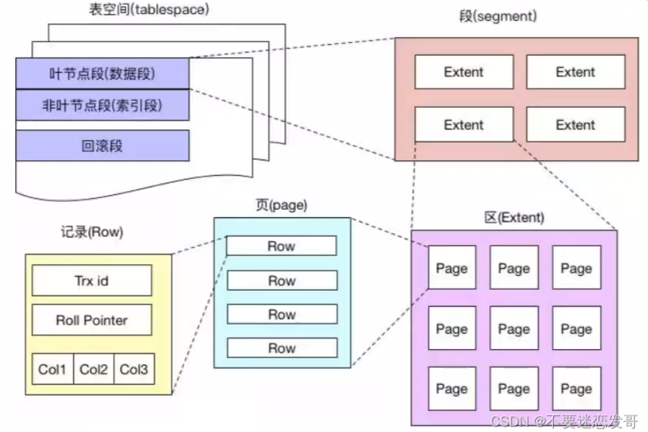
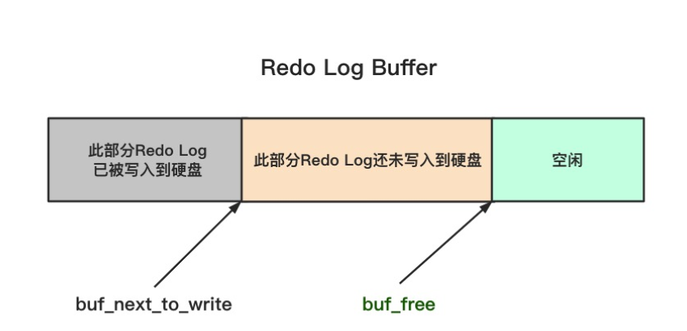
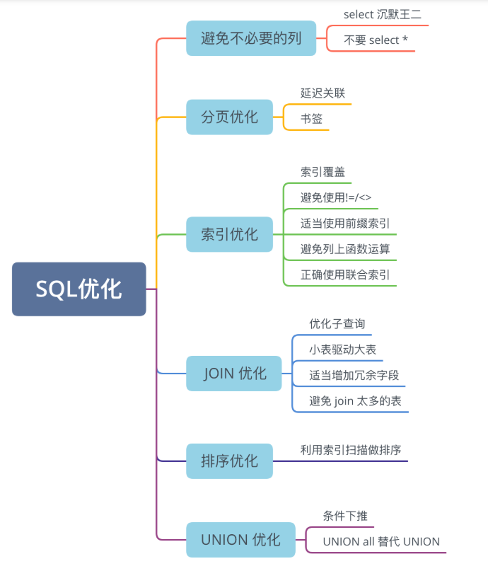
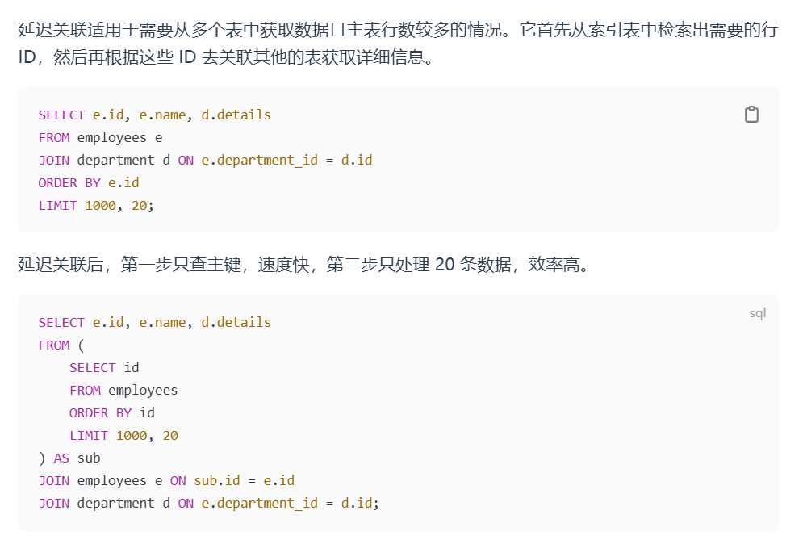
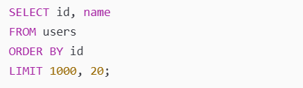
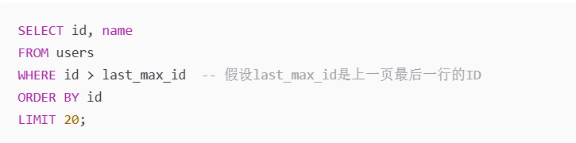

# Mysql

## Mysql基础

### 1.MySQL出现性能差的原因有哪些？

1.可能使用了全表扫描（要加索引优化）

2.可能查询语句过于复杂，如多表 JOIN 或嵌套子查询（优化查询语句）

3.可能单表数据量过大（进行分表优化）

4.可能热点数据访问量过大（使用Redis进行压力分摊）

### 2.数据库三大范式

1.第一范式：每一列都是不可再细分的基础数据单元

2.第二范式：每一列都和主键直接相关

3.第三范式：非主键列应该只依赖于主键

### 3.varchar和char的区别

varchar是可变数据类型，最多可到65535字符数，因为实际字符集的存在，

需要占用2个字符长度，因此可存最多65533

char是不可变数据类型，多出来的空位会以空格填充

### 4.blob和text区别

blob存储二进制数据，例如图片、音频、视频、文件

text存储文本数据，例如日志、评论、文章

### 5.DATETIME和TIMESTAMP的区别

DATETIME直接存储时间的完整值，不考虑时区

TIMESTAMP存储Unix时间戳，考虑时区因素

### 6.in和exists区别

in会先执行子查询，将其加载到内存中形成临时表，再进行外层查询

exists会对外部查询的每一行执行一次子查询，该子查询只关心是否返回行，

返回则exist为真，所以不会加载太多数据到内存

如果子查询出现了NULL值，则in条件查询永远不会为真，发生NULL值陷，

而exists只要返回行就为真，所以不受NULL值影响

### 7.记录货币用什么类型较好

DECIMAL精确数值类型

float和double是浮点数类型，存在精度问题

### 8.怎么存储emoji

emoji是4个字节的UTF-8字符，而mysql的utf8最多支持3个字节，

需要使用utf8mb4

### 9.drop、delete、truncate的区别

drop是物理删除整张表，无法回滚

delete是行级删除，带where条件，可以回滚

truncate 用于清空表中的所有数据，但会保留表结构，不能回滚。

### 10.union和union all区别

union 会去重结果的重复行，union all不会

### 11.count(1)、count(*)、count(列名)区别

count(1)和count(*)无区别，count(列名)会统计列不为NULL的行数

### 12.SQL的查询语句执行顺序

先执行 FROM 确定主表，再执行 JOIN 连接，然后 WHERE 进行过滤，

接着 GROUP BY 进行分组，HAVING 过滤聚合结果，SELECT 选择最终列，

ORDER BY 排序，最后 LIMIT 限制返回行数。

## 数据库架构

### 13.Mysql基础架构

连接层：负责客户端的连接，包括身份验证、权限校验等

服务层：负责查询解析、优化、执行等操作，binlog就在这一层记录sql语句变化

存储引擎层：负责实际数据的存储，支持InnoDB、MyISAM、Memory

### 14.一条查询语句如何执行的

1.客户端发送 SQL 查询语句到 MySQL 服务器。

（连接层）2.MySQL 服务器的连接器开始处理这个请求，跟客户端建立连接、获取权限、管理连接。

（连接层）3.解析器对 SQL 语句进行解析，检查语句是否符合 SQL 语法规则，确保数据库、表和列都是存在的，并处理 SQL 语句中的名称解析和权限验证。

（服务层）4.优化器负责确定 SQL 语句的执行计划，这包括选择使用哪些索引，以及决定表之间的连接顺序等。

（服务层）5.执行器会调用存储引擎的 API 来进行数据的读写。

6.存储引擎负责查询数据，并将执行结果返回给客户端。客户端接收到查询结果，完成这次查询请求。

### 15.更新一条语句的事务的全流程：

┌── 事务开始 (START TRANSACTION / 自动开始) ───────────────────────┐
│ undo log记录数据的原来样子做备份
│根据用户的事务代码将变更的数据写入bufferpool的data page中
└──────────────────────────────────────────────────────────────────┘

    ↓ 执行 COMMIT（二阶段提交）

┌── Prepare 阶段 (InnoDB) ───────────────────────────────────────────┐
│将此次数据物理变更信息更新到redolog buffer内存中
│根据设置（innodb_flush_log_at_trx_commit=1）选择是否立即将redo buffer中的信息立即写入磁盘
│写入之后追加prepare标记
└──────────────────────────────────────────────────────────────────┘

    ↓ 然后 MySQL Server 层处理 binlog

┌── Binlog 写入 + 刷盘 ───────────────────────────────────────────────┐
│ 将本事务的数据逻辑变更 写入 binlog buffer 内存中
│ 根据设置选择是否立即将binlog buffer写入磁盘
└──────────────────────────────────────────────────────────────────┘

    ↓ binlog fsync 成功

┌── Commit 阶段 (InnoDB 完成提交) ───────────────────────────────────┐
│ binlog刷盘之后代表着板上钉钉，binlog中会写入一个XID_EVENT代表事务提交，此时根据设置可以选择是否将redolog中commit立即替换prepare，也可以为了效率后续批量处理                  │
└──────────────────────────────────────────────────────────────────┘

    ↓ 数据页 (dirty page) 尚未 necessarily 持久化

┌── 后台 / 异步阶段: data page + Undo log cleanup ─────────────────────┐
│同步buffer pool中的datapage数据到磁盘，并且清除undo log

──────────────────────────────────────────────────────────────────┘

### 16.Mysql的段区页行

1.表空间有多个段（数据段、索引段、回滚段）

2.每一段有多个区，区包含64个连续页，大概1M数据

3.页是InnoDB基本单元，16KB，对应索引树上一个节点

4.一页有多个行，InnoDB 采用行存储方式

## 存储引擎

### 17.存储引擎应该如何选择

大多数情况下，使用默认的 InnoDB 就可以了

InnoDB 可以提供事务、行级锁、外键、B+ 树索引等能力。

且为聚簇索引，索引和数据不分开。叶子节点存的是数据。

MyISAM 只支持表锁，适合读多写少的场景。且为非聚簇索引，

索引和数据分开存储，叶子结点存的是数据文件的指针。

MEMORY 适合临时表，数据量不大的情况。因为数据都存放在内存，

所以速度非常快。

### 18.InnoDB的内存结构

buffer pool 和 redolog buffer。 buffer pool 用于缓存数据页和索引页，

提升读写性能；redolog buffer 用于缓存 redo log，将多次刷盘的操作变成一次整体刷盘，

减少io次数，提升写入性能。

### 19.InnoDB的LRU算法优化

普通的LRU是针对最久没使用的数据进行清理，但是当查询大量的数据的时候，会导致大量热点数据被挤出缓冲区。

改良的LRU会分young区和old区，用midpoint在大概80%的位置区分，这样可以保证热区数据不会被挤出去，冷区数据反复更替。

## 日志

### 20.MySQL的日志文件有哪些

错误日志用于问题诊断

慢查询日志用于 SQL 性能分析

general log 用于记录所有的 SQL 语句

binlog 用于主从复制和数据恢复以及二阶段提交的一致性

redo log 用于保证事务持久性

undo log 用于事务回滚和 MVCC。

### 21.WAL

先写日志再刷盘的思想。数据最终是要写入磁盘的，

但磁盘 IO 很慢，如果每次更新都立刻把数据页刷盘，

性能很差；如果还没完全写入磁盘就宕机，事务会丢失，

磁盘中的数据也会混乱。

执行事务的时候...（这里答事务流程）

### 22.重点说说binlog

1.在执行事务过程中，binlog可以配合redolog以及undolog，

实现二阶段提交过程。

2.binlog是记录数据库逻辑信息变化的日志，例如误删了数据，

可以用来做数据库信息的恢复。

3.在高可用设计角度下，主从数据库可以用binlog保证数据的一致性，

从库读取主库的binlog日志文件来更新自己的数据

4.默认是没有binlog的，在生产环境下一定要开启binlog，

配置binlog可以通过在my.cnf文件中设置log_bin = mysql-bin开启binlog。

### 23.为什么要二阶段提交

1.二阶段提交（2PC）的 核心设计目的 ，

是解决 MySQL 引擎层 redo log 和 Server 层 binlog 的日志原子提交问题，

保证两层日志强一致，从根上保障事务的持久性；

2.高可用方案下，主从数据库的信息通过binlog进行传递，

由于二阶段提交，顺带保证了主从数据库数据的一致性。

### 24.哪些场景会触发redolog的刷盘操作

1.redolog buffer空间不足时

2.事务提交时

3.后台线程定期刷盘时

### 25.buffer_next_to_write了解吗

buf_next_to_write 指向 Redo Log Buffer 中下一次需要写入硬盘的起始位置。而 buf_free 指向的是 Redo Log Buffer 中空闲区域的起始位置。

### 26.了解MTR吗

Mini Transaction 是 InnoDB 内部用于操作数据页的原子操作单元。

多个事务的 Redo Log 会以 MTR 为单位交替写入到 Redo Log Buffer 中。

### 27.redolog block了解吗

redolog buffer是由多个连续的redolog block组成的，

Redo Log Block 由日志头、日志体和日志尾组成，一共占用 512 个字节。

### 28.redolog block为什么是512字节

因为机械硬盘的物理扇区大小通常为 512 字节，

Redo Log Block 也设计为同样的大小，

就可以确保每次刷盘写入都是整数个扇区，减少对齐开销。

### 29.checkpoint和LSN了解吗

Mysql的redolog磁盘文件采用环形设计，LSN是日志记录的单调递增编号，

其中有两个指针，一个是Writepos作为写指针，表示下一次

写redolog从哪里开始写，一个是Checkpoint，

表示已经落盘持久化的数据，

小于checkpoint的LSN对应的数据均已落盘持久化完成。

具体来说，当一个事务提交之后，

redolog从prepare标记变成commit，

系统后台开始慢慢执行刷脏数据的过程，

脏页刷一点，checkpoint后移一点直到脏页刷完，

他停止移动。而checkpoint到writepos之间的部分

是还没有刷盘的数据对应的redolog日志，

这部分的日志如果已经commit，

他也会不久之后把checkpoint后移到writepos处。

如果writepos一直大量写新的redolog，

可能会从后面追上CP，那这个时候空间不够了，

就会触发刷脏数据机制，会催促系统进行脏页刷盘，

这样CP也能往后移，这样redolog的writepos与

checkpoint之间的环形区又有空间了，可以WP继续写新的日志了。

## SQL优化

### 30.什么是慢SQL

MySQL 中有一个叫 long_query_time 的参数，

原则上执行时间超过该参数值的 SQL 就是慢 SQL，

会被记录到慢查询日志中。

### 31.如何优化慢SQL

1.线上应急排查情况：使用show processlist实时查看数据库当前活跃连接，

找到运行的慢SQL、阻塞连接、锁等待，可以kill掉阻塞连接及时止损

2.追溯复盘情况下：开启数据库慢查询日志，

配置long_query_time参数（默认是十秒，生产环境一般为1-3秒）

每日复盘的时候可以看到哪些是慢SQL。

然后用explain关键字查看慢SQL的执行计划，

看看是否用了索引，一般情况下慢SQL是因为没有用到索引。

再针对性的添加索引，优化查询条件，解决慢SQL问题。

### 32.哪些方法来优化SQL

最常见的方法是加索引，

比如说使用覆盖索引、

让联合索引遵守最左前缀原则等。

将覆盖索引和联合索引结合使用，

较少回表的操作，增加sql效率。

### 33.什么是覆盖索引

查询所需的字段都在一个索引里，

这样mysql就不用回表，直接从索引中返回结果。

### 34.什么是联合索引

使用联合索引要遵循最左前缀原则，

查询条件需要从索引的左侧字段开始。

因为建立联合索引的话，

b+树是按照联合索引的顺序进行逐层排序，

* 比如创建联合索引 `idx(a,b,c)`，B + 树会先按 `a` 排序；
* 当 `a` 的值相同时，再按 `b` 排序；
* 当 `b` 的值也相同时，最后按 `c` 排序。

### 35.如何进行分页优化

分页优化的目的是为了避免深度偏移带来的全表扫描，

可以通过延迟关联和添加书签来优化。

1.延迟关联：主表行数过多并且需要关联多表的时候，

先在主表进行主键id检索（走索引）生成一个临时表

（这一步也要用offset扫到limit位置），

然后用该表的每一条id数据去流式join连接其他表。

2.添加书签：上一次查询的最后一行的主键值会被记录下来，

然后下一次查询会从这个值开始，

从而不用offset，相当于加了一个书签。

### 36.JOIN代替子查询有什么好处

**标量子查询**因其嵌套可能会导致索引优势不明显，

效率低，Join on会进行一次连接操作，

更直接触发索引，避免了嵌套操作，效率更高。

### 37.JOIN操作为什么要小表驱动大表

1.如果大表的JOIN字段有索引，

小表驱动大表可以通过索引快速匹配，

时间开销是O（NlogM）。如果是大表驱动小表，

时间开销是O（MlogN）

~~2.如果是大表JOIN字段无索引，小表驱动大表时间开销是O（NM）+小表K次分段*扫描大表的IO时间开销。~~

~~如果是小表JOIN字段无索引，如果是大表驱动小表，时间开销是O（MN）+大表K次分段*扫描小表的IO时间开销~~

### 38.为什么要避免JOIN关联太多表

多表JOIN会导致执行路径指数级增长，

优化器会为了减少路径成本可能会调整，

可能导致大表驱动小表的问题，

而且JOIN关联多表的时间复杂度也是连乘级别。

而且多表JOIN可能需要缓存中间结果集到内存临时表，

如果结果集太大，内存临时表会直接转为磁盘临时表，

IO开销暴增。

### 39.如何进行排序优化

1.添加索引，多个字段要满足最左前缀原则

2.增大 sort_buffer_size，让filesort排序在内存中完成，

避免写入磁盘文件中进行filesort排序（也就是外部归并排序）

（其实即使有索引，也可能触发内存排序，比如select *，

优化器会决策回表走一遍聚簇索引的随机IO的代价是否更大，可能会走全表扫描+内存排序）

### 40.全字段排序和rewid排序是什么

当无法使用索引排序时，MySQL 需要在内存或磁盘中进行filesort排序操作，

分为全字段排序和 rowid 排序两种算法。

1.全字段排序：读取所有满足条件行的数据，然后排序。

2.rewid排序：读取排序字段和只拿主键ID进行排序，

然后回表拿其他字段，比全字段排序多了一次回表IO操作。

### 41.sort_merge_passes了解吗

这个是一个状态参数，用来记录归并排序的次数，

如果这个参数较大，说明Mysql执行排序时的

数据无法全部进入sort_buffer_size，

需要写入磁盘临时文件进行归并排序。

因此通过该参数可以调整sort_buffer_size或者

添加索引进行优化。

### 42.条件下推了解吗

条件下推原理他是将外层的过滤条件

通过Mysql的优化器下推到更底层

更靠近数据源的位置，例如将外层where的条件

下推到子查询，减少返回的数据量。

-- 例子1：没有条件下推（多层子查询）
SELECT * FROM (
  SELECT * FROM students WHERE class_id = 1  -- 假设有索引
) AS class1_students
WHERE age > 18;  -- age没有索引

-- 例子2：条件下推后
SELECT * FROM students
WHERE class_id = 1 AND age > 18;

### 43.为什么要避免使用select*

因为select *需要读取所有字段，很多字段是不需要的，

占用了大量的缓存空间，而且有些字段可能没有在索引中，

无法通过覆盖索引直接返回结果，需要回表，导致IO。

### 44.explain的参数有哪些

explain最重要的四个参数是type、key、extra、rows。

1.type：代表了查询的方式，

例如where后面到底是等值查找、

范围查找、还是全表查找。

~~最好是const、eq_ref 或 ref而不是全表扫的ALL。~~

2.key：代表是否走索引或者使用的索引是什么。

最好是key≠NULL，代表走的索引

3.extra：提供了额外的信息包括使用了哪种排序，

是走的索引还是filesort。这个值最好是index，

而不是filesort，代表走的索引。

4.rows：代表预估的扫描的行数。越小越好。

## 索引

### 45.说一下索引的分类有哪些

1.有主键索引、唯一索引、全文索引；

2.有 B+ 树索引、哈希索引；

3.有聚簇索引、非聚簇索引。

### 46.唯一索引和主键索引的区别

主键索引非空且唯一，一张表只能有一个主键索引

但是可以有很多唯一索引，唯一索引可以为NULL，

通过创建时加入unique key字段自动添加唯一索引，

添加unique index也会隐式添加唯一键约束。

### 47.创建与维护索引有哪些注意点

1.选择合适的字段，频繁出现在 WHERE、JOIN、

ORDER BY、GROUP BY 中的字段，

优先选择区分度较高的字段，比如用户ID，手机号等，

而不是性别、状态等区分度低的字段。

索引就是为了精确快速定位，

性别这种一次查到一大堆的非唯一字段肯定不适合作为索引，

或者可以让性别等字段配合联合索引中的其他区分度高的一起进行索引，

2.要控制索引数量，索引是占用存储空间的，

单表索引不建议超过5个，定期检查不常用的索引进行删除。

### 48.索引哪些情况会失效呢

1.对索引使用函数或者表达式会失效

2.LIKE模糊查询在索引字段前面使用通配符%会导致索引失效。

`%xxx` 破坏了索引的前缀匹配特性

3.联合索引违反了最左前缀原则

联合索引需要从左到右使用，跳过前面的字段就失效

4.使用or连接非索引列会导致索引失效

比如WHERE a = 10 OR b = 20，其中a有索引b没有，

mysql会考虑对a进行索引查找，然后对b进行查找，

但是发现b没有索引，于是只能进行全表扫描，

优化器会认为既然都全表扫描了，a的索引额外找一遍就没意义了。

5.使用 `!=` 或 `<>` 不等值查询会导致索引失效

如果排除的值只占小部分，索引仍然有用；

如果排除的值占大部分，优化器会可能选择全表扫描

6.联合索引情况下，范围条件之后的索引会失效

联合索引中，范围查询后的字段不再有序

### 49.索引不适合哪些场景呢

1.区分度低的列不适合，或者可以和其他高区分度的列组成联合索引。

2.频繁更新的列，索引会增加更新的成本。

3.当表的数据量很小的时候，不超过 1000 行，

全表扫描可能比使用索引更快。

### 50.索引优化的思路

先通过慢查询日志找出性能瓶颈，

然后用 EXPLAIN 分析执行计划，判断是否走了索引、

是否回表、是否排序。

接着根据字段特性设计合适的索引，

如选择区分度高的字段，

使用联合索引和覆盖索引，

满足最左前缀原则，避免索引失效的写法，

最后通过实测来验证优化效果。

### 51.为什么innoDB用b+树作为索引

b+树是一个高度平衡的多路查找树，

支持有序遍历和范围查询

**1**.对比哈希索引，哈希索引通过哈希函数

将键值映射到固定长度的哈希值进行等值查询，

不支持范围查询。

**2**.对比二叉树，b+树的每一个节点对应磁盘上的一个页16kb。

他比普通的二叉树的层数要少，因此假如查询缓存没有命中的话，

b+树走每一层需要进行一次IO操作次数也比二叉树少。

**3**.对比b树，b树的索引和数据在每个节点上存储，

体量较大，导致每一个节点存的索引数量少，

例如一个16kb的结点页只能存几百个索引，

而b+树的每一个非叶子结点页由于没有数据存放

可以存上千个索引，

b树范围查询要中序遍历，

而b+树遍历链表没有回溯开销，

而且b树查询时可能要回溯父节点，

b+树直接进行双向链表的遍历。

b树的查询不稳定，可能在根节点或者上层节点就结束，

也可能在最后一层结束，但是b+树稳定，

都是在叶子结点结束，时间复杂度维持在logn，

对于高并发场景下更合适。

### 52.为什么MongoDB要用b树

在官方的解释中，MongoDB采用的是WiredTiger架构，

他底层是一种优化后的b-树，风格是b+树那样，但是没有双向链表。

MongoDB是文档型数据库，通常以json格式存储，

非叶子节点存键和导航指针，

叶子结点存放数据指针，属于非聚簇索引。

他的查询以单键查询为主，虽然范围查询稍弱，

但 MongoDB 的主要场景是点查询和复杂条件查询。

### 53.一颗b+树能存多少数据

在 InnoDB 中，页的默认大小为 16KB，

当主键为 bigint 时，3 层 B+ 树通常可以存储约 2000 万条数据。

### 54.聚簇索引和非聚簇索引有什么区别

1.聚簇索引的叶子节点存储了完整的数据行，

数据和索引是在一起的。InnoDB 的主键索引就是聚簇索引，

每个表只有一个聚簇索引也就是主键的索引。

2.非聚簇索引的叶子节点只包含了自身索引和主键值，

如果查询条件有其他字段，

可能需要通过主键进行回表，

按照主键去聚簇索引b+树中的叶子结点

去查找其他列字段的值，

唯一索引、普通索引等非主键索引都是非聚簇索引。

### 55.了解MRR吗

它会先把非聚簇索引查到的主键值列表   进行排序，

再按顺序去主键索引中批量回表，

**将随机 I/O 转换为顺序 I/O**，以减少磁盘寻道时间。

### 56.联合索引的底层存储结构是怎样的

联合索引属于非聚簇索引，也是通过b+树存储，

每一个节点存储了所有索引列的键值以及指针，

其中叶子结点存储了各索引列的值和对应的主键值，

如果查询的字段没有在联合索引中，

则会通过主键值进行聚簇索引的操作，这一过程称为回表。

### 57.什么是索引下推

索引下推ICP是指：MySQL 把 WHERE 条件尽可能

“下推”到索引扫描阶段，

在存储引擎层提前过滤掉不符合条件的记录。

假如索引失效情况发生，比如%在前面

会直接全表扫描，这时不走二级索引，

所以 ICP 开不开都没影响，都会在sever层进行逐行条件过滤。

如果选择了走二级索引扫描，ICP 会在遍历二级索引叶子结点的记录时，

用索引里已有的列先过滤，

只有通过的记录才拿主键去聚簇索引回表来查取整行。

这样回表的行数比用ICP少了，减少了大量的回表所需的IO开销。

索引下推发挥作用的情况之一就是

where 后面第一个条件命中索引，

但是由于范围问题导致后面的条件无法走索引（但是也在索引中），

这个时候若没有进行ICP，就会先回表再过率，如果有ICP，

就会在二级索引叶子结点进行先过滤再回表。

举例子：

联合索引（name，age）

SELECT *
FROM user
WHERE name = '张三' AND age = 10;

这个例子走了精确定位，ICP开不开效益不大

SELECT *
FROM user
WHERE name like '张%' AND age = 10;

age索引失效，不开ICP会先回表再在server层过滤，

开ICP会在二级索引叶子结点处进行先age过滤，再回表。

## 锁

### 58.Mysql有哪几种锁

1.按照粒度划分有行锁和表锁

2.按照机制划分有悲观锁和乐观锁

3.按照兼容性来划分有共享锁和排他锁

4.按照范围来划分有记录锁，间隙锁，临键锁

### 59.表锁了解吗

表锁适合于读多写少的场景，

可以细分为共享锁和排他锁，

共享锁允许多个事务同时读表，但不能写，

排它锁只允许一个事务进行写，其他事务不能读也不能写。

MyISAM引擎中，默认使用表锁，InnoDB引擎使用的是行锁，

是对索引加锁实现的，对于InnoDB引擎执行的事务没有索引的话，

可能进行全表扫描，这个时候退化为表锁。

### 60.select for update 有什么需要注意的

这个语句会上行级写锁（排它锁），

必须在事务中使用，否则会立即释放，

范围查询时必须命中索引，否则可能会锁全表。

### 61.哪些情况下会上锁，上什么锁

在 InnoDB 引擎下：

1. 当手动执行 `START TRANSACTION`显式开启事务时：

执行 `SELECT ... FOR UPDATE`会上行级排他锁（写锁 / X 锁），

执行 `SELECT ... LOCK IN SHARE MODE`会上行级共享锁（读锁 / S 锁），

两种锁都要持续到显式事务 `COMMIT`/`ROLLBACK`结束；

若直接进行 `INSERT/UPDATE/DELETE`（无前置 `SELECT ... FOR UPDATE`），

也会自动上行级排他锁（写锁 / X 锁），且锁持续事务流程结束。

如果直接执行select查找而不加share mode，他会普通读，可能会依赖MVCC，具体看隔离级别

2. 如果默认开启 `autocommit = 1`，代表单条语句会被隐式的封装成事务

比如，当我们没有显式开启事务时，直接执行 `INSERT/UPDATE/DELETE`，

会隐式上行级排他锁（写锁 / X 锁），锁仅持续到本条语句执行结束

执行完就立刻释放锁了

如果直接执行普通 `SELECT`查找操作

（也就是无没有 `LOCK IN SHARE MODE`），

则不会施加任何行级读锁（S 锁），实现普通读

### 61.记录锁，间隙锁，临键锁了解吗

1.记录锁：当我们在事务中使用唯一索引或者主键索引进行等值查询时并且FOR UPDATE的时候，

MySQL 会为该记录自动添加排他锁，

禁止其他事务加锁读取或者修改锁定记录。

2.间隙锁：间隙锁用于在范围查询时锁定记录之间的“间隙”，

防止其他事务在该范围内插入新记录

3.临建锁：临键锁是记录锁和间隙锁的结合体，

锁住的是索引记录和索引记录之间的间隙，

临键锁的间隙是一个左开右闭区间。

### 62.意向锁了解吗

意向锁是表级意义的锁，在没有意向锁的情况下，

当事务 A 持有某表的行锁时，如果事务 B 想添加表锁，

InnoDB 必须检查表中每一行数据是否被加锁，

这种全表扫描的方式效率极低。

有了意向锁之后，事务在加行锁前，

先在表上加对应的意向锁；

其他事务加表锁时，只需检查表上的意向锁，

无需逐行检查。

### 63.乐观锁和悲观锁了解吗

悲观锁是一种"先上锁再操作"的保守策略，

它假设数据被外界访问时必然会产生冲突，

因此在数据处理过程中全程加锁，

我们所说的行锁，表锁，记录锁，间隙锁，临键锁，读锁，写锁，都是悲观锁

乐观锁本质上不是锁机制，他是通过版本号进行并发控制，

乐观锁会假设并发操作不会总发生冲突，属于小概率事件，

因此不会在读取数据时加锁，

而是在提交更新时才检查数据是否被其他事务修改过。

比如A线程进行改数据，通过where进行版本号的限制，

但是改的时候发现where版本号不匹配，

说明B线程提前更新了数据也同步更新了版本号，

导致A的条件失败，更新操作也失败。

### 64.库存超卖问题

大家同时看到还有货，然后一起扣，没人管控，就扣成负数了。

**所以扣库存这一步必须是原子的** ，也就是“查和扣要合在一起做”。

1）乐观锁（更适合高并发）

意思就是： **我不先锁住你，我直接去改，**

**但我会带个“版本号”校验** 。

如果我改的时候发现版本号变了，

说明有人抢先改过了，那我这次就失败/重试。

优点：**不太会排队等锁，体验会更流畅**

缺点：**太热点时可能失败很多，**

**需要重试，会有“重试风暴”风险**

2）悲观锁（更“稳”，但可能排队）

比如 `SELECT ... FOR UPDATE`，意思就是：

 **我先把这行库存锁住，别人得等我处理完** 。

优点：逻辑直观，冲突少

缺点： **并发特别高时大家会排队，**

**吞吐下降** （锁等太多数据库也会难受）

因为线上通常是组合拳。我的做法是：最底层先把扣库存做成原子操作，

比如直接 `UPDATE stock SET stock=stock-1 WHERE sku_id=? AND stock>0`，

靠影响行数判断成功失败，这样从数据库层面先把超卖堵死。

然后为了扛高并发和热点，我会在入口做一点限流或者排队，

比如同一个爆款别让所有请求一股脑打到库里；同时库存会做“预扣/冻结”，

用户下单先把库存占住，后面支付成功再确认扣减，超时就把冻结释放掉，

这样体验上不会卡太久也不容易乱。

再往后我会用 MQ 把“下单、扣库存、发货”这些动作解耦一下，

保证就算某一步抖一下也能最终一致地补偿回来；

最后接口层一定做幂等，比如同一个订单号重复点、网络重试，

都不会重复扣库存。整体思路就是：

入口削峰、过程中先占后扣、底层原子防超卖、异步保证一致、幂等防重复，

这样才扛得住真正的高并发场景。

### 65.遇到过死锁吗，怎么解决的

了解，假如两个事务，一个事务1和一个事务2并发开启并且有都两条更新语句，

事务1的第一条update锁了行1，事务2的第一条update锁了行2，

然后事务1的第二条update是要锁行2，但是发现行2被事务2锁了，

而事务2还没结束，就会导致事务1等待，

同理事务2的第二条update是要锁行1，

发现也被事务1锁行了，也等待最后造成死锁。

解决方法：

1.统一按照固定的顺序去更新记录，比如事务1和事务2都按照：

先更新行1，再更新行2。

2.缩短事务的执行时间，把非核心逻辑移出事务，只保留必须的增删改操作。

这样可以缩短事务的时间窗口，减少死锁的风险。

3.设置事务超时时间，数据库设置超时时间，超过这个时间就进行回滚。

## 事务

### 66.事务的四大特性了解吗

原子性、一致性、隔离性和持久性

1.原子性：保证事务中的操作要么全部执行、要么全部失败

2.一致性：一致性确保事务从一个一致的状态转换到另一个一致的状态，

比如银行系统客户转账前后，总金额不变

3.隔离性：隔离性意味着并发执行的事务是彼此隔离效果的（MVCC）。

4.持久性：持久性确保事务一旦提交，它对数据所做的更改就是永久性的，

即使系统发生崩溃，数据也能恢复到最近一次提交的状态。

### 67.ACID靠什么保证的呢

原子性主要通过 Undo Log 来实现，

持久性通过 Redo Log 来实现，隔离性由 MVCC 和锁机制来实现，

一致性则由其他三大特性共同保证。

### 68.隔离级别是如何实现的

简单来说是锁机制+MVCC实现的

1.读未提交：事务A两次普通读/快照读同一个字段数据的期间，事务B修改了这条数据（行写锁）但未提交，导致事务A后续普通读/快照读的信息是当前最新修改后的，但如果事务B后来进行回滚，A的第二次读到的就是脏数据。

2.读已提交：事务A两次普通读/快照读同一个数据的期间，事务B修改了这条数据(行写锁)但未提交，事务A后续读仍然不变，除非B期间提交，A再次读会读到最新提交的快照版本。但两次读的数据还是不一致，不可重复读。

3.可重复读：同一事务内多次普通读/快照读 SELECT 通常读同一个 Read View，哪怕期间B提交了新的数据，也不影响，但是无法解决幻影读（A虽然两次普通select读到的行数不变，但是如果批量修改数据可能会影响到新插入进来的数据行，造成幻觉）

4.串行化：最高隔离级别，强制上锁保证串行操作解决幻影读，但是并发效率低

### 69.MVCC了解吗

MVCC多版本并发控制器，

在读已提交和可重复读的事务隔离级别下需要通过MVCC进行并发控制。

每一条数据信息保存着当前事务ID与undolog指针指向undolog的老历史信息用于回滚。

1.读已提交：在当前事务每一次查询信息时会创建readview快照信息，readview会根据当前事务ID，未提交事务ID，未开始事务ID做判断来去undolog找对应版本数据信息。

2.可重复读：在当前事务无论进行多少次查询，所使用的readview是第一次查找时的同一份readview，然后同理进行判断并去undolog找对应版本信息。

## 高并发

### 70.Mysql数据库读写分离了解吗

读写分离就是把“写操作”交给主库处理，

“读操作”分给多个从库处理，从而提升系统并发性能。

主库将数据变更通过 binlog 同步到从库，从而保持数据一致性。

主库 dump_thread 线程通过 TCP 将 binlog 推送给从库，

从库 io_thread 线程，接收主库 binlog，

写入 relay log，从库 sql_thread 线程读取 relay log，

并顺序执行 SQL 语句，更新从库数据。

### 71.读写分离的实现方式有哪些

小型项目:最简单的是在应用层手动控制主从数据源。

中型项目：用 Go 的 Gorm 框架来实现，

先配好主从两个（或多个）数据源，

再借助 Gorm 一些方法，

自动识别 SQL 是写还是读，写的话走主库，读的话走从库。

大型项目：在服务端与数据库之间部署ShardingSphere、

MyCat、ProxySQL 这些中间件，在中间件里配好主库和从库。

~~Go 的应用就把中间件当普通数据库连接， Gorm 正常写代码，底层的路由、负载均衡还有故障转移，全靠中间件自动处理~~

### 72.主从同步延迟怎么处理

主从同步延迟是因为从库需要先接收 binlog，

再执行 SQL 才能同步主库数据，

在高并发写或网络抖动时容易出现延迟，导致读写不一致。

解决方案就是，对一致性要求高的查询

（比如像支付结果查询）可以直接走主库。

或者对于非关键业务允许短暂数据不一致，

可以提示用户“数据同步中，请稍后刷新”。

### 73.数据安全问题怎么解决

异步复制下，当主库完成订单后会先给用户返回完成，

然后把binlog给从库传输过去，但是如果这个时候主库宕机了，

binlog还没来的及传输，或者甚至还没把binlog落盘，

那么当主从切换之后，这个数据就丢失了，造成不安全问题。

采用半同步复制，主库在事务提交时，

要等至少一个从库确认收到 binlog（

但不要求执行完成），才算提交成功。

这个时候主库宕机，主从切换到接收到binlog的从库当新主库，

然后进行一次新主从数据同步，就可以保证数据持久化了。

### 74.一般是怎么分库的呢

第一种是垂直分库：比如说用户、登录、权限等表放在用户库中，

商品、分类、库存放在商品库中，优惠券、满减、秒杀放在活动库中。

第二种是水平分库：按照一定的策略拆分到多个库中，

比如哈希分片和范围分片，对用户 id 进行取模运算或者范围划分，

这样将数据分散到不同的库中。

### 75.一般是如何分表的

当单表超过 500 万条数据，就可以考虑水平分表了。

比如说我们可以将文章表拆分成多个表，

如 article_0、article_9999、article_19999 等。

假如我们要展示文章的基本信息：作者，日期，标题等。

就没必要将正文内容也进行查询，会占用大量空间，

降低IO效率，我们就要垂直分表，正文放在正文表中，

基本信息放在信息表中。

### 76.水平分库分表的分片策略有哪些

1.范围分片：根据某个字段的值范围进行水平拆分。

2.哈希分片：通过对分片键的值进行哈希取模，

将数据均匀分布到多个库表中

3.路由分片：路由分片是通过路由配置来确定数据应该存储在哪个库表。

### 77.不停机数据库扩容/迁移怎么实现

1.改业务代码，让所有写操作同时写新旧库；

业务写旧库成功后，发一条操作的消息到队列，

如果新库写入失败，可以通过消息队列自动读消息补偿，

重新把数据写到新库，这样就避免数据不一致。

这时候读操作还走旧库，用户没感知。

2.然后用 Canal 监听旧库的 binlog，

把写新库与写旧库操作之前的历史数据全量同步到新库。

同步完之后，业务查询时同时查新旧库，

对比数据是否一致，不一致就修复。

3.先把非核心业务的读请求切到新库，观察没问题再切核心业务；

等所有读请求都切到新库，且稳定运行一段时间后，

把业务代码的双写改成只写新库，停掉补偿程序和消息队列，

最后下线旧库，迁移或者扩容就完成了。

### 78.常用分库分表的中间件有哪些

常用的分库分表中间件主要有 **ShardingSphere** 和  **MyCat** ，

其中重点说下 ShardingSphere：

ShardingSphere 最初由当当开源，后来捐赠给 Apache 基金会，是一款开源的分布式数据库中间件；

对于 Go 语言来说，我们不使用它的 Java 端组件（Sharding-JDBC），

而是优先选择  **ShardingSphere-Proxy** （它是独立部署的中间件，跨语言兼容）；

ShardingSphere-Proxy 无需修改 Go 应用代码，

只需将它部署在应用和数据库之间，

Go 应用把它当作普通数据库连接（用 `database/sql`、Gorm都可以），

底层的分库分表、路由、负载均衡全由它完成。

### 79.你觉得分库分表会带来什么问题呢

1.跨库事务无法依赖单机 MySQL 的 ACID 特性，

需要使用分布式事务解决方案。可以参考Seata 的 AT 模式、TCC 模式等。

2.跨库后无法使用 JOIN 联表查询。可以在业务层进行拼接。

3.自增 ID 在分片场景下容易冲突，

需要使用全局唯一方案，比如说雪花算法。

### 80.雪花算法是如何实现的

雪花算法是 Twitter 开源的分布式 ID 生成算法，

其核心思想是：使用一个 64 位的数字来作为全局唯一 ID。

* 第 1 位是符号位，永远是 0，表示正数。
* 接下来的 41 位是时间戳，
* 记录的是当前时间戳减去一个固定的开始时间戳，可以使用 69 年。
* 然后是 10 位的工作机器 ID。
* 最后是 12 位的序列号，每毫秒最多可生成 4096 个 ID。

## 运维

### 81.百万级数据如何删除

大范围的 DELETE 语句往往会造成锁表时间长、

事务日志膨胀等问题。可以采用批量删除的方案，

将删除操作分成多个小批次进行处理。

也可以采用创建新表替换原表的方式，

把需要保留的数据迁移到新表中，然后删除旧表。

### 82.千万级大表如何添加字段

可以直接通过 `ALTER TABLE` 来完成，

因为加入了 INSTAN 算法，添加列并不会长时间锁表。

### 83.MYSQL导致cpu飙升怎么办

我通常先通过 top 命令确认是否是 mysqld 的进程占用，如果是，

说明**MySQL 服务本身正在吃 CPU** （通常是大量查询、复杂排序/聚合、

没有走索引导致扫描、并发太高等因素）

然后通过 `SHOW PROCESSLIST` 和慢查询日志定位是否存在耗时 SQL，

再配合 explain 分析 SQL 是否命中索引。

最终通过 SQL 优化、加索引、分批操作来优化。

# Redis

## 线程模式

### 1.为什么redis这么快

1. redis是基于内存的，不需要进行IO读写
2. redis是单线程，避免线程上下文切换产生开销
3. redis采用IO多路复用模型，减少网络带宽消耗，用户收发消息不会阻塞
4. 数据结构高效：像String（底层SDS）、Sorted Set（底层跳表）

### 2.IO多路复用：

#### 阻塞IO：

用户态去轮询查看fd列表，挨个判断是否有fd消息到来，

若没到来就阻塞等待，坏处是容易造成阻塞，影响用户体验

#### 非阻塞IO：

和阻塞IO不一样的地方是轮询若遇到某个fd没有消息，

会跳过该fd并休眠一段时间继续访问下一个fd，虽然改进了机制，

但是仍然存在休眠时间下无法处理某个fd的消息，若取消休眠时间，

则进行cpu高强度运行浪费资源。

#### select:

select是做了三次遍历,两次拷贝，第一次拷贝是用户态拷贝到内核态，

进程进行第一次遍历看看有没有哪个fd是有数据的，

没有的话进程就进入阻塞等待。

第二次遍历是当有数据到达socket缓冲区的时候，

会唤醒select进程，再次扫描一遍找到有数据的fd，

标记并进行第二次拷贝回用户态。

第三次遍历是用户态扫描一遍找出有标记的fd进行数据处理。

文件描述符fd:操作系统就会分配一个数字 ID 来标识对应的Socket。

#### poll

poll的处理fd数量没有固定数量上限，在用户态扫描标记并处理fd之后，

不会像select那样全部清除并重置bitmap，而是对于有标记的重置，

这样就达到复用的效果

#### epoll

先内核态epoll_create创建一个epoll对象，

也就是建立一颗红黑树，同时建立就绪链表，

当有socket连接，用户态调用epoll_ctl触发系统调用，

内核通过用户传入的 fd 找到对应的内核 Socket 对象，

将该 Socket 对象插入 epoll 红黑树；

同时给这个 Socket 注册 epoll 的回调函数。

这个时候，当没有数据到达socket的时候，

用户态epoll_wait函数是进行睡眠阻塞状态。

当有数据的时候，这个时候会触发socket的回调函数

找到他所在的epoll实例（包含红黑树以及就绪链表），

然后将这个socket的事件信息加入到就绪链表中，

将链表拷贝给用户态的events数组，

然后唤醒用户态的睡眠状态开始遍历数组处理事件

## 持久化

### 3.AOF

redis AOF持久化的过程是将写入进来的数据从内存写入磁盘的AOF文件中的过程，

这样当redis崩溃重启后数据不会丢失，

AOF文件中是类似mysql 的binlog数据那样记录了逻辑命令，

但是不能每写入一条数据进行一次持久化落盘，

因此redis开启了一个aof_buf缓冲区，

将写数据的命令，集中写在这里并以一定的频率进行刷盘操作。

为了使得AOF文件中的数据不臃肿，redis进行数据瘦身，进行AOF重写，

他会fork出一个子进程，然后将内存中的键值生成最精简的指令慢慢写入这个新的AOF文件中，

但是重写这一过程redis还会写入新的数据，

这样会造成重写之后的AOF文件少了新的操作指令，

因此在开启重写的时候redis还会创建一个aof_rewrite_buf重写缓冲区，

记录重写期间新的写入操作，在重写完成后，

将这个缓冲区的数据补偿回写到重写后的AOF文件。

优点是以一定频率、以增量的形式刷盘操作指令，

资源耗费不像RDB那么大。缺点是，在持久化过程中，

如果 Redis 异常崩溃，`aof_buf` 里还没刷盘的命令

就会随着内存里面的aof_buf丢失而丢失。而且他是通过逻辑指令恢复的，很慢。

### 4.RDB

RDB他是主进程fork一个子进程出来（这一步是阻塞的），

子进程创建完成之后会结束阻塞，

然后会将复制的数据快照写入磁盘中，

写完之后这个子进程结束，完成一轮持久化。

但是这个时候主进程可能在子进程刷盘的时候有新的数据写进来，

这时候内存中的这页内存数据就会被复制一份（但是在同一内存下），

主进程仍然往内存数据里面写，

但是子进程会对备份的那个内存数据进行刷盘。

因为主进程还在这个期间有数据写入内存，

导致持久化磁盘中的数据不是最新的，

这时候可以根据系统配置，设置间隔，开启下一轮RDB过程了。

优点是redis崩溃重启后根据快照信息恢复速度快，

因此缺点是redis崩溃，重新加载的可能不是最新的数据，造成数据丢失。

### 5.混合持久化

这一步针对重写步骤来说的。混合持久化的过程是：

**“触发重写→fork 子进程写 RDB 全量→主进程将缓存增量**

**写到 aof_rewrite_buf→子进程写完 RDB 后，**

**主进程补写 aof_rewrite_buf到持久化文件中→替换旧文件”，**

**混合持久化的 RDB 部分，是写在**新的临时  文件开头，

不是直接写入旧的 AOF 文件。

## Redis过期删除和内存淘汰

### 6.过期删除策略

1.惰性删除：不主动删除过期的key，访问到发现过期就删除

2.定期删除：随机抽取一定数量的key进行检查并删除其中过期的key

缺点：有些过期的key不会及时被删除导致占用内存

### 7.Redis持久化过期键处理

在RDB策略下，每次持久化的时候，

redis会遍历内存中所有的键，过期的不会写入到RDB中，

主从服务器都是这个机制。

而在服务器重启加载的时候，

主服务器会加载那些RDB未过期的键，

而从服务器会加载包括过期的RDB键，

这是因为从服务器的过期时间可能和主服务器的过期时间不一样，

时间戳不一致，因此从服务器要加载包括过期的数据，

随后主服务器会和从服务器进行全量数据同步，保持主从一致。

在AOF策略下，	每次持久化的时候，

redis主服务器会把aof_buf里面的命令刷盘到AOF文件中，

包括过期键的设置，然后同步发给从库。

当键过期的时候，给aof_buf写一条delete语句，

并且后续刷盘进AOF中，并给从库同样发一个指令，

从库也和主库一样进行刷盘持久化

来保持数据一致。

当服务器重新加载的时候，

主库和从库都是从自己的AOF进行数据加载的，

随后会进行一次基于RDB数据进行全量数据同步的操作

来确保数据的一致性。触发重写操作的时候，

主库和从库是各写各的，因为他们的指令是同步的，

所以重写之后的数据也是一致的。

### 8.内存淘汰

虽然有了过期策略删除操作，

但是还是会有一部分键没有被过期删除掉，

或者是内存即将满了，因此需要进行内存淘汰，

无论是否这个键面临过期问题。

常见的淘汰策略有三种:

ttl：更早过期（优先删除「存活时间最短、最快要过期」的键。）

LRU：最近最少使用（按最近使用时间）

LFU：最近最不常用（按最近使用频率）

## Redis缓存设计

### 9.缓存击穿

一个数据在过期的时候或者临期被内存淘汰的时候，

被大量访问，会导致请求穿过redis打入数据库造成数据库压力大甚至宕机，造成击穿。

解决方案：

1.加锁更新，比如查询A的时候发现缓存中没有，

就对A这个key加锁，从数据库中查找，然后放到缓存里面，

再返回给用户。（这样可能会导致查询请求要阻塞等待一会，

但是保证了数据库不被打崩的风险）

2.将过期时间组合写在value中，

异步的方式不断刷新过期时间

（这个方案虽然不会造成击穿，

但是有些冷门的数据一直保留导致redis内存压力增大）

### 10.缓存雪崩

大量数据同时过期：某一时刻大量缓存数据同时过期，

大量查询请求落到数据库（MySQL）上，或者Redis服务器宕机，导致数据库崩溃。

解决方案：均匀设置过期时间

### 11.缓存穿透

查询缓存中不存在的数据（因为没有）

所以每次都要穿过缓存到数据库中访问

（数据库也没有，所以无法构建缓存数据），

频繁查询会给数据库带来很大压力。

解决方案：使用布隆过滤器（在存储和缓存之前），

过滤器里保存了缓存中的数据，如果判断数据不存在就不访问存储。

### 12.什么是热KEY

短时间内被频繁访问的键

### 13.如何解决热KEY问题

1.建立本地二级缓存，访问请求先从本地缓存拿数据，

如果没有再去redis缓存中拿

2.在分布式redis环境下，可以使用自定义路由：

把热key分散到不同的redis服务器中，可以建立映射规则，

这样来自客户端的访问压力就分摊到不同的redis中。

也可以采用一致性哈希：将多个redis放入一个圆环上，

通过计算访问的key的哈希值，寻找圆环上最近的redis结点进行读取数据。

3.数据库进行主从配合，从数据库负责读数据，

redis万一击穿了，也能够从从数据库中读数据，不会影响核心写入业务。

### 14.大key是什么

String类型的值大于10kb

Hash、List、Set、Zset的数量大于5000个

### 15.大key出现的问题

1.客户端超时阻塞：单线程处理，操作大key比较耗时

2.网络阻塞：获取大key产生的流量大，

如果一个大key1MB每秒访问1000次就是1000MB

3.阻塞工作线程：比如删除大key就会阻塞工作线程

4.内存分布不均：集群模型在slot分片均匀的情况下，

会出现数据和查询倾斜的情况，部分有大key的Redis节点占用内存多，QPS也会相应更大

#### 如何删除

删除大key：

* 异步删除
* 分批次删除

## Mysql和Redis数据一致性

### 16.旁路缓存+binlog+canal方案（最流行的方案）

1.读数据时先查缓存，缓存没有则去数据库中读然后填回缓存；

2.改数据时先改数据库，MySQL 改数据自动写 binlog 日志；

3.Canal 伪装成 MySQL 从库，读取并解析 binlog，

把mysql更新数据的消息发到 Kafka；

4.专门的「缓存消费服务」一直盯着 Kafka，

拿到这条消息后，主动调用 Redis 的删除命令，删掉该数据的缓存；

5.若 Redis 正常，删缓存成功，若不正常，则redis过期时间作为兜底删除

### 17.延迟双删

先删缓存，再改数据库，再删一遍缓存。

因为如果只第一次删缓存而后续不删的话，

会导致更新数据库的时候其他线程进来并发读数据的时候，

找缓存发现没有，于是将数据库的未更新完的旧数据拿来写到缓存中，

等数据库更新完导致数据不一致，于是要第二次删除。

## 高可用

### 18.主从复制

主从复制是为了实现redis高可用提出的一个方案，

部署主服务器和从服务器，主服务器进行数据读写之后

会同时写入一个缓冲区，好像叫**复制积压缓冲区**，

然后发送给从服务器来进行增量同步。

如果从服务器第一次连接的时候，则需要全量数据，

这个时候主服务器将RDB快照文件给从服务器进行同步，

如果从库不是第一次连接并且短时间挂掉，

重启之后只需读取来自主服务器的复制积压缓冲区的最近的增量数据，

如果是长时间挂掉，则需要来自主服务器的RDB全量数据。

### 19.单点故障

主节点发生故障，可以手动或者通过哨兵来将从节点升级为主节点，

然后原主节点降级并尝试重启恢复。

具体来说先要通过Raft算法选举一个领导哨兵负责故障转移，

哨兵结点们会以一定频率用ping命令问候主节点，

当多个哨兵都发现这个节点没有回复，说明这个节点挂了，

需要故障转移，把新的从节点成为主节点，

然后其他从节点从这个主节点同步数据，然后把旧的主节点改为从节点。

我们需要把硬件配置高的、复制偏移量最大的从节点作为主节点。

### 20.切片集群

为了减少单节点的访问压力和提高读写能力，我们需要集群部署多个redis主从结点，

然后每个主节点存放的不是全部的数据，而是进行切片槽划分，

每一组主从结点负责一组槽位。这样就分摊了单组主从结点的压力。

### 21.为什么要有16384个槽

redis通过CRC16哈希函数计算key的哈希值，范围是0-65535，

但是65536/8=8192B = 8KB，由于这些数据是要集群结点之间传输的，

结点一多，传输开销太大，而选取16384这个范围，16384/8 = 2KB，

心跳包只需要2KB，压力小的多，而且16384足够用了。

## Redis数据类型

1. String（缓存对象，分布式锁）
2. hash（购物车）：（listpack和哈希表）
3. set（点赞、共同关注）：哈希表或者证书集合
4. Zset（排序场景） ：Set（集合，保证唯一性） + Score（分数，用于排序）
5. List（消息队列）：3.2之后quicklist代替了双向链表和压缩链表
6. Geo(地理位置)
7. HyperLogLog（基数统计）
8. bitmap（二值状态统计）
9. stream（消息队列）

### Zset底层实现

跳表：链表+多级索引结构

# Kafka

### 1.分区副本

Kafka 的分区是主题的最小存储单元（按我理解他类似快递货架），

每条消息都会落到某个分区里。我们的 `topic3` 目前只有 1 个分区，

对应的 `review-job` 也只部署了 1 个实例

 因为目前我这个项目是边学习边部署，还没有搞很多分区。

然后副本就是分区的备份，实现了**高可用机制** ，

避免分区挂掉导致数据丢失。他有leader和follower，类似raft算法那样。

**1.Leader ** ：负责所有的读写请求，

我们的 Canal 往 `topic3` 发评论数据、`review-job` 从 `topic3` 读数据，都是和 Leader 打交道；

2.**Follower ** ：只做一件事 —— 实时同步 Leader 的数据，不处理任何读写请求。

### 2.为什么分区能保证消息顺序？

答：因为 Kafka 的分区是 **有序的消息存储机制**，

消息是按写入顺序存储的，

而且一个分区只能被同一个消费者组的一个实例消费，

所以能保证先写的评论先同步到 ES。

而且即使我开很多分区和消费者组，

由于是按ID的哈希值计算落入分区的，

一个用户的先后评论不会落入其他分区，仍在同一个分区，

他的消息先后就有保障。

### 3.消息积压处理了解吗

消息积压就是 Kafka 里的消息堆积，消费速度跟不上生产速度。

在我的项目中，Canal 可能每秒发1000条消息到 Kafka，
但 review-job 可能只能每秒消费100条，
那就会导致消息越来越多，最终堆积。"

一般通过他的一些指标来看：

1.他有一个监控消费者组的 lag（落后数量）
如果 lag 一直在增长，说明有积压

2.他还有一个 offset（消费进度）
消费的 offset 没有增长，说明消费不了

（其他的就有点忘了）

3.检查消费者日志
看有没有报错，比如 ES 连接超时

处理方法：

1.消费者慢。
比如我现在只有一个 review-job 实例，
如果消费慢，可以启动多个实例，
利用 Kafka 的分区，并行消费。
2.消费者下游慢

可能还是ES的问题，比如ES压力太大，

可以加分片集群，把来的数据写到不同的节点上，

也可以增加副本，一个节点挂了可以用副本顶上，

这样可以保证ES分摊数据读写压力，

并且一个节点挂了可以从节点顶上。这也会让消费者更快速消费。

# 微服务

## Raft算法

### 1.Leader投票选举

所有节点一开始都是跟随者，任期号是1，

然后开始按照超时时间进行计算，谁最先等待结束，

会把自己变成候选人，然后给自己投一票，任期号变成2，

其他的结点这时候也会进行投票给候选人，

并把自己的任期号变成2，然后候选人统计选票数大于半数结点数以上，成为leader。

### 2.心跳检测与结点故障恢复

领导者会给跟随者以一定频率发送，

并且收到回复，当领导者宕机，其他跟随者没有收到领导者的心跳，

然后开始新一轮的候选人投票选举领导人。

如果后面旧领导者重启恢复，会发现新领导者的数值比自己大，

然后同步这个数值之后成为跟随者。

### 3.日志复制

领导者会将自己的日志以心跳的方式发送给所有跟随者，

如果该条日志已经有半数以上跟随者接收到了，

那么这条日志就会变成提交状态，并且将信息传给跟随者们，

告诉他们这条日志可以提交了，然后跟随者就接收到这个信息之后把该条日志提交。

# 1

# 2
