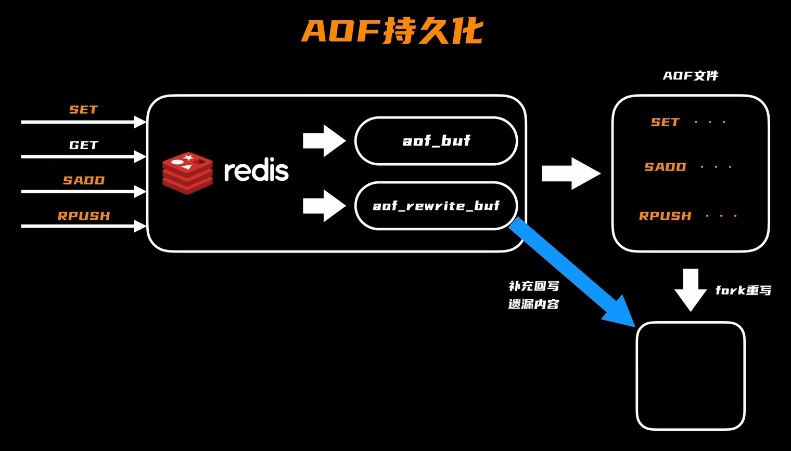
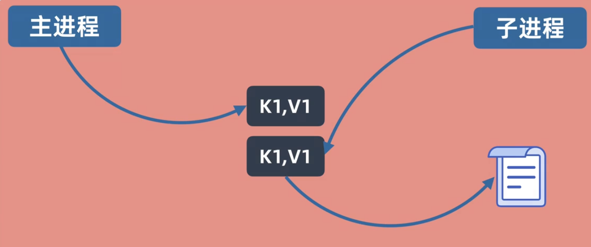

## 事务的全流程：

┌── 事务开始 (START TRANSACTION / 自动开始) ───────────────────────┐
│ undo log记录数据的原来样子做备份
│根据用户的事务代码将变更的数据写入data page中
└──────────────────────────────────────────────────────────────────┘

    ↓ 客户端执行 COMMIT

┌── Prepare 阶段 (InnoDB) ───────────────────────────────────────────┐
│将此次数据变更的信息更新到redolog buffer内存中
│根据设置选择是否立即将redo buffer中的信息立即写入磁盘
│写入之后追加prepare标记
└──────────────────────────────────────────────────────────────────┘

    ↓ 然后 MySQL Server 层处理 binlog

┌── Binlog 写入 + 刷盘 ───────────────────────────────────────────────┐
│ 将本事务的操作 写入 binlog cache / binlog buffer 内存中
│ 根据设置选择是否立即将binlog buffer写入磁盘
└──────────────────────────────────────────────────────────────────┘

    ↓ binlog fsync 成功

┌── Commit 阶段 (InnoDB 完成提交) ───────────────────────────────────┐
│ binlog刷盘之后代表着板上钉钉，此时根据设置可以选择是否将redolog中commit立即替换prepare，也可以为了效率后续批量处理                  │
└──────────────────────────────────────────────────────────────────┘

    ↓ 数据页 (dirty page) 尚未 necessarily 持久化

┌── 后台 / 异步阶段: data page + Undo log cleanup ─────────────────────┐
│同步buffer pool中数据到磁盘，并且清除undo log

──────────────────────────────────────────────────────────────────┘

## select/epoll：

#### select:

select是做了三次遍历,两次拷贝，第一次是用户态拷贝到内核态，进程进行第一次遍历看看有没有哪个fd是有数据的，扫描一遍之后发现如果有就标记之后拷贝回用户态，没有的话进程就进入阻塞等待。第二次是当有数据到达socket缓冲区的时候，会唤醒select进程，再次扫描一遍找到有数据的fd标记并拷贝回用户态。第三次用户态扫描一遍找出有标记的fd进行数据处理。

#### epoll

先内核态epoll_create创建一个epoll对象，也就是建立一颗红黑树，同时建立就绪链表，当有socket连接，用户态调用epoll_ctl触发系统调用，内核通过用户传入的 fd 找到对应的内核 Socket 对象，将该 Socket 对象插入 epoll 红黑树；同时给这个 Socket 注册 epoll 的回调函数。这个时候，当没有数据到达socket的时候，用户态epoll_wait函数是进行睡眠阻塞状态。当有数据的时候，这个时候会触发socket的回调函数找到他所在的epoll实例（包含红黑树以及就绪链表），然后将这个socket的事件信息加入到就绪链表中，将链表拷贝给用户态的events数组，然后唤醒用户态的睡眠状态开始遍历数组处理事件

## 持久化

#### AOF

#### RDB

RDB他是主进程fork一个子进程出来（这一步是阻塞的），子进程创建完成之后会结束阻塞，然后会将复制的数据快照写入磁盘中，写完之后这个子进程结束，完成一轮持久化。但是这个时候主进程可能在子进程刷盘的时候有新的数据写进来，这时候内存中的这页内存数据就会被复制一份（但是在同一内存下），主进程仍然往内存数据里面写，但是子进程会对备份的那个内存数据进行刷盘。因为主进程还在这个期间有数据写入内存，导致持久化磁盘中的数据不是最新的，这时候可以根据系统配置设置RDB间隔又要开启下一轮RDB过程了。可以通过save和bgsave来手动触发RDB持久化操作。自动触发：redis.conf配置文件设置 `save <seconds> <changes>`（可多次）来设置触发条件。

#### 混合持久化

这一步针对重写步骤来说的。混合持久化的核心是：**“触发重写→fork 子进程写 RDB 全量→主进程缓存增量到 aof_rewrite_buf→子进程写完 RDB 后，主进程补写 aof_rewrite_buf→替换旧文件”，混合持久化的 RDB 部分，是写在**新的临时 AOF 文件**开头，不是直接写入旧的 AOF 文件。	**

#### Mysql和Redis数据一致性

### 1.旁路缓存+binlog+canal方案（最流行的方案）

1. 读数据时先查缓存，缓存没有则去数据库中读然后填回缓存；
2. 写数据时先改数据库，MySQL 改数据自动写 binlog 日志；
3. Canal 伪装成 MySQL 从库，读取并解析 binlog，把mysql更新数据的消息发到 Kafka；
4. 专门的「缓存消费服务」一直盯着 Kafka，拿到这条消息后，主动调用 Redis 的删除命令，删掉该数据的缓存；
5. 若 Redis 正常，删缓存成功，若不正常，则redis过期时间作为兜底删除

#### 2.延迟双删

先删缓存，再删数据库，再删一遍缓存。因为如果只第一次删缓存而后续不删的话，会导致更新数据库的时候其他线程进来并发读数据的时候，找缓存发现没有，于是将数据库的未更新完的旧数据拿来写到缓存中，等数据库更新完导致数据不一致，于是要第二次删除。
